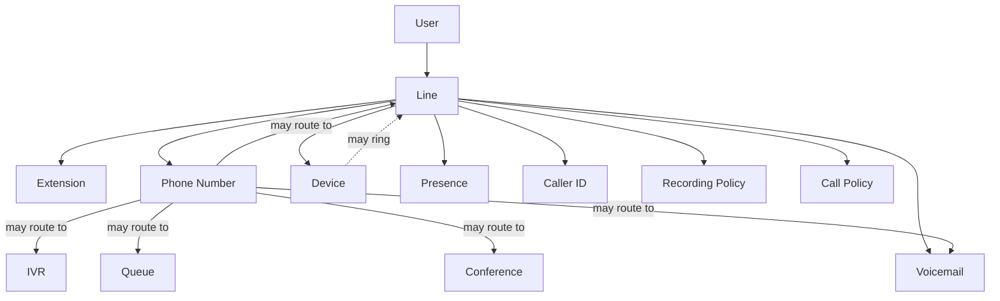
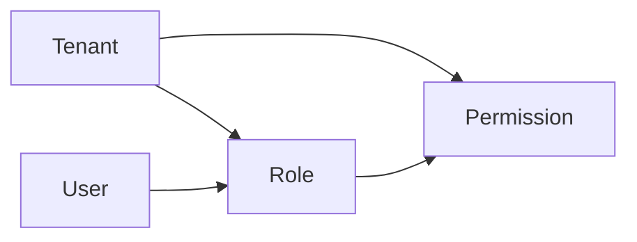

# VSP Phone v4 — Domain Model

| Field | Value |
|-------|-------|
| **Document ID** | DB-DOM-001 |
| **Version** | 1.0.0 |
| **Status** | Approved |
| **Last Updated** | 2026-07-08 |
| **Owner** | Architecture |
| **Location** | `docs/03-database/domain-model.md` |

---

## Purpose

This document defines the **official approved core business domain model** for VSP Phone v4.

It describes platform entities, their responsibilities, relationships, ownership, lifecycle, and extensibility boundaries. It is the authoritative domain reference for future schema design, application modules, and data modeling work.

This document does **not** define database tables, Prisma models, migrations, or implementation details.

---

## Table of Contents

1. [Domain Overview](#1-domain-overview)
2. [Approved Business Rules](#2-approved-business-rules)
3. [Cross-Cutting Domain Conventions](#3-cross-cutting-domain-conventions)
4. [Platform](#4-platform)
5. [Tenant-Scoped Entities](#5-tenant-scoped-entities)
6. [Line-Owned Domain Concepts](#6-line-owned-domain-concepts)
7. [Platform Services](#7-platform-services)
8. [Entity Relationship Summary](#8-entity-relationship-summary)
9. [Related Documents](#9-related-documents)
10. [Revision History](#10-revision-history)

---

## 1. Domain Overview

VSP Phone v4 is a multi-tenant UCaaS platform. All business resources are scoped to a **Tenant** under a single **Platform** root.

### Approved domain hierarchy

```
Platform
│
└── Tenant
      │
      ├── Site
      ├── User
      ├── Role
      ├── Permission
      ├── Line
      ├── Device
      ├── Phone Number
      ├── Queue
      ├── IVR
      ├── Conference
      ├── Recording
      ├── Carrier
      ├── SIP Endpoint
      └── Policies

Platform Services

├── Billing
├── CRM
├── Audit
├── Notifications
└── Reporting
```

### Domain layers

| Layer | Scope | Description |
|-------|-------|-------------|
| **Platform** | Global | Root platform context shared across all tenants |
| **Tenant domain** | Per tenant | Core business entities operated by each tenant |
| **Line-owned concepts** | Per line | Telephony identity attributes owned by a Line |
| **Platform services** | Cross-tenant / platform-wide | Supporting operational and integration capabilities |

---

## 2. Approved Business Rules

The following rules are **approved** and govern the domain model:

| # | Rule |
|---|------|
| 1 | Every resource belongs to exactly one Tenant. |
| 2 | A Tenant can have multiple Sites. |
| 3 | A Site belongs to one Tenant. |
| 4 | Users may belong to multiple Sites. |
| 5 | Users may own multiple Lines. |
| 6 | A Line represents a telephony identity. A Line owns: Extension, Phone Numbers, Devices, Voicemail, Presence, Caller ID, Recording Policy, and Call Policy. |
| 7 | A Line may ring multiple Devices. |
| 8 | A Device may be reassigned to another User over time. |
| 9 | Extensions are unique within a Tenant. |
| 10 | Phone Numbers belong to one Tenant but may be reassigned between Sites. |
| 11 | Multiple Phone Numbers may terminate on the same Line. |
| 12 | One Phone Number may route to IVR, Queue, Line, Conference, or Voicemail. |
| 13 | Permissions use Role-Based Access Control (RBAC). |
| 14 | Every table will include `tenant_id`. |
| 15 | Every business entity supports soft delete. |
| 16 | Every business entity supports audit history. |

---

## 3. Cross-Cutting Domain Conventions

These conventions apply to all tenant-scoped business entities and platform services documented below.

| Convention | Approved requirement |
|------------|---------------------|
| **Tenant isolation** | Every resource belongs to exactly one Tenant (Rule 1) |
| **Tenant key** | Every persisted business record will include `tenant_id` (Rule 14) |
| **Soft delete** | Every business entity supports soft delete (Rule 15) |
| **Audit history** | Every business entity supports audit history (Rule 16) |
| **Authorization** | Access control follows RBAC via Role and Permission (Rule 13) |

---

## 4. Platform

### Purpose

Represents the VSP Phone v4 platform root — the global context under which all Tenants and Platform Services exist.

### Responsibilities

- Define the top-level boundary for multi-tenant operation
- Contain all Tenants
- Host Platform Services that operate across or in support of tenants

### Relationships

| Related entity | Relationship |
|----------------|--------------|
| Tenant | Platform contains one or more Tenants |
| Platform Services | Platform provides Billing, CRM, Audit, Notifications, and Reporting |

### Ownership

- Owned by the platform operator (outside any single Tenant)

### Lifecycle

- Persistent platform context
- Tenants are created, operated, and retired within the Platform

### Future extensibility

- Additional platform-wide capabilities may be introduced as new Platform Services without altering the Tenant domain hierarchy

---

## 5. Tenant-Scoped Entities

All entities in this section belong to **exactly one Tenant** (Rule 1).

---

### Tenant

#### Purpose

The primary isolation and account boundary for a customer organization on VSP Phone v4.

#### Responsibilities

- Own all tenant-scoped business resources
- Enforce tenant-level isolation across Sites, Users, Lines, telephony resources, and policies
- Serve as the RBAC and policy scope for tenant administration

#### Relationships

| Related entity | Relationship |
|----------------|--------------|
| Platform | Each Tenant belongs to the Platform |
| Site | A Tenant can have multiple Sites (Rule 2) |
| User | Users exist within a Tenant |
| Role | Roles are defined within a Tenant |
| Permission | Permissions are defined within a Tenant |
| Line | Lines exist within a Tenant |
| Device | Devices exist within a Tenant |
| Phone Number | Phone Numbers belong to one Tenant (Rule 10) |
| Queue | Queues exist within a Tenant |
| IVR | IVR configurations exist within a Tenant |
| Conference | Conferences exist within a Tenant |
| Recording | Recordings exist within a Tenant |
| Carrier | Carrier associations exist within a Tenant |
| SIP Endpoint | SIP Endpoints exist within a Tenant |
| Policies | Tenant-level Policies exist within a Tenant |

#### Ownership

- Owned by the Platform
- Operated by tenant administrators and users within RBAC constraints

#### Lifecycle

- Created when a customer organization is onboarded
- Active while the organization uses the platform
- Supports soft delete and audit history

#### Future extensibility

- Tenant may accumulate additional resource types while preserving single-tenant ownership of all business entities

---

### Site

#### Purpose

Represents a logical or physical subdivision of a Tenant (e.g., office, region, business unit).

#### Responsibilities

- Group Users and operational resources within a Tenant
- Provide a scope for Phone Number assignment changes between Sites (Rule 10)
- Support multi-site tenant operations

#### Relationships

| Related entity | Relationship |
|----------------|--------------|
| Tenant | A Site belongs to one Tenant (Rule 3) |
| User | Users may belong to multiple Sites (Rule 4) |
| Phone Number | Phone Numbers may be reassigned between Sites within the same Tenant (Rule 10) |

#### Ownership

- Owned by exactly one Tenant

#### Lifecycle

- Created within a Tenant
- Updated as organizational structure changes
- Supports soft delete and audit history

#### Future extensibility

- Additional site-scoped groupings may be introduced without breaking Tenant ownership

---

### User

#### Purpose

Represents a person or account identity that operates within a Tenant.

#### Responsibilities

- Belong to one or more Sites within a Tenant
- Own one or more Lines as a telephony identity holder
- Be subject to RBAC through Role and Permission assignments
- May be associated with Devices over time

#### Relationships

| Related entity | Relationship |
|----------------|--------------|
| Tenant | User belongs to exactly one Tenant |
| Site | User may belong to multiple Sites (Rule 4) |
| Line | User may own multiple Lines (Rule 5) |
| Role | User receives permissions through Roles (Rule 13) |
| Device | Device may be reassigned to another User over time (Rule 8) |

#### Ownership

- Owned by exactly one Tenant

#### Lifecycle

- Provisioned within a Tenant
- Assigned to Sites and Lines
- May be deactivated via soft delete
- Full audit history retained

#### Future extensibility

- User identity may integrate with external identity providers without changing Tenant ownership rules

---

### Role

#### Purpose

Represents a named collection of Permissions used in RBAC.

#### Responsibilities

- Group Permissions for assignment to Users
- Enforce Role-Based Access Control within a Tenant (Rule 13)

#### Relationships

| Related entity | Relationship |
|----------------|--------------|
| Tenant | Role belongs to exactly one Tenant |
| Permission | Role aggregates Permissions |
| User | Users are authorized through Role assignments |

#### Ownership

- Owned by exactly one Tenant

#### Lifecycle

- Defined by tenant administrators
- Assigned to Users
- Supports soft delete and audit history

#### Future extensibility

- Additional Permission types may be added while preserving RBAC structure

---

### Permission

#### Purpose

Represents an atomic authorization capability within RBAC.

#### Responsibilities

- Define allowed actions on tenant resources
- Combine into Roles for User authorization (Rule 13)

#### Relationships

| Related entity | Relationship |
|----------------|--------------|
| Tenant | Permission belongs to exactly one Tenant |
| Role | Permissions are assigned to Roles |

#### Ownership

- Owned by exactly one Tenant

#### Lifecycle

- Defined within tenant RBAC model
- Referenced by Roles
- Supports soft delete and audit history

#### Future extensibility

- Permission catalog may expand as new tenant resources are introduced

---

### Line

#### Purpose

Represents a **telephony identity** — the central anchor for user-facing calling behavior within a Tenant.

#### Responsibilities

- Serve as the primary telephony identity for a User
- Own Extension, Phone Numbers, Devices, Voicemail, Presence, Caller ID, Recording Policy, and Call Policy (Rule 6)
- Support ringing multiple Devices (Rule 7)
- Terminate multiple Phone Numbers (Rule 11)
- Act as a routing target for Phone Numbers (Rule 12)

#### Relationships

| Related entity | Relationship |
|----------------|--------------|
| Tenant | Line belongs to exactly one Tenant |
| User | User may own multiple Lines (Rule 5) |
| Device | A Line may ring multiple Devices (Rule 7); Line owns Devices |
| Phone Number | Multiple Phone Numbers may terminate on the same Line (Rule 11); Line owns Phone Numbers |
| Queue | Phone Number may route to Queue (Rule 12) |
| IVR | Phone Number may route to IVR (Rule 12) |
| Conference | Phone Number may route to Conference (Rule 12) |
| Voicemail | Phone Number may route to Voicemail (Rule 12); Line owns Voicemail |

#### Ownership

- Owned by exactly one Tenant
- Associated with a User
- Owns Line-scoped telephony identity concepts (see [Line-Owned Domain Concepts](#6-line-owned-domain-concepts))

#### Lifecycle

- Created for a User within a Tenant
- Devices, Phone Numbers, and Line-owned policies may change over time
- Supports soft delete and audit history

#### Future extensibility

- Additional Line-owned telephony attributes may be added without changing Line's role as telephony identity anchor

---

### Device

#### Purpose

Represents an endpoint used to place or receive calls (e.g., desk phone, softphone, mobile client).

#### Responsibilities

- Register as a calling endpoint within a Tenant
- Be associated with a Line for ringing (Rule 7)
- Be reassigned to another User over time (Rule 8)

#### Relationships

| Related entity | Relationship |
|----------------|--------------|
| Tenant | Device belongs to exactly one Tenant |
| Line | Line owns Devices; a Line may ring multiple Devices (Rule 7) |
| User | Device may be reassigned to another User over time (Rule 8) |
| SIP Endpoint | Device may be associated with SIP Endpoint registration context |

#### Ownership

- Owned by exactly one Tenant
- Owned by a Line for ringing purposes

#### Lifecycle

- Provisioned within a Tenant
- Assigned to a Line and User
- May be reassigned across Users over time
- Supports soft delete and audit history

#### Future extensibility

- Additional device types may be supported while preserving reassignment and Line ownership rules

---

### Phone Number

#### Purpose

Represents a dialable number assigned within a Tenant used for inbound and outbound calling.

#### Responsibilities

- Belong to one Tenant (Rule 10)
- Be reassigned between Sites within the same Tenant (Rule 10)
- Terminate on a Line — multiple Phone Numbers may terminate on the same Line (Rule 11)
- Route inbound traffic to IVR, Queue, Line, Conference, or Voicemail (Rule 12)

#### Relationships

| Related entity | Relationship |
|----------------|--------------|
| Tenant | Phone Number belongs to exactly one Tenant (Rule 10) |
| Site | Phone Number may be reassigned between Sites (Rule 10) |
| Line | Multiple Phone Numbers may terminate on the same Line (Rule 11); Line owns Phone Numbers |
| IVR | Phone Number may route to IVR (Rule 12) |
| Queue | Phone Number may route to Queue (Rule 12) |
| Conference | Phone Number may route to Conference (Rule 12) |
| Voicemail | Phone Number may route to Voicemail (Rule 12) |
| Carrier | Phone Number may be associated with Carrier interconnect |

#### Ownership

- Owned by exactly one Tenant
- Owned by a Line when terminating on that Line

#### Lifecycle

- Acquired and assigned within a Tenant
- May be reassigned between Sites
- May be associated with different Lines or routing targets over time
- Supports soft delete and audit history

#### Future extensibility

- Number portability and carrier-specific attributes may be added within Tenant ownership constraints

---

### Queue

#### Purpose

Represents a call queue that routes inbound callers to available agents or destinations.

#### Responsibilities

- Serve as an inbound routing target for Phone Numbers (Rule 12)
- Manage queued call handling within a Tenant

#### Relationships

| Related entity | Relationship |
|----------------|--------------|
| Tenant | Queue belongs to exactly one Tenant |
| Phone Number | Phone Number may route to Queue (Rule 12) |
| Line | Queued calls may ultimately reach Lines or Users |

#### Ownership

- Owned by exactly one Tenant

#### Lifecycle

- Configured within a Tenant
- Associated with Phone Number routing
- Supports soft delete and audit history

#### Future extensibility

- Queue strategies and agent assignment models may evolve without changing Queue as a routing target

---

### IVR

#### Purpose

Represents an interactive voice response flow that handles inbound callers through menus and routing logic.

#### Responsibilities

- Serve as an inbound routing target for Phone Numbers (Rule 12)
- Direct callers to other tenant resources (Queue, Line, Conference, Voicemail)

#### Relationships

| Related entity | Relationship |
|----------------|--------------|
| Tenant | IVR belongs to exactly one Tenant |
| Phone Number | Phone Number may route to IVR (Rule 12) |
| Queue | IVR may route to Queue |
| Line | IVR may route to Line |
| Conference | IVR may route to Conference |
| Voicemail | IVR may route to Voicemail |

#### Ownership

- Owned by exactly one Tenant

#### Lifecycle

- Configured within a Tenant
- Associated with Phone Number routing
- Supports soft delete and audit history

#### Future extensibility

- IVR flow complexity may increase while preserving approved routing targets

---

### Conference

#### Purpose

Represents a conference bridge or multi-party calling resource within a Tenant.

#### Responsibilities

- Serve as an inbound routing target for Phone Numbers (Rule 12)
- Support multi-party calling sessions

#### Relationships

| Related entity | Relationship |
|----------------|--------------|
| Tenant | Conference belongs to exactly one Tenant |
| Phone Number | Phone Number may route to Conference (Rule 12) |
| Line | Conference participants may include Lines and Devices |
| Recording | Conference may be subject to Recording |

#### Ownership

- Owned by exactly one Tenant

#### Lifecycle

- Configured within a Tenant
- Used for scheduled or ad-hoc conferences
- Supports soft delete and audit history

#### Future extensibility

- Conference capacity and participant models may expand within Tenant scope

---

### Recording

#### Purpose

Represents captured call media and associated recording metadata within a Tenant.

#### Responsibilities

- Store and reference call recordings
- Operate under Line-owned Recording Policy where applicable

#### Relationships

| Related entity | Relationship |
|----------------|--------------|
| Tenant | Recording belongs to exactly one Tenant |
| Line | Recording Policy is owned by Line (Rule 6) |
| Conference | Recordings may be associated with Conference sessions |
| Policies | Tenant and Line recording rules govern Recording behavior |

#### Ownership

- Owned by exactly one Tenant

#### Lifecycle

- Created when recording is captured per policy
- Retained per tenant and line policy
- Supports soft delete and audit history

#### Future extensibility

- Retention, compliance, and export requirements may be added without changing Recording as a tenant entity

---

### Carrier

#### Purpose

Represents a carrier interconnect association used for PSTN and external telephony connectivity within a Tenant.

#### Responsibilities

- Define carrier relationships for inbound and outbound calling
- Support Phone Number and SIP interconnect context within a Tenant

#### Relationships

| Related entity | Relationship |
|----------------|--------------|
| Tenant | Carrier belongs to exactly one Tenant |
| Phone Number | Phone Numbers may be associated with Carrier resources |
| SIP Endpoint | Carrier interconnect relates to SIP signaling context |

#### Ownership

- Owned by exactly one Tenant

#### Lifecycle

- Configured when carrier interconnect is provisioned
- Updated as carrier assignments change
- Supports soft delete and audit history

#### Future extensibility

- Multiple carrier relationships may be supported per Tenant through future carrier abstraction

---

### SIP Endpoint

#### Purpose

Represents a SIP registration and signaling endpoint identity within a Tenant.

#### Responsibilities

- Represent SIP-level endpoint context for Devices and carrier interconnect
- Support SIP registration within tenant boundaries

#### Relationships

| Related entity | Relationship |
|----------------|--------------|
| Tenant | SIP Endpoint belongs to exactly one Tenant |
| Device | Device may be associated with SIP Endpoint |
| Carrier | SIP Endpoint relates to carrier SIP interconnect |

#### Ownership

- Owned by exactly one Tenant

#### Lifecycle

- Created when SIP endpoint is provisioned
- Updated on registration state changes
- Supports soft delete and audit history

#### Future extensibility

- SIP endpoint profiles may expand without breaking Tenant isolation

---

### Policies

#### Purpose

Represents tenant-level policy definitions that govern platform behavior within a Tenant.

#### Responsibilities

- Hold tenant-scoped policy configuration
- Complement Line-owned Recording Policy and Call Policy (Rule 6)
- Support governed behavior across tenant resources

#### Relationships

| Related entity | Relationship |
|----------------|--------------|
| Tenant | Policies belong to exactly one Tenant |
| Line | Line owns Recording Policy and Call Policy (Rule 6) |
| Recording | Recording behavior governed by recording-related policies |
| User | Policy enforcement applies to Users through RBAC and Line rules |

#### Ownership

- Owned by exactly one Tenant

#### Lifecycle

- Defined and updated by tenant administrators
- Applied to tenant operations
- Supports soft delete and audit history

#### Future extensibility

- Additional policy categories may be introduced at Tenant or Line level

---

## 6. Line-Owned Domain Concepts

The following concepts are **owned by a Line** (Rule 6). They are not separate top-level Tenant entities in the approved hierarchy but are core parts of the Line telephony identity.

---

### Extension

#### Purpose

Represents the dialable extension identity associated with a Line within a Tenant.

#### Responsibilities

- Provide internal extension identity for a Line
- Remain unique within a Tenant (Rule 9)

#### Relationships

| Related entity | Relationship |
|----------------|--------------|
| Line | Owned by Line (Rule 6) |
| Tenant | Uniqueness scoped to Tenant (Rule 9) |

#### Ownership

- Owned by Line
- Scoped to exactly one Tenant

#### Lifecycle

- Assigned when Line is created
- May be updated within Tenant uniqueness constraints
- Supports soft delete and audit history

#### Future extensibility

- Extension numbering plans may vary per Tenant while preserving tenant-level uniqueness

---

### Voicemail

#### Purpose

Represents voicemail storage and retrieval associated with a Line.

#### Responsibilities

- Serve as a Line-owned messaging destination
- Act as an inbound routing target for Phone Numbers (Rule 12)

#### Relationships

| Related entity | Relationship |
|----------------|--------------|
| Line | Owned by Line (Rule 6) |
| Phone Number | Phone Number may route to Voicemail (Rule 12) |

#### Ownership

- Owned by Line
- Scoped to exactly one Tenant

#### Lifecycle

- Provisioned with Line
- Messages created through call routing and user interaction
- Supports soft delete and audit history

#### Future extensibility

- Voicemail transcription and delivery channels may be added under Line ownership

---

### Presence

#### Purpose

Represents the availability state associated with a Line's telephony identity.

#### Responsibilities

- Reflect Line availability for call delivery and routing decisions

#### Relationships

| Related entity | Relationship |
|----------------|--------------|
| Line | Owned by Line (Rule 6) |
| Device | Presence may reflect Device and Line state |

#### Ownership

- Owned by Line
- Scoped to exactly one Tenant

#### Lifecycle

- Updated as Line and Device state changes
- Supports audit history

#### Future extensibility

- Presence sources and federation may expand while remaining Line-owned

---

### Caller ID

#### Purpose

Represents outbound caller identification associated with a Line.

#### Responsibilities

- Define caller identity presented on outbound calls from a Line

#### Relationships

| Related entity | Relationship |
|----------------|--------------|
| Line | Owned by Line (Rule 6) |
| Phone Number | Caller ID may reference assigned Phone Numbers |

#### Ownership

- Owned by Line
- Scoped to exactly one Tenant

#### Lifecycle

- Configured on Line
- Updated when Line or Phone Number assignments change
- Supports audit history

#### Future extensibility

- Per-destination caller ID rules may be added under Line ownership

---

### Recording Policy

#### Purpose

Represents the rules governing when and how calls associated with a Line are recorded.

#### Responsibilities

- Control recording behavior for Line-associated calls
- Relate to tenant Recording entities

#### Relationships

| Related entity | Relationship |
|----------------|--------------|
| Line | Owned by Line (Rule 6) |
| Recording | Governs Recording creation |
| Policies | Complements tenant-level Policies |

#### Ownership

- Owned by Line
- Scoped to exactly one Tenant

#### Lifecycle

- Defined when Line recording requirements are set
- Updated by administrators
- Supports soft delete and audit history

#### Future extensibility

- Jurisdiction-specific recording rules may be added per Line

---

### Call Policy

#### Purpose

Represents the rules governing call behavior for a Line (e.g., call handling constraints and permitted call types).

#### Responsibilities

- Govern call behavior for the Line telephony identity
- Complement tenant-level Policies

#### Relationships

| Related entity | Relationship |
|----------------|--------------|
| Line | Owned by Line (Rule 6) |
| Device | Call Policy affects how Devices on the Line behave |
| Policies | Complements tenant-level Policies |

#### Ownership

- Owned by Line
- Scoped to exactly one Tenant

#### Lifecycle

- Defined when Line is configured
- Updated as call handling requirements change
- Supports soft delete and audit history

#### Future extensibility

- Additional call handling rules may be added under Line Call Policy

---

## 7. Platform Services

Platform Services operate at the **Platform** level and support tenants across the system. They are approved domain capabilities distinct from core Tenant entities.

---

### Billing

#### Purpose

Provides usage metering, rating, and billing support for tenant consumption of platform services.

#### Responsibilities

- Track billable usage associated with tenant activity
- Support commercial operation of the platform

#### Relationships

| Related entity | Relationship |
|----------------|--------------|
| Platform | Billing is a Platform Service |
| Tenant | Billing applies to Tenant usage |
| Recording | Recording usage may contribute to billing events |
| Phone Number | Number usage may contribute to billing events |

#### Ownership

- Operated at Platform level
- References Tenant-scoped usage

#### Lifecycle

- Continuous operational service
- Billing records generated from tenant activity
- Supports audit history

#### Future extensibility

- Rating plans and invoice models may expand without altering Tenant entity ownership

---

### CRM

#### Purpose

Provides customer relationship management integration and contact context for tenant operations.

#### Responsibilities

- Integrate external or platform CRM data with tenant workflows
- Support contact-centric telephony context

#### Relationships

| Related entity | Relationship |
|----------------|--------------|
| Platform | CRM is a Platform Service |
| Tenant | CRM data is scoped to Tenant operations |
| User | CRM may relate to User and contact records |

#### Ownership

- Operated at Platform level
- Tenant-scoped data references

#### Lifecycle

- Integrated when tenant enables CRM capabilities
- Synced over time with external systems
- Supports audit history

#### Future extensibility

- Additional CRM providers may be supported as integrations

---

### Audit

#### Purpose

Provides compliance and operational audit logging across the platform.

#### Responsibilities

- Record audit history for business entities (Rule 16)
- Support compliance and forensic review

#### Relationships

| Related entity | Relationship |
|----------------|--------------|
| Platform | Audit is a Platform Service |
| Tenant | Audit events are scoped to Tenant activity |
| All business entities | Every business entity supports audit history (Rule 16) |

#### Ownership

- Operated at Platform level
- Captures Tenant-scoped events

#### Lifecycle

- Continuous capture of auditable events
- Retained per platform and tenant policy
- Immutable audit trail semantics (details pending ADR)

#### Future extensibility

- Additional audit event types as new entities are introduced

---

### Notifications

#### Purpose

Provides notification delivery across channels for tenant events and alerts.

#### Responsibilities

- Deliver notifications triggered by tenant and platform events
- Support operational and user-facing alerts

#### Relationships

| Related entity | Relationship |
|----------------|--------------|
| Platform | Notifications is a Platform Service |
| Tenant | Notifications are scoped to Tenant context |
| User | Notifications may target Users |

#### Ownership

- Operated at Platform level
- Delivers Tenant-scoped messages

#### Lifecycle

- Triggered by platform and tenant events
- Delivered through approved channels
- Supports audit history

#### Future extensibility

- Additional notification channels may be added

---

### Reporting

#### Purpose

Provides analytics and reporting over tenant and platform operational data.

#### Responsibilities

- Aggregate tenant usage and operational metrics
- Support administrative and business reporting

#### Relationships

| Related entity | Relationship |
|----------------|--------------|
| Platform | Reporting is a Platform Service |
| Tenant | Reports are scoped to Tenant data |
| Queue | Queue metrics may appear in reports |
| Recording | Recording usage may appear in reports |
| Billing | Reporting may complement Billing data |

#### Ownership

- Operated at Platform level
- Reads Tenant-scoped data

#### Lifecycle

- Continuous aggregation and on-demand report generation
- Supports audit history for report access

#### Future extensibility

- Additional report types and dashboards may be introduced

---

## 8. Entity Relationship Summary

### Tenant containment

All tenant-scoped entities belong to exactly one Tenant (Rule 1).

### Key cardinalities

| From | To | Approved rule |
|------|-----|---------------|
| Tenant | Site | One Tenant → many Sites (Rule 2) |
| Site | Tenant | One Site → one Tenant (Rule 3) |
| User | Site | Many-to-many (Rule 4) |
| User | Line | One User → many Lines (Rule 5) |
| Line | Device | One Line → many Devices (Rule 7) |
| Line | Phone Number | One Line → many Phone Numbers (Rule 11) |
| Phone Number | Line | Many Phone Numbers → one Line (Rule 11) |
| Extension | Tenant | Unique within Tenant (Rule 9) |
| Phone Number | Site | Reassignable within Tenant (Rule 10) |
| Phone Number | Routing target | One Phone Number → IVR, Queue, Line, Conference, or Voicemail (Rule 12) |

### Line as telephony identity hub



### RBAC model



---

## 9. Related Documents

| Document | Relevance |
|----------|-----------|
| [Domain Model](./domain-model.md) | This document — official approved domain model |
| [Call Architecture](../architecture/call-architecture.md) | Call-domain module boundaries |
| [Domain-Driven Design](../02-architecture/Domain-Driven-Design.md) | Bounded contexts and aggregates (to align in future ADRs) |
| [Database README](./README.md) | Future schema and migration documentation |
| [ADR Index](../ADR/README.md) | Future data model decisions |

---

## 10. Revision History

| Version | Date | Author | Changes |
|---------|--------|--------|---------|
| 1.0.0 | 2026-07-08 | Architecture | Initial approved core business domain model |
