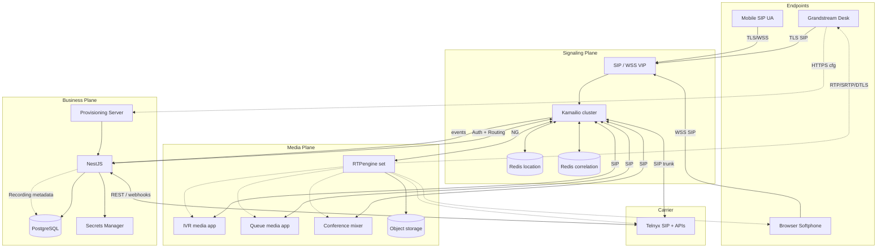
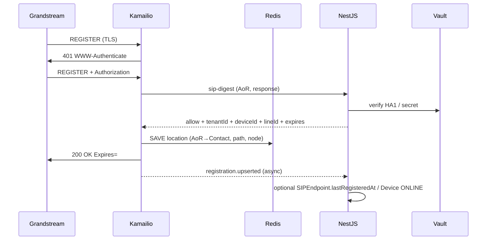
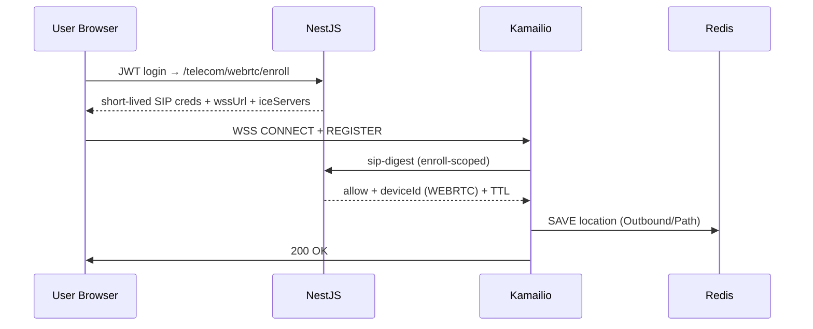
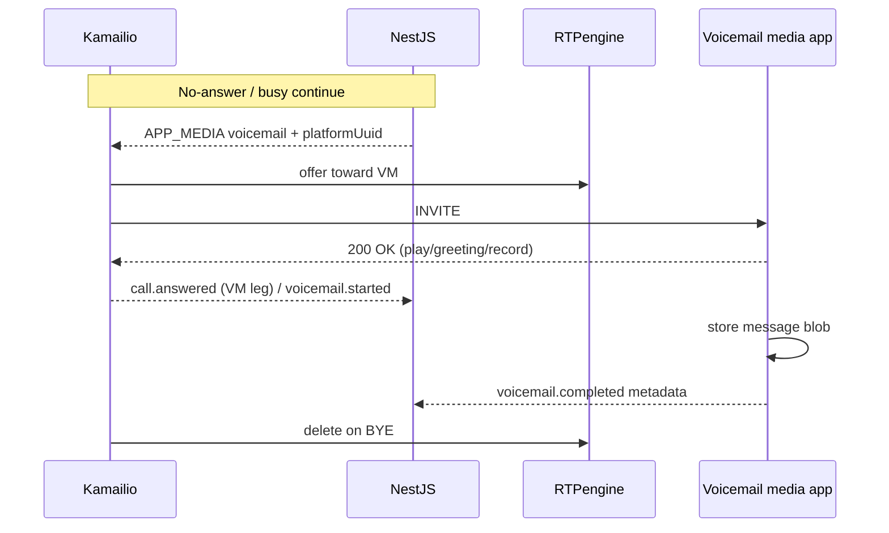
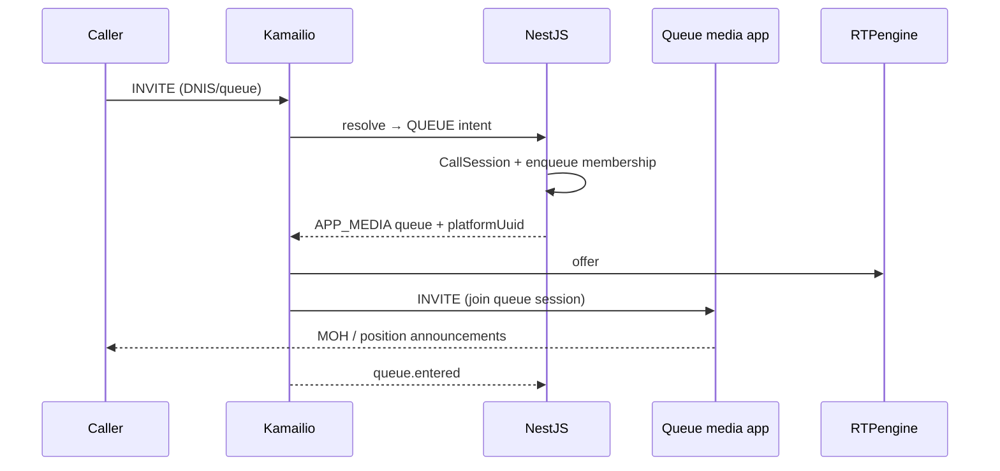
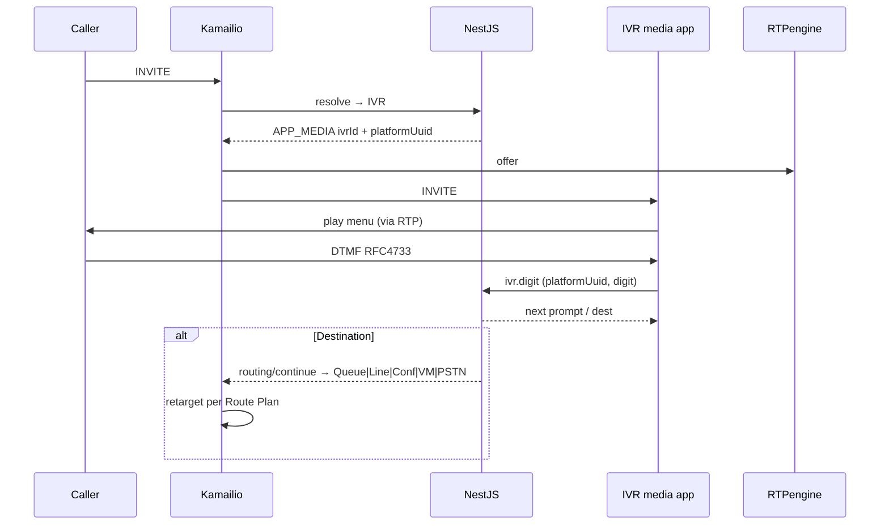
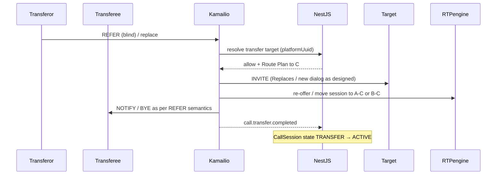
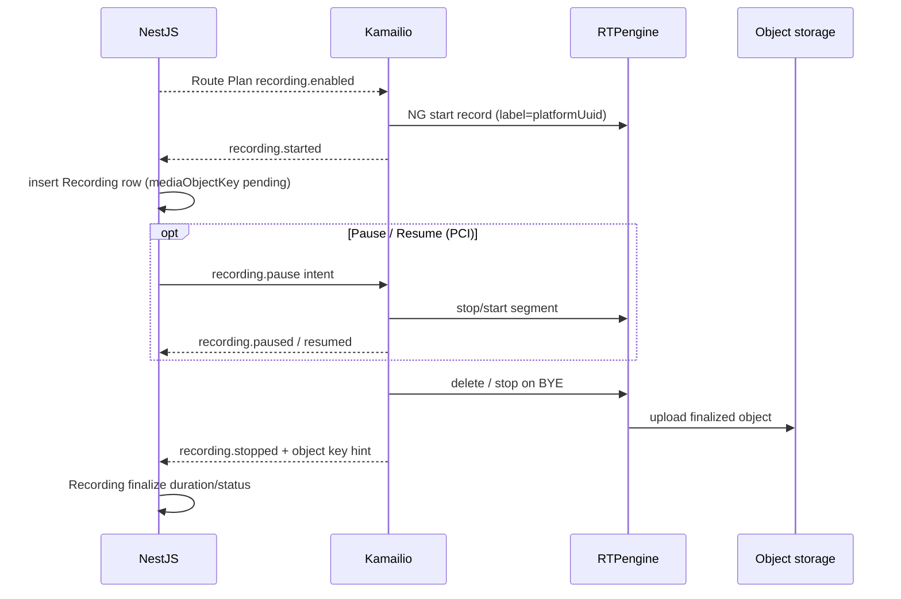

# VSP Phone v4 — Enterprise SIP Call Flows & Runtime Architecture

| Field | Value |
|-------|-------|
| **Document ID** | TEL-RT-001 |
| **Version** | 1.0.0 |
| **Status** | Architecture — Sprint 4.6 Design |
| **Last Updated** | 2026-07-08 |
| **Owner** | Telecom Architecture |
| **Location** | `docs/04-telecom/enterprise-sip-call-flows-runtime-architecture.md` |
| **Depends On** | ADR-001–004, ADR-007–012, ADR-014–017; TEL-KAM-002; TEL-RTP-001; TEL-CAR-001; TEL-WRTC-001; TEL-PROV-001; Frozen business domains |

---

## Purpose

This document is the **definitive end-to-end runtime architecture** for VSP Phone v4. It connects every frozen business and telecom design into complete call-processing flows with sequence diagrams, ownership validation, failure recovery, security, and observability.

Architecture and documentation only. No implementation code, Prisma changes, or ADR file edits (new ADRs are recommended where gaps remain).

**Frozen (do not redesign):** Identity, Telephony, Call Engine, Kamailio, RTPengine, Telnyx, WebRTC, Grandstream Provisioning.

**Invariant:** `platformUuid` is the only cross-layer correlation identifier. SIP Call-ID, dialog IDs, Contact bindings, SDP, ICE, DTLS, RTPengine session IDs, and Telnyx call IDs stay in the telecom layer (Redis / ops), never in the business Prisma schema.

---

## Table of Contents

1. [Executive Summary](#1-executive-summary)
2. [Runtime Component Diagram](#2-runtime-component-diagram)
3. [Runtime Contracts](#3-runtime-contracts)
4. [Registration Flows](#4-registration-flows)
5. [Internal Calling Flows](#5-internal-calling-flows)
6. [PSTN Flows](#6-pstn-flows)
7. [Queue Flows](#7-queue-flows)
8. [IVR Flows](#8-ivr-flows)
9. [Conference Flows](#9-conference-flows)
10. [Transfer Flows](#10-transfer-flows)
11. [Call Feature Flows](#11-call-feature-flows)
12. [Recording Flows](#12-recording-flows)
13. [WebRTC Flows](#13-webrtc-flows)
14. [Failure Scenarios](#14-failure-scenarios)
15. [Call Lifecycle Mapping](#15-call-lifecycle-mapping)
16. [Component Responsibility Matrix](#16-component-responsibility-matrix)
17. [Failure & Recovery Matrix](#17-failure--recovery-matrix)
18. [Security Validation](#18-security-validation)
19. [Observability Strategy](#19-observability-strategy)
20. [Enterprise Readiness Assessment](#20-enterprise-readiness-assessment)
21. [Final Freeze Recommendation](#21-final-freeze-recommendation)
22. [Recommended ADRs](#22-recommended-adrs)

---

## 1. Executive Summary

VSP Phone v4 runtime is a **three-plane enterprise UCaaS**:

| Plane | Owner | Runtime role |
|-------|-------|----------------|
| **Business** | NestJS + PostgreSQL | Policies, Route Plan, CallSession `platformUuid`, Queue/IVR/Conference decisions, Recording metadata, Presence |
| **Signaling** | Kamailio (+ Redis location/correlation) | REGISTER, INVITE, REFER, BYE, WSS, digest, carrier SIP, NG → RTPengine |
| **Media** | RTPengine (+ media apps) | RTP/SRTP/DTLS-SRTP, ICE, recording capture, MOH/IVR/conference mix |

```text
Endpoints (Desk / Browser / Mobile)
        │ SIP TLS | WSS
        ▼
   Kamailio VIP ──HTTPS──► NestJS (auth + Route Plan + events)
        │ NG
        ▼
   RTPengine ──RTP──► endpoints / Telnyx / IVR|Queue|Conf media apps
        │
        ▼
   Object storage (recording media) · NestJS Recording rows
```

**How layers meet:** On every new business call, NestJS allocates `CallSession.platformUuid` and returns a **Route Plan**. Kamailio executes SIP only; RTPengine executes media only; NestJS persists business state from async telecom events tagged with `platformUuid`.

This document proves that TEL-KAM-002, TEL-RTP-001, TEL-CAR-001, TEL-WRTC-001, and TEL-PROV-001 compose into one cohesive runtime suitable to freeze before Sprint 5 implementation.

---

## 2. Runtime Component Diagram



### Plane rules (non-negotiable)

1. NestJS never parses raw SIP or touches RTP bytes.  
2. Kamailio never writes CallSession rows directly to PostgreSQL.  
3. RTPengine never decides Route Plan targets.  
4. Provisioning never participates in live call dialogs.  
5. `platformUuid` is allocated by NestJS for business calls; Redis maps SIP Call-ID ↔ `platformUuid`.

---

## 3. Runtime Contracts

### 3.1 NestJS ↔ Kamailio (sync)

| API (conceptual) | When | Returns |
|------------------|------|---------|
| `POST /telecom/auth/sip-digest` | REGISTER / authenticated INVITE | allow/deny, tenantId, deviceId, lineId, expires policy |
| `POST /telecom/routing/resolve` | New INVITE / transfer target resolve | Route Plan + `platformUuid` + recording flags |
| `POST /telecom/routing/continue` | Queue timeout, IVR DTMF, overflow | Next Route Plan actions |
| `POST /telecom/features/{hold,transfer,dtmf,…}` | Mid-call feature intents (optional) | Allow + updated plan flags |

### 3.2 NestJS ← Kamailio / media apps (async events)

`registration.upserted`, `call.created`/`ringing`/`answered`/`held`/`transfer*`/`ended`, `recording.started`/`paused`/`resumed`/`stopped`, `queue.*`, `ivr.digit`, `conference.*` — all carry `platformUuid` + `tenantId`.

### 3.3 Route Plan (executor contract)

```text
platformUuid, tenantId, callIntent
actions[]: FORK | SERIAL | BRIDGE_CARRIER | APP_MEDIA | VOICEMAIL | REJECT
recording { enabled, direction, pauseAllowed }
rtp { flags, crypto preference }
timers { noAnswerSec, queueRingSec, ivrTimeoutSec }
```

Kamailio is a **deterministic executor**. If NestJS is down, fail closed (except documented emergency policy).

### 3.4 Per-flow validation legend

Each flow below is validated against:

| Dim | Question |
|-----|----------|
| **State** | Who holds wire / dialog / business state? |
| **Decision** | Who chooses destination / policy? |
| **SIP** | Who speaks SIP? |
| **Media** | Who relays media? |
| **Persistence** | Who writes durable business data? |
| **Retries** | Who retries which failure class? |

---

## 4. Registration Flows

### 4.1 Desk Phone REGISTER

**Precondition:** Device provisioned ([TEL-PROV-001](./grandstream-provisioning-architecture.md)); SIP secret in vault; AoR on `SIPEndpoint`.



| Dim | Owner |
|-----|-------|
| State | Redis location (wire); Device status sync (business) |
| Decision | NestJS digest allow + expires policy |
| SIP | Kamailio |
| Media | N/A |
| Persistence | NestJS (optional lastRegisteredAt); never Contact IP as source of truth |
| Retries | Phone re-REGISTER on fail; Kamailio does not invent auth |

**Security:** Digest ≠ User password; TLS; rate-limit REGISTER storms; realm/tenant bind.  
**platformUuid:** Not allocated on REGISTER.  
**HA:** Shared location so any Kamailio node can serve next INVITE.  
**Observability:** `register_success_total{ua=desk}`, auth fail counters, UA/firmware tags.

### 4.2 Browser REGISTER (WSS)



| Dim | Owner |
|-----|-------|
| Decision | NestJS enroll + digest |
| SIP | Kamailio WSS |
| Media | N/A until INVITE |
| Retries | Browser re-enroll on enroll expiry; re-REGISTER on WSS drop |

**Security:** WSS; enroll TTL; device binding; strip untrusted client headers ([TEL-WRTC-001](./webrtc-signaling-architecture.md)).

### 4.3 Registration refresh

Phone/browser sends REGISTER before `Expires`. Kamailio refreshes Redis TTL; optional sparse NestJS event (throttled). No new `platformUuid`. Failures → phone retries with backoff; after N failures Device may mark OFFLINE via missing refresh reconcile job.

### 4.4 Registration expiry

Location TTL elapses → Contact removed. NestJS reconcile / explicit expiry event → `Device`/`SIPEndpoint` UNREGISTERED/OFFLINE. In-flight calls use dialog Record-Route (not location) until BYE.

### 4.5 Device reboot

1. Local SIP stack drops (contacts expire or unregister).  
2. HTTPS provision check (Grandstream) if configured.  
3. Fresh REGISTER as §4.1.  
4. Early dialogs may fail → far end cancel; NestJS ends CallSession if legs die.

### 4.6 Authentication failure

Bad digest → NestJS deny → Kamailio `403`/`401`. No location write. Metrics: `sip_auth_fail_total`. After threshold: temporary AoR throttle. Secrets rotate only via provisioning/enroll — not mid-REGISTER invent.

---

## 5. Internal Calling Flows

### 5.1 Extension → Extension

```mermaid
sequenceDiagram
  participant A as Caller Device
  participant K as Kamailio
  participant N as NestJS
  participant C as Redis corr
  participant RTP as RTPengine
  participant B as Callee Device(s)

  A->>K: INVITE (ext / AoR)
  K->>N: routing/resolve
  N->>N: CallPolicy + Extension→Line; Create CallSession platformUuid=RINGING
  N-->>K: Route Plan FORK/SERIAL + recording flags
  K->>C: map Call-ID ↔ platformUuid
  K->>RTP: offer
  K->>B: INVITE (+ X-VSP-Platform-UUID)
  B-->>K: 180 Ringing
  K-->>A: 180
  K-->>N: call.ringing
  B-->>K: 200 OK
  K->>RTP: answer
  K-->>A: 200 OK
  K-->>N: call.answered → ACTIVE
  Note over A,B: Media A ↔ RTP ↔ B
  A->>K: BYE
  K->>RTP: delete
  K-->>N: call.ended (platformUuid)
```

| Dim | Owner |
|-----|-------|
| State | Dialog: Kamailio; CallSession: NestJS; Media session: RTPengine |
| Decision | NestJS Extension/Line/CallPolicy |
| SIP / Media | Kamailio / RTPengine |
| Persistence | NestJS CallSession + participants |
| Retries | Kamailio transaction retransmits; NestJS does not retry INVITE |

**platformUuid:** Created on resolve; on every SIP event and media/recording key.

### 5.2 Multiple registered devices

NestJS returns FORK to all Digests of Line Devices that are REGISTERED. Kamailio parallel-forks. First 200 OK wins → CANCEL others. CallParticipants may record which Device answered. Presence may show BUSY/ON_CALL for Line.

### 5.3 Busy

Callee/device signals 486 or NestJS Presence/CallPolicy DND → Route Plan `REJECT` or next action (VM). No answer media if rejected early. CallSession → ENDED with busy cause class.

### 5.4 No answer

Timer from Route Plan `noAnswerSec` → CANCEL → NestJS `routing/continue` (forward / VM / end). Kamailio executes returned next action.

### 5.5 Voicemail fallback



Voicemail **media** owned by VM app + RTPengine; **metadata** NestJS `Voicemail`; SIP dialog Kamailio.

---

## 6. PSTN Flows

### 6.1 Outbound PSTN

Per [TEL-CAR-001](./telnyx-carrier-integration-architecture.md): Device INVITE → NestJS creates `platformUuid` → Carrier Adapter trunk hint → Kamailio dispatcher INVITE to Telnyx → RTPengine offers.

| Dim | Owner |
|-----|-------|
| Decision | NestJS CallPolicy + CallerID + Adapter trunk |
| SIP | Kamailio ↔ Telnyx |
| Media | Device ↔ RTPengine ↔ Telnyx RTP |
| Retries | Dispatcher secondary set on 5xx/timeout; Adapter does not invent SIP retries |

**Security:** CLI must be tenant-owned DID; Telnyx IP/token auth.

### 6.2 Inbound PSTN

Telnyx INVITE → Kamailio ACL → NestJS DNIS resolve → Line/Queue/IVR/Conf/VM Route Plan → same media anchoring.

**platformUuid:** Allocated on NestJS resolve before forking to users/apps. Redis also maps Telnyx call id when present.

### 6.3 Anonymous caller

Telnyx may deliver privacy/`Anonymous`. NestJS stores presentation as received; CallPolicy may reject anonymous inbound. Screen/UI shows restricted; SIP headers not persisted as Protocol columns.

### 6.4 Caller ID

Outbound: NestJS `CallerID` + Adapter validates CLI against trunk inventory. Kamailio sets From/PAI per Route Plan (not client-spoofable). Inbound: DNIS for routing; CLI for display/CDR fields on CallSession (business), not raw SIP dump.

### 6.5 Emergency calling

```text
Device dials emergency digit map
  → NestJS recognizes emergency intent (Site emergencyAddress)
  → Route Plan: prefer on-net emergency trunk; fail-open policy per ADR
  → Adapter ensures DID emergency endpoint binding (Telnyx)
  → Kamailio priority route; logging flagged PII-careful
```

Media still via RTPengine. Emergency may allow limited route if NestJS partially unavailable — **only** if explicitly Accepted in a future emergency ADR; default remain fail-closed for normal calls.

### 6.6 Carrier failover

Dispatcher OPTIONS probe; on INVITE failure → backup Telnyx set / alternate Carrier Adapter hint via `routing/continue`. Correlation keeps same `platformUuid`. CDR records carrier attempt metadata in telecom ops / event payload, not SIP Call-ID columns.

---

## 7. Queue Flows

Media pattern: Caller ↔ RTPengine ↔ Queue media app (MOH); agents are SIP endpoints.

### 7.1 Enter queue



### 7.2 Agent ringing

NestJS Queue strategy (RR/least-recent/linear — ADR-004) ranks available agents (Presence ≠ OFFLINE/DND/ON_CALL as configured). `routing/continue` → FORK/SERIAL to agent Devices. Agent 180/200 → stop MOH bridge; caller–agent media via RTPengine.

### 7.3 Agent timeout

Ring timer → CANCEL agent → NestJS returns next agent or stay in queue. Caller remains on Queue media app dialog/session keyed by `platformUuid`.

### 7.4 Overflow

Max wait / max size / no agents → NestJS overflow dest (VM, alternate Queue, Line, external PSTN). New Route Plan actions; same `platformUuid` unless product defines new session (default: **same** CallSession).

### 7.5 Queue recording

RecordingPolicy / Queue config → Route Plan `recording.enabled` while in queue and/or after answer. RTPengine records mix; NestJS `Recording` rows. Pause rules for PCI if configured (§12).

### 7.6 Agent logout

Admin/Presence → agent removed from eligible set. NestJS stops offering agent; in-flight agent call completes normally. Presence event audited; not a SIP unregister unless Device also unregisters.

| Dim | Owner |
|-----|-------|
| State | Queue membership: NestJS; MOH dialog: Kamailio+app; media: RTPengine |
| Decision | NestJS strategy + Presence |
| Retries | Next agent from NestJS; Kamailio does not invent agent order |

---

## 8. IVR Flows



### 8.1 DTMF navigation

IVR app detects RFC 4733; NestJS owns menu graph. RTPengine is pass-through only ([TEL-RTP-001](./rtpengine-architecture.md)).

### 8.2 Destinations

| Digit outcome | Route Plan action |
|---------------|-------------------|
| Queue | APP_MEDIA / FORK queue enter (§7) |
| Line | FORK Line devices (§5) |
| Conference | APP_MEDIA conference (§9) |
| Voicemail | APP_MEDIA voicemail (§5.5) |

### 8.3 Invalid input

NestJS returns `reprompt` with invalid-count; after N → timeout path / operator / hangup. SIP: INFO not required if in-band DTMF to media app.

### 8.4 Timeout

`ivrTimeoutSec` → NestJS default action (often operator Queue or BYE). Kamailio executes continue plan.

| Dim | Owner |
|-----|-------|
| Decision | NestJS IVR definition |
| SIP | Kamailio |
| Media | RTPengine ↔ IVR app |
| Persistence | NestJS IVR session breadcrumbs optional on CallSession events |

---

## 9. Conference Flows

Conference mixer is a SIP media application (or FS/mixer fleet) selected by NestJS.

### 9.1 Host joins

```text
Host INVITE → NestJS CONFERENCE intent → APP_MEDIA confUri
Kamailio INVITE mixer; RTPengine anchors; NestJS ConferenceParticipant HOST
```

### 9.2 Participant joins

Same `conferenceId` business object; each leg may have own SIP Call-ID mapped to **shared or per-leg** `platformUuid` policy:

- **Recommended:** one CallSession/`platformUuid` per conference *instance* with participants as CallParticipants **or** per-leg CallSessions linked by `conferenceId` (choose in ADR-049). Until ADR: treat NestJS `Conference` as business aggregate; telecom Redis maps each SIP Call-ID → `conferenceId` + optional parent `platformUuid`.

### 9.3 Leave

BYE from participant → mixer drops leg; RTPengine delete for that tag; NestJS participant LEFT. Last participant / host end policy ends Conference.

### 9.4 Recording

Route Plan / Conference policy → RTPengine record conference mix (and optional per-leg). Metadata `Recording` with `conferenceId` + correlation ids.

### 9.5 Moderator controls

Mute participant, lock, kick: NestJS Conference API → media app control plane (WS/HTTP) **and/or** SIP INFO — **not** Prisma SIP state. Kamailio may relay if using SIP REC/controls; preferred: NestJS → mixer API.

| Dim | Owner |
|-----|-------|
| Decision | NestJS Conference ACL |
| Media mix | Conference app + RTPengine |
| SIP | Kamailio |

---

## 10. Transfer Flows

### 10.1 Blind transfer



SIP Call-ID may change; **Redis remaps new Call-ID → same platformUuid** ([TEL-KAM-002](./kamailio-telecom-integration-architecture.md)).

### 10.2 Attended transfer

Transferor places B on hold (§11); establishes consultation dialog to C (may allocate child correlation or reuse plan); on REFER with Replaces, Kamailio bridges B–C; NestJS records attended transfer event.

### 10.3 Transfer failure

Target 486/408/403 → NestJS deny or SIP failure → NOTIFY sipfrag failure → restore prior dialog if intact; CallSession remains ACTIVE with prior parties; audit `transfer.failed`.

### 10.4 Transfer cancel

Transferor CANCEL/REFER cancel before completion → teardown consultation; resume B; NestJS `transfer.cancelled`.

| Dim | Owner |
|-----|-------|
| Decision | NestJS CallPolicy (can transfer? destinations) |
| SIP REFER | Kamailio |
| Media move | RTPengine (hash prefer platformUuid) |
| Persistence | NestJS state machine |
| Retries | No blind auto-retry loop; user re-initiates |

---

## 11. Call Feature Flows

### 11.1 Hold / Resume

Endpoint INVITE hold SDP (a=sendonly/inactive) → Kamailio → RTPengine re-offer → NestJS `call.held` / CallSession HOLD. Resume: sendrecv → ACTIVE. Optional MOH from Queue/feature media app when policy requires network MOH.

### 11.2 Mute

| Mute type | Path |
|-----------|------|
| Local mic mute | Endpoint only; no NestJS required |
| Server mute (moderator/compliance) | NestJS → mixer/RTPengine direction flags via Kamailio NG |

### 11.3 DTMF

RFC 4733 through RTPengine to peer or media app; SIP INFO optional. IVR uses §8. NestJS receives digits only via media-app events, not from Kamailio packet inspection.

### 11.4 Call waiting

Second INVITE to busy Device → NestJS CallPolicy: reject, offer waiting, or fork other Devices. Endpoint-local call-waiting UI supported; platform correlation: second CallSession/`platformUuid` for waiting call.

### 11.5 Shared Line Appearance (SLA)

**Status:** Future per [ADR-011](../ADR/ADR-011-grandstream-provisioning.md). Runtime placeholder: NestJS Line appearance group → FORK invite pattern + phone template keys; **not required for Sprint 5 MVP**. Documented for cohesion; implement behind ADR-050.

### 11.6 BLF

**Status:** Future (ADR-011). Runtime placeholder: presence SUBSCRIBE/NOTIFY from Kamailio presence or NestJS-fed; does not alter INVITE ownership.

### 11.7 Presence

NestJS `Presence` (Line-owned) + Device signals. Sources: registration, call state events, user override. Consumers: Queue ranking, directory, FORK eligibility. SIP presence network optional; business Presence remains NestJS truth for routing.

### 11.8 Paging / Intercom

NestJS feature codes → Route Plan FORK with auto-answer headers (`Answer-Mode` / vendor auto-answer) where devices support; media via RTPengine; one-way codec preference possible. Failures: fall back to normal ring.

---

## 12. Recording Flows



| Op | Owner |
|----|-------|
| Start/Stop policy | NestJS RecordingPolicy / Queue/Conf |
| NG commands | Kamailio |
| Capture / file | RTPengine → OSS |
| Metadata | NestJS `Recording` |
| Retries | Uploader retry to OSS; NestJS reconcile missing objects |

**platformUuid:** In NG label, object key prefix, all events. Multiple segments allowed (1:N recordings — ADR-004 / TEL-RTP-001).

---

## 13. WebRTC Flows

### 13.1 Browser ↔ Browser

Both UAs WSS REGISTER; INVITE via Kamailio; media DTLS-SRTP ↔ RTPengine ↔ DTLS-SRTP; ICE force-relay ([TEL-WRTC-001](./webrtc-signaling-architecture.md), [TEL-RTP-001](./rtpengine-architecture.md)). NestJS Route Plan identical to internal call.

### 13.2 Browser ↔ Desk Phone

DTLS-SRTP ↔ RTPengine ↔ RTP/SRTP. Signaling both via Kamailio (WSS vs TLS).

### 13.3 Browser ↔ PSTN

DTLS-SRTP ↔ RTPengine ↔ Telnyx RTP; NestJS+Adapter as §6.

### 13.4 ICE restart

Browser triggers restart; RTPengine NG supports candidate refresh; SIP re-INVITE may occur. **Same platformUuid**; media may briefly glitch. No PeerConnection IDs in Prisma.

### 13.5 Session recovery

| Event | Behavior |
|-------|----------|
| WSS drop | Reconnect + re-REGISTER; dialogs may survive if Kamailio + Path intact |
| Enroll expiry | Re-enroll → new SIP creds → REGISTER |
| RTPengine node loss | Media drop; dialog may send BYE; CallSession ENDED — SLA documented |
| Full recovery of media without renegotiation | Not guaranteed; prefer clean re-invite |

---

## 14. Failure Scenarios

### 14.1 Kamailio restart

VIP moves; dialogs on dead node fail unless dialog replication (phase B). Shared location preserves REGISTER. Active calls on lost node: BYE/timeout → NestJS ends via missing heartbeat / peer BYE. New calls attach to healthy nodes.

### 14.2 RTPengine node failure

Dispatcher removes node; **existing** media sessions on that node fail (delete orphan); NestJS recording finalize best-effort. New offers hash to healthy nodes. Prefer `platformUuid` affinity when alive.

### 14.3 Telnyx outage

OPTIONS fail → backup dispatcher / alternate carrier hint. Inbound fails at PSTN until recovered. NestJS marks carrier degraded; user-facing fast-fail tone/announcement via media app optional.

### 14.4 Redis unavailable

| Function | Behavior |
|----------|----------|
| Location | REGISTER/INVITE degrade — **fail closed** for new calls if no location |
| Correlation | Prefer local dialog vars; rebuild risk on transfer — shed load / fail |
| Auth cache | Fall back to NestJS (increased latency) |

Redis is HA-clustered in production (ADR-015/017); single-node Redis is non-enterprise.

### 14.5 Network partition

Split Kamailio↔NestJS: fail closed new INVITEs. Split Kamailio↔RTPengine: reject offers. Partition endpoints: REGISTER refresh fails → OFFLINE. Prefer consistency over split-brain Route Plans.

### 14.6 Device reconnect

See §4.5 / refresh. Early media calls may die; user redials (new `platformUuid`).

### 14.7 Browser reconnect

See §13.5. Do not persist SDP in PostgreSQL for resurrection.

---

## 15. Call Lifecycle Mapping

Maps [ADR-004](../ADR/ADR-004-call-architecture.md) states to runtime owners.

| Business state | Trigger | Signaling | Media | Persistence |
|----------------|---------|-----------|-------|-------------|
| Created | NestJS resolve allocates platformUuid | Pre-dialog / early | offer may start | CallSession insert |
| Dialing / Ringing | INVITE / 18x | Kamailio txs | early media optional | events |
| Answered / Active | 200 OK ACK | confirmed dialog | bidirectional RTP | CallSession ACTIVE |
| Hold | hold SDP / feature | re-INVITE | sendonly + optional MOH | HOLD |
| Transfer | REFER / replaces | Kamailio | RTPengine remux | TRANSFER → ACTIVE |
| Park | feature (future detail) | park app | MOH | PARK |
| Ended | BYE / cancel / fail | teardown | delete | ENDED |
| Archived | retention job | — | — | ARCHIVED |

**Queue / IVR / Conference** are `callIntent` overlays while CallSession advances through the same coarse states; fine-grained queue position lives in NestJS queue runtime, not SIP.

---

## 16. Component Responsibility Matrix

| Concern | Grandstream | Browser | NestJS | Kamailio | RTPengine | Media apps | Telnyx | Redis | PostgreSQL | Vault |
|---------|-------------|---------|--------|----------|-----------|------------|--------|-------|------------|-------|
| Provision cfg | Pull | Enroll API | Orchestrate | — | — | — | — | — | Device row | SIP secrets |
| REGISTER | Yes | WSS | Digest decision | Execute | — | — | — | Location | lastReg sync | HA1 |
| Route decision | — | — | **Own** | Execute plan | — | — | Trunk hint | Cache | Policies | — |
| SIP dialog | UA | UA | — | **Own** | — | UA | UA | Corr map | — | — |
| Media bytes | RTP | DTLS | — | NG only | **Own** | RTP | RTP | — | — | — |
| CallSession | — | — | **Own** | Events | — | Events | Webhooks | — | **Own** | — |
| Recording file | — | — | Metadata | NG start | **File** | — | — | — | Recording row | — |
| Queue strategy | — | — | **Own** | Fork | Anchor | MOH | — | — | Queue defs | — |
| IVR graph | — | — | **Own** | Bridge | Anchor | Play/collect | — | — | IVR defs | — |
| platformUuid | Header opaque | Header opaque | **Allocate** | Propagate | Label | Tag events | Map if id | Map Call-ID | CallSession | — |
| Retries (SIP) | UA | UA | — | Tx timers | — | — | — | — | — | — |
| Retries (policy continue) | — | — | **Own** | Execute | — | — | Dispatcher | — | — | — |
| Retries (upload) | — | — | Reconcile | — | Uploader | — | REST backoff | — | — | — |

---

## 17. Failure & Recovery Matrix

| Failure | User impact | Auto recovery | Manual / ops | Data integrity |
|---------|-------------|---------------|--------------|----------------|
| Kamailio node loss | Calls on node drop | VIP + shared location | Drain node | End CallSessions via events/timeout |
| RTPengine node loss | Media drop | New calls elsewhere | Evacuate; check recordings | Segments may truncate — mark FAILED |
| NestJS outage | New calls fail closed | Restart / HA API | Emergency ADR only | No orphan business UUIDs invented by Kamailio |
| Redis outage | Register/route break | Redis HA failover | Freeze traffic | Avoid split-brain location |
| Telnyx SIP outage | PSTN fail | Dispatcher failover | Carrier status page | Same platformUuid across attempts |
| Telnyx API outage | Provisioning/DID lag | Retry queue | — | Calls may still SIP if trunk up |
| Vault outage | Auth fail | Cache short TTL only | Restore vault | No plaintext fallback in logs |
| Browser WSS drop | Softphone disconnect | Auto re-REGISTER | — | New media after renegotiate |
| Desk reboot | Temporary offline | Auto REGISTER | Re-provision if cfg lost | — |
| Network partition K↔N | No new calls | Heal; reject dirty plans | — | Fail closed |

---

## 18. Security Validation

| Control | Where enforced |
|---------|----------------|
| **Authentication (API)** | NestJS JWT ([ADR-007](../ADR/ADR-007-authentication-authorization.md)) |
| **Authentication (SIP)** | Digest via NestJS/vault; enroll TTL for WebRTC |
| **Authentication (carrier)** | Telnyx IP ACL + token/mTLS as configured |
| **Authorization (call)** | NestJS CallPolicy / TenantFeature / DID ownership in Route Plan |
| **TLS** | SIP TLS to desk; HTTPS APIs; provisioning HTTPS |
| **WSS** | Browser signaling only to Kamailio VIP |
| **DTLS-SRTP** | Browser media via RTPengine |
| **SRTP (desk)** | Preferred toward phones when provisioned |
| **Tenant isolation** | AoR/realm bind; Route Plan tenant checks; Redis key prefix; no client-trusted tenant headers |
| **Secret handling** | Vault for SIP & trunk secrets; never User password; never log Authorization digests |
| **Rate limiting** | Pike/flood on Kamailio; API rate limits; REGISTER/INVITE per AoR; provisioning MAC limits |
| **Topology hiding** | Kamailio hides internal Via where configured |
| **Header trust** | Strip inbound `X-VSP-*` from untrusted UAs; only Kamailio injects platformUuid after NestJS allocate |

---

## 19. Observability Strategy

### 19.1 Correlation

Every call log/metric/trace after resolve includes:

`tenantId`, `platformUuid`, (telecom-only) `sipCallId`, `rtpSessionId?`, `legId?`

Joins across Kibana/Grafana/Tempo **must** prefer `platformUuid`.

### 19.2 Per-flow signals (summary)

| Flow family | Logs | Metrics | Traces | Audit |
|-------------|------|---------|--------|-------|
| REGISTER | AoR, deviceId, result | register_ok/fail, auth_fail | auth span | credential rotate |
| Internal/PSTN | invite in/out, cause | asr, acd, NER, PDD | resolve→invite→answer | CallStarted/Ended |
| Queue | enqueue, offer agent | wait time, abandon | continue spans | QueueJoined/Left |
| IVR | digit, node id | timeout/invalid rates | digit→continue | — |
| Conference | join/leave | participants gauge | — | moderator actions |
| Transfer | refer outcome | transfer_success | transfer span | transfer events |
| Recording | start/stop/key | recording_fail | — | RecordingStarted |
| WebRTC | enroll, WSS, ICE | enroll_fail, ice_fail | enroll+call | — |
| Failures | component down | health, dispatcher | — | config changes |

### 19.3 Tracing shape

```text
NestJS routing.resolve (platformUuid)
  └─ Kamailio invite.execute
       ├─ RTPengine offer/answer
       └─ child legs / carrier / media app
```

### 19.4 Audit

Business audits via ADR-014 domain events plus telecom security audits (auth lockouts, emergency calls, recording access). SIP RRs are **not** the compliance archive — CallSession + Recording + audit log are.

---

## 20. Enterprise Readiness Assessment

| Dimension | Score (0–10) | Notes |
|-----------|--------------|-------|
| Cross-architecture cohesion | 9.5 | All Sprint 4.x docs compose cleanly |
| platformUuid discipline | 9.5 | Explicit remap on transfer / ICE |
| Plane separation | 9.5 | Business / SIP / media clear |
| Registration completeness | 9 | Desk + WSS + expiry/reboot |
| Internal + PSTN flows | 9.5 | Aligned KAM/CAR/RTP |
| Queue / IVR / Conf | 8.5 | Media-app plane assumed; ADR-049 for Conf ID model |
| Transfers / hold | 9 | REFER + RTPengine remap |
| Features (SLA/BLF) | 7.5 | Correctly deferred; placeholders only |
| Failure & HA | 8.5 | Fail-closed NestJS; Redis HA required |
| Security | 9 | Digest/JWT/TLS/WSS/DTLS + tenant checks |
| Observability | 9 | Unified correlation story |
| Implementation readiness | 8.5 | Needs ADRs 019/021/025/049 before code |
| **Overall** | **9.0** | Ready to freeze Sprint 4.6 as runtime baseline |

---

## 21. Final Freeze Recommendation

**Freeze TEL-RT-001 as the Sprint 4.6 runtime architecture and the final architecture artifact before Sprint 5 implementation.**

### Lock these decisions

1. Three planes: NestJS business, Kamailio signaling, RTPengine (+ media apps) media.  
2. `platformUuid` only cross-layer ID; Redis maps SIP ↔ platform; **no SIP protocol state in Prisma**.  
3. NestJS allocates CallSession + Route Plan; Kamailio executes; fail closed if NestJS down (emergency exception only via future ADR).  
4. All productive media anchored through RTPengine.  
5. PSTN solely via Telnyx SIP trunk + Carrier Adapter (TEL-CAR-001).  
6. WebRTC = SIP over WSS + DTLS-SRTP (TEL-WRTC-001).  
7. Desk phones = provisioning then REGISTER (TEL-PROV-001) — provisioning out of call path.  
8. Queue/IVR/Conference use SIP media applications driven by NestJS continue APIs.  
9. Transfers remap correlation; media hash prefers `platformUuid`.  
10. SLA/BLF remain future; do not block Sprint 5 core voice.  
11. No redesign of frozen Sprint 1–4.5 architectures.

### Sprint 5 implementation gate

Do not start production dialplan coding until **ADR-019** (correlation header/Redis), **ADR-021** (DNIS), **ADR-025** (AoR/realm), and **ADR-049** (conference correlation) are Accepted — plus prior gates ADR-042–044 for desk rollouts and ADR-038–039 for softphone.

### Non-goals of this freeze

- Choosing FreeSWITCH vs custom mixer vendor  
- Writing `kamailio.cfg` / NestJS modules  
- Prisma migrations  
- Full BLF/SLA product behavior  

---

## 22. Recommended ADRs

| ADR | Title | Why before Sprint 5 |
|-----|-------|---------------------|
| **ADR-019** | Telecom Correlation (`platformUuid` header + Redis maps) | Wire format freeze |
| **ADR-021** | Inbound DNIS Routing | PSTN/IVR/Queue destinations |
| **ADR-025** | SIP Identity & Realm | Desk + WebRTC AoR |
| **ADR-024** | Kamailio ↔ NestJS API Contracts | Auth/resolve/continue schemas |
| **ADR-029** | Recording Capture & Object Keys | NG method + OSS layout |
| **ADR-049** | Conference Correlation Model | One vs many platformUuid per conference |
| **ADR-050** | SLA / BLF Runtime (future) | When product prioritizes |
| **ADR-051** | Emergency Calling Fail-Open Policy | Whether NestJS outage allows limited E911 |
| **ADR-030** | Media Crypto & ICE Policy | Confirm if not Accepted |

---

## Related Documents

| Document | Role |
|----------|------|
| [TEL-KAM-002](./kamailio-telecom-integration-architecture.md) | SIP edge |
| [TEL-RTP-001](./rtpengine-architecture.md) | Media |
| [TEL-CAR-001](./telnyx-carrier-integration-architecture.md) | PSTN |
| [TEL-WRTC-001](./webrtc-signaling-architecture.md) | Browser |
| [TEL-PROV-001](./grandstream-provisioning-architecture.md) | Desk onboard |
| [ADR-004](../ADR/ADR-004-call-architecture.md) | Call states / types |
| [ADR-014](../ADR/ADR-014-event-driven-architecture.md) | Domain events |

---

## Revision History

| Version | Date | Changes |
|---------|------|---------|
| 1.0.0 | 2026-07-08 | Sprint 4.6 enterprise SIP call flows & runtime architecture |
