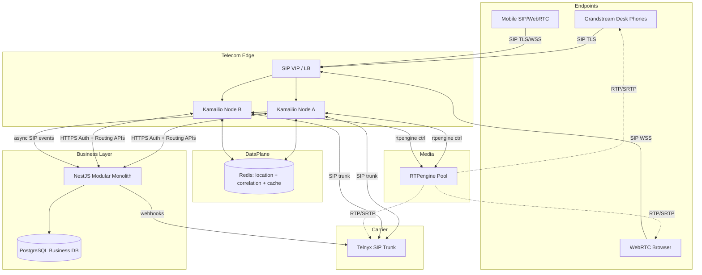
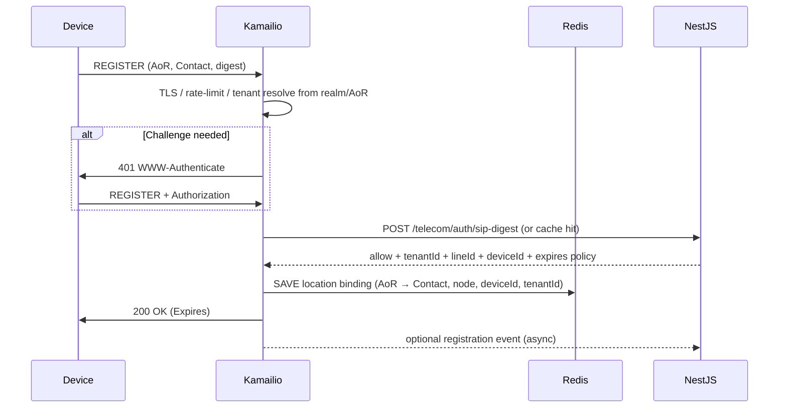
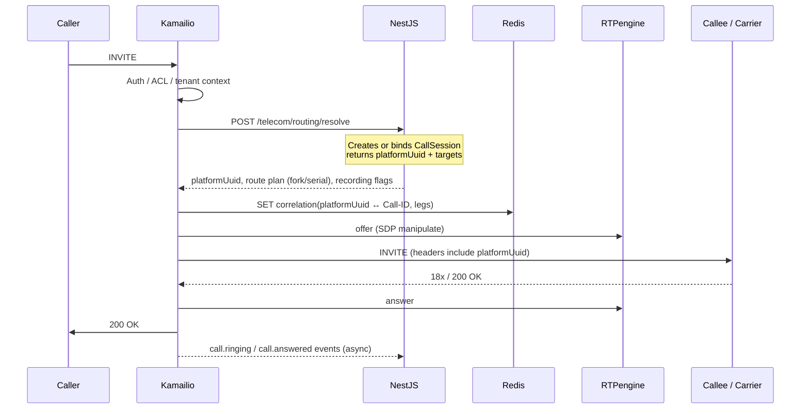
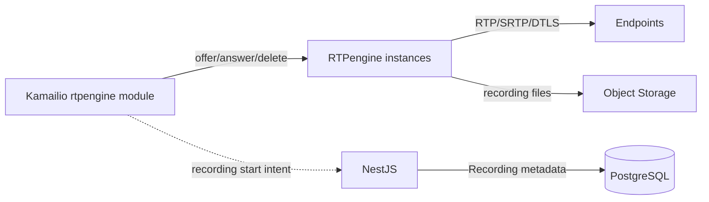
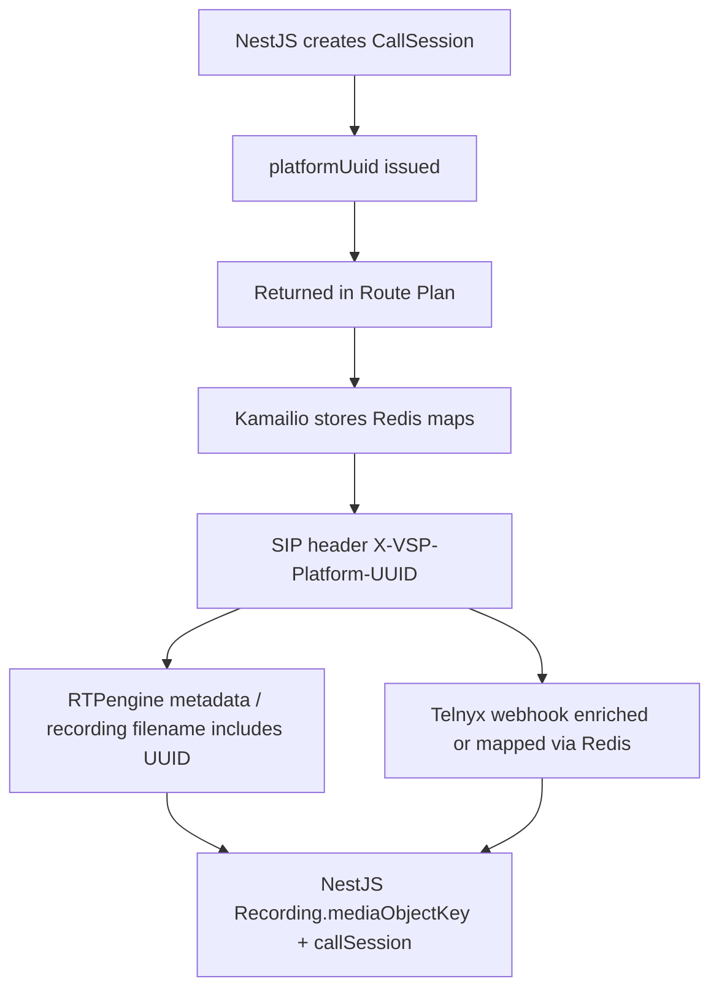

# VSP Phone v4 — Kamailio Telecom Integration Architecture

| Field | Value |
|-------|-------|
| **Document ID** | TEL-KAM-002 |
| **Version** | 1.0.0 |
| **Status** | Architecture — Sprint 4 Design |
| **Last Updated** | 2026-07-08 |
| **Owner** | Telecom Architecture |
| **Location** | `docs/04-telecom/kamailio-telecom-integration-architecture.md` |
| **Depends On** | ADR-001, ADR-003, ADR-004, ADR-007, ADR-008, ADR-009, ADR-010, ADR-012, ADR-016, ADR-017; Frozen Call Engine |

---

## Purpose

This document defines the **enterprise Kamailio architecture** for the VSP Phone v4 Telecom Integration Layer.

It is an architecture exercise only. It does **not** include `kamailio.cfg`, dialplan scripts, NestJS code, Redis schemas as DDL, or Prisma changes.

**Frozen domains (do not redesign):** Identity, Telephony, Call Engine.

**Cross-layer correlation key:** `platformUuid` only.

**Hard boundary:** SIP protocol identifiers (Call-ID, Dialog IDs, Branch, Via, RTPengine session IDs, SDP, ICE, DTLS, carrier SIP tags) must **not** enter the business Prisma schema. They live in the Telecom Integration Layer (Redis correlation store and/or telecom operational tables outside the frozen business models).

---

## Table of Contents

1. [Executive Summary](#1-executive-summary)
2. [Kamailio Responsibilities](#2-kamailio-responsibilities)
3. [Component Interaction Diagram](#3-component-interaction-diagram)
4. [Request Flow (REGISTER, INVITE, BYE)](#4-request-flow-register-invite-bye)
5. [Authentication Architecture](#5-authentication-architecture)
6. [Registration Architecture](#6-registration-architecture)
7. [SIP Routing Architecture](#7-sip-routing-architecture)
8. [Tenant Isolation Strategy](#8-tenant-isolation-strategy)
9. [Media Control Architecture](#9-media-control-architecture)
10. [High Availability Design](#10-high-availability-design)
11. [Security Architecture](#11-security-architecture)
12. [Observability Architecture](#12-observability-architecture)
13. [Failure Recovery Strategy](#13-failure-recovery-strategy)
14. [Telecom Correlation Strategy (`platformUuid`)](#14-telecom-correlation-strategy-platformuuid)
15. [Recommended ADRs](#15-recommended-adrs)
16. [Risks and Trade-offs](#16-risks-and-trade-offs)
17. [Enterprise Readiness Assessment](#17-enterprise-readiness-assessment)
18. [Final Architecture Recommendation](#18-final-architecture-recommendation)

---

## 1. Executive Summary

Kamailio is the **SIP signaling edge and softswitch control plane** for VSP Phone v4. It terminates TLS/WSS, authenticates endpoints, holds registrations, routes INVITEs for all approved call patterns, drives RTPengine for media anchoring, and interconnects carriers (initially Telnyx) via SIP trunks.

**NestJS owns business truth** (Tenant, Line, Device, CallSession, Queue, IVR, Conference, Recording metadata). **Kamailio owns SIP protocol truth** (dialogs, transactions, registrations at the wire). **RTPengine owns RTP/SRTP**. These layers communicate through explicit integration contracts — never by embedding SIP state in Prisma business models.

The architecture is:

| Pattern | Choice |
|---------|--------|
| Edge role | Kamailio as SIP SBC/edge proxy + registrar |
| Scaling | Horizontally scaled Kamailio set behind SIP VIP / dispatcher |
| Registration DB | Shared location store (Redis preferred for hot path; PostgreSQL optional persistence) |
| Business integration | HTTP/gRPC **Routing & Auth APIs** from NestJS (sync for decisions) + async events for CallSession lifecycle |
| Correlation | NestJS generates `platformUuid` (or Kamailio requests allocation); propagated in SIP custom headers and Redis correlation maps |
| Carrier | Telnyx SIP trunk first; Carrier Adapter + dispatcher sets for multi-carrier |
| Media | Kamailio `rtpengine` module; always anchor media for NAT/WebRTC/recording |
| HA | Active-active Kamailio; DMQ for shared tables; dispatcher OPTIONS probing; RTPengine multi-instance |

This matches enterprise UCaaS patterns used by platforms built on Kamailio/OpenSIPS: keep the SIP core thin, push routing policy to the application layer, and correlate everything with a platform call ID independent of SIP Call-ID ([ADR-004](../ADR/ADR-004-call-architecture.md), [ADR-008](../ADR/ADR-008-kamailio-architecture.md)).

---

## 2. Kamailio Responsibilities

### Owned by Kamailio (signaling)

| Responsibility | Notes |
|----------------|-------|
| SIP Registrar | REGISTER / expires / Contact binding |
| SIP Proxy / B2BUA mode selection | Stateless proxy where practical; dialog tracking where needed |
| SIP authentication (digest) | Credentials retrieved via NestJS or telecom credential cache |
| TLS / WSS termination | SIP over TLS; WebSocket for WebRTC signaling ([ADR-012](../ADR/ADR-012-webrtc-mobile-signaling.md)) |
| Carrier SIP interconnect | Telnyx (and future) trunks via allowlists + dispatcher |
| RTPengine control | offer/answer/delete for media anchoring & recording triggers |
| Load balancing | Dispatcher sets for carriers, media nodes, peer SBC |
| SIP security | Pike/flood, rate limits, topology hiding |
| Correlation header insert | Inject/propagate `X-VSP-Platform-UUID` (name TBD in ADR) |

### Explicitly not owned by Kamailio

| Concern | Owner |
|---------|-------|
| Tenant/User/Line business CRUD | NestJS |
| CallSession state machine / CDR business fields | NestJS Call Engine |
| RBAC / JWT | NestJS ([ADR-007](../ADR/ADR-007-authentication-authorization.md)) |
| Carrier business provisioning APIs | NestJS Carrier Adapter ([ADR-010](../ADR/ADR-010-carrier-abstraction.md)) |
| Recording media files | RTPengine → object storage |
| Recording metadata | NestJS `Recording` |
| Queue strategy selection / agent ranking | NestJS (Kamailio queries / receives targets) |
| Prisma schema | Frozen business domains |

### Ownership matrix

| Component | Owns | Reads | Never does |
|-----------|------|-------|------------|
| **Kamailio** | SIP wire protocol, registrations, dialog/tx, RTPengine control signaling | Auth/route decisions from NestJS; location cache | Business DB writes to CallSession; JWT APIs |
| **NestJS** | Business logic, CallSession `platformUuid`, policies | Events/webhooks from Kamailio/carriers | Parse raw SIP packets |
| **RTPengine** | RTP/SRTP, ICE/DTLS, recording capture | Kamailio control commands | SIP routing decisions |
| **Redis** | Location hot cache, dialplan cache, **SIP↔platformUuid correlation**, rate-limit counters | Kamailio + NestJS | Durable business source of truth |
| **PostgreSQL** | Identity / Telephony / Call Engine business data | NestJS only (business); telecom may use separate ops DB | SIP Call-IDs in business tables |
| **Telnyx** | PSTN carriage | INVITE to/from Kamailio; webhooks to NestJS | Direct device registration |

---

## 3. Component Interaction Diagram



### NestJS integration boundary modules (existing placeholders)

- `apps/api/src/modules/kamailio` — Kamailio HTTP callbacks / commands
- `apps/api/src/modules/sip` — SIP abstraction for business callers
- `apps/api/src/modules/carrier` — Carrier Adapter / Telnyx webhooks
- `apps/api/src/modules/rtpengine` — recording policy → media control intents (not wire RTP)

---

## 4. Request Flow (REGISTER, INVITE, BYE)

### 4.1 REGISTER



**Rules**

- Digest auth is SIP-layer only; passwords never equal User JWT passwords ([ADR-007](../ADR/ADR-007-authentication-authorization.md)).
- Location entries are **telecom operational state**, not Prisma `SIPEndpoint` mutators on every register (periodic sync of lastRegisteredAt is acceptable via NestJS events).
- Registration expiry per ADR-008 Registration Expiration.

### 4.2 INVITE (generic)



**platformUuid generation**

1. NestJS allocates `CallSession.platformUuid` when routing decides a new business call.
2. Kamailio never invents business UUIDs for CDR; if NestJS is unreachable, INVITE fails closed (or limited emergency route only — policy ADR).
3. Subsequent in-dialog requests reuse Redis correlation by SIP Call-ID → `platformUuid`.

### 4.3 BYE / teardown

```mermaid
sequenceDiagram
  participant X as Either party
  participant K as Kamailio
  participant RTP as RTPengine
  participant R as Redis
  participant N as NestJS

  X->>K: BYE
  K->>RTP: delete (stop media / finalize recording file)
  K->>R: lookup platformUuid by Call-ID
  K->>N: call.ended event (platformUuid, timestamps, hangup cause class)
  N->>N: CallSession → ENDED / ARCHIVED; Recording metadata finalize
  K->>X: 200 OK
  K->>R: TTL expire correlation keys
```

---

## 5. Authentication Architecture

### Two planes (immutable principle)

| Plane | Mechanism | Scope |
|-------|-----------|-------|
| API | JWT / refresh | NestJS Admin, APIs ([ADR-007](../ADR/ADR-007-authentication-authorization.md)) |
| SIP | Digest (and mTLS for carriers) | Devices ↔ Kamailio |

### SIP digest flow

1. Device identity maps to `SIPEndpoint` / Device (Telephony domain).
2. NestJS Telecom Auth API validates digest HA1 or challenges using secrets stored in a **secrets manager / hashed SIP credential store** (not `User.passwordHash`).
3. Kamailio may cache successful auth assertions in Redis with short TTL to protect NestJS.
4. Carriers: IP allow list + optional SIP TLS client certs / trunk credentials ([ADR-008](../ADR/ADR-008-kamailio-architecture.md)).

### Authorization vs authentication

- Authentication: "Is this AoR/device legitimate?"
- Authorization (call permission): NestJS Routing API evaluates CallPolicy, Line status, TenantFeature, DID ownership before returning a route plan.
- Kamailio enforces NestJS allow/deny; it does not reimplement RBAC.

---

## 6. Registration Architecture

### Location service design

| Concern | Design |
|---------|--------|
| Hot path | Redis (or Kamailio usrloc DB mode with shared backend) |
| Multi-node | Shared location so any Kamailio can fork INVITE to Contact |
| AoR format | Tenant-scoped: `sip:{extension\|uuid}@{tenant-realm}` or PAI mapping (finalize in ADR) |
| NAT | Path / Record-Route; outbound module; RTPengine for media NAT |
| WebRTC | WSS registrar; same location store; ICE via RTPengine |
| Grandstream | Register to Kamailio after provisioning ([ADR-011](../ADR/ADR-011-grandstream-provisioning.md)) |

### Registration data (telecom layer)

Example Redis binding fields (illustrative, not schema freeze):

- `tenantId`, `deviceId`, `lineId`, `contact`, `received`, `socket`, `expiresAt`, `userAgent`, `nodeId`

**Do not** write Contact IPs into business Prisma on every refresh.

### Registrar security

- Max contacts per AoR
- Expire enforcement
- Digest qop
- Registration storm rate limits (Pike + custom)

---

## 7. SIP Routing Architecture

NestJS returns a **Route Plan** abstraction. Kamailio executes SIP only.

### Route plan (conceptual)

```text
platformUuid
tenantId
callIntent: INTERNAL | INBOUND_PSTN | OUTBOUND_PSTN | QUEUE | IVR | CONFERENCE | ...
actions: [
  { type: FORK, targets: [contact/AoR...] },
  { type: SERIAL, targets: [...] },
  { type: BRIDGE_CARRIER, dispatcherSet: telnyx_primary, cli, cld },
  { type: APP_MEDIA, app: IVR|QUEUE|CONF, websocket/sip uri to media app },
]
recording: { enabled, direction }
rtp: { flag: ... }
```

### Pattern mapping

| Scenario | NestJS decides | Kamailio executes |
|----------|----------------|-------------------|
| **Internal Line↔Line** | Resolve callee Line → Devices/Contacts | Parallel/serial fork to registered contacts |
| **Inbound PSTN** | DNIS → destination (Line/Queue/IVR/Conf/VM) via Routing ADR | Accept from Telnyx ACL; INVITE to targets or app |
| **Outbound PSTN** | Select Carrier Adapter trunk + CLI | Dispatcher to Telnyx set; RTPengine gateway |
| **Queue** | Ranking of Lines (strategy in NestJS) | Fork/serial to member contacts; re-query on timeout |
| **IVR** | IVR id / media app endpoint | Send call to IVR media service SIP/MSRP/WS; collect DTMF → NestJS for next menu |
| **Conference** | Conference bridge URI / mixer | Route into conference media app or FS/mixer via SIP |
| **WebRTC** | Same Line/Device model | WSS + RTPengine DTLS/ICE ([ADR-012](../ADR/ADR-012-webrtc-mobile-signaling.md)) |

### DNIS / inbound note

Durable PhoneNumber → destination routing is **Sprint 4+/ADR-021** (Call Engine review). Until then, NestJS Routing Engine is the sole resolver Kamailio calls on every inbound INVITE.

### Queue/IVR media apps

Enterprise pattern: Kamailio stays signaling; **media applications** (IVR play/collect, queue MOH, conference mixer) run as SIP-connected services or FreeSWITCH/mediaserver — still controlled by NestJS policy. VSP may phase IVR:

1. Phase A: NestJS + external media bot  
2. Phase B: dedicated IVR/MS fleet  

Kamailio only needs a stable SIP URI / dispatcher set per app class.

---

## 8. Tenant Isolation Strategy

| Layer | Mechanism |
|-------|-----------|
| Signaling identity | Realm / domain / AoR prefix embeds or maps to `tenantId` |
| Auth API | NestJS resolves tenant from AoR; rejects cross-tenant |
| Routing API | All decisions scoped by `tenantId`; targets must share tenant |
| Carrier trunks | Shared or per-tenant trunks; DNIS ownership check in NestJS |
| Redis keys | Prefix `vsp:{tenantId}:...` |
| Media | RTPengine sessions correlated by `platformUuid` + tenant label |
| Observability | Logs include `tenantId` + `platformUuid` ([ADR-016](../ADR/ADR-016-monitoring-observability.md)) |

**Kamailio never trusts client-supplied tenant headers without cryptographic/auth binding.**

Topology hiding (hide Via/Record-Route internals) reduces cross-tenant reconnaissance.

---

## 9. Media Control Architecture



### Rules ([ADR-009](../ADR/ADR-009-rtpengine-architecture.md))

- Media always anchored through RTPengine for production calls (NAT, WebRTC, recording, consistent QoS).
- Kamailio selects RTPengine node via dispatcher or rtpengine set (hash on Call-ID or `platformUuid`).
- Recording start follows NestJS policy flags in Route Plan → Kamailio instructs RTPengine → NestJS writes `Recording` metadata with `platformUuid`.
- SDP/ICE/DTLS remain in media path only.

### Selection hashing

Prefer hash on `platformUuid` (stable across SIP Call-ID changes during transfer) when inserting into SIP early enough; else Call-ID with correlation remap on REFER/replaces.

---

## 10. High Availability Design

### Kamailio cluster

| Element | Design |
|---------|--------|
| Mode | Active-active N≥2 ([ADR-008](../ADR/ADR-008-kamailio-architecture.md)) |
| Front door | DNS SRV / SIP VIP / cloud NLB UDP+TCP+TLS+WSS |
| Shared state | Redis location + correlation; DMQ for htable sync if needed |
| Dialog | Prefer minimize dialog state; where required, DMQ/`dialog` replication strategy |
| Config | Immutable images; config from GitOps |

### Dispatcher usage

| Set | Purpose |
|-----|---------|
| `rtpengine` | Media nodes, OPTIONS/probe |
| `telnyx_primary` / `telnyx_backup` | Carrier failover |
| `ivr_apps` / `queue_moh` / `conference` | Application media servers |
| `kamailio_peers` | Optional internal mesh |

Algorithms: round-robin or hash; `ds_next_dst()` on 408/503/timeout ([dispatcher module](https://www.kamailio.org/docs/modules/stable/modules/dispatcher.html)).

### Stateless preference

- REGISTER bindings in shared Redis → any node handles INVITE.
- Transaction module (`tm`) for reliable delivery.
- Avoid per-node-only memory for location.

### RTPengine HA

Multiple instances; Kamailio knows set; no single media box ([ADR-009](../ADR/ADR-009-rtpengine-architecture.md)).

---

## 11. Security Architecture

| Control | Implementation |
|---------|----------------|
| TLS | SIP TLS 1.2+ for devices; WSS for browsers |
| Digest | Per-device SIP credentials |
| Carrier ACL | IP allow lists (+ SIP TLS optional) |
| Rate limiting | Pike / ratelimit modules |
| Flood protection | Pike thresholds, reciprocal ban |
| Topology hiding | Hide internal topology from endpoints/carriers |
| SRTP | Mandated for WebRTC; policy for internal/PSTN gateways via RTPengine |
| Secrets | SIP HA1 in vault; never in business User table |
| Headers | Strip untrusted `X-VSP-*` from unauthenticated requests |
| SBC policies | Max concurrent calls per tenant (NestJS + Kamailio htable counters) |

Aligns with ADR-008 TLS, Digest, Rate Limiting, Flood Protection, IP Allow Lists.

---

## 12. Observability Architecture

Aligned with [ADR-016](../ADR/ADR-016-monitoring-observability.md):

| Signal | Approach |
|--------|----------|
| **Logs** | Structured JSON from Kamailio (xlog → Fluent Bit → Loki); fields: `tenantId`, `platformUuid`, method, response code — **not** full Authorization digests |
| **Metrics** | Prometheus: REGISTER rate, INVITE rate, 4xx/5xx, dialog count, rtpengine errors, dispatcher health |
| **Tracing** | OpenTelemetry: NestJS route resolve spans; inject `platformUuid` as trace attribute; Kamailio may emit span events via export sidecar in later phase |
| **Health** | Liveness: process; Readiness: Redis + NestJS routing health + rtpengine probe |

Correlation IDs: prefer `platformUuid` as primary call correlation; SIP Call-ID only in telecom logs.

---

## 13. Failure Recovery Strategy

| Failure | Behavior |
|---------|----------|
| NestJS Auth/Routing timeout | Fail closed on new INVITE (503); retries with backup NestJS via dispatcher |
| Redis down | Degraded: location miss → re-REGISTER storm risk; run Redis Sentinel/Cluster HA |
| RTPengine node down | `ds_next_dst` / rtpengine set failover; mid-call media may drop (documented) |
| Telnyx primary down | Dispatcher failover to backup trunk; NestJS Carrier Adapter aware |
| Kamailio node down | VIP removes node; shared location keeps registrations |
| Partial BYE loss | Session timers / NestJS timeout job marks CallSession ENDED |

Recording finalize is best-effort with NestJS reconciliation job scanning incomplete `Recording` rows.

---

## 14. Telecom Correlation Strategy (`platformUuid`)

### Lifecycle



### Redis correlation maps (telecom only)

| Key | Value |
|-----|-------|
| `corr:sip:{callId}` | `platformUuid`, `tenantId`, legs[] |
| `corr:platform:{platformUuid}` | active SIP Call-IDs[], rtpengine call ids, carrier tags |
| TTL | Call duration + grace |

### Propagation rules

1. **Generate** in NestJS at CallSession create (frozen Call Engine).
2. **Propagate** Kamailio → all legs via custom header; never required for endpoints that strip headers — Redis remains source of truth.
3. **Transfers**: New SIP Call-ID attaches to same `platformUuid` via NestJS transfer API + Redis update.
4. **Recordings**: Object keys include `platformUuid`.
5. **Telnyx**: Prefer outbound trunk headers; inbound match DNIS + time window / SIP header if Telnyx echoes; else NestJS webhook uses Redis by Telnyx call control ID mapped at INVITE time.
6. **Never** persist SIP Call-ID on `CallSession` (Sprint 3 freeze finding F1).

---

## 15. Recommended ADRs

| ADR | Title | Purpose |
|-----|-------|---------|
| **ADR-019** | Telecom Correlation Layer | Redis maps, header name, TTL, transfer remap; forbid SIP IDs in business DB |
| **ADR-024** | Kamailio ↔ NestJS Integration Contract | Auth + Routing APIs, async event schemas, timeouts, fail-closed policy |
| **ADR-025** | SIP Identity & Realm Model | AoR format, tenant realm, mapping to Line/Device |
| **ADR-026** | Registration Location Store | Redis vs DB usrloc, multi-node sync, NAT fields |
| **ADR-027** | Dispatcher & RTPengine Topology | Sets, probes, hashing on platformUuid |
| **ADR-028** | Media Application Plane | IVR/Queue/Conference media SIP apps vs in-Kamailio |
| **ADR-021** | Inbound Number Routing | DNIS durable mapping (from Call Engine review) |
| **ADR-022** | Call Data Lifecycle | Archive/partition (orthogonal but impacts event volume) |

Sprint 4 implementation should not start `kamailio.cfg` until **ADR-019** and **ADR-024** are Accepted.

---

## 16. Risks and Trade-offs

| Risk | Trade-off | Mitigation |
|------|-----------|------------|
| NestJS in hot SIP path | Extra latency vs centralized policy | Cache; sub-50ms budget; Co-locate; circuit breaker |
| Fail-closed on NestJS outage | Availability vs incorrect routing | Hot standby API; emergency destination ADR |
| Redis as location brain | Ops dependency | Sentinel/Cluster; backup DB usrloc |
| Shared carrier trunks | Noisy neighbor | Per-tenant CPS limits |
| Header stripping by carriers | Lose in-band UUID | Redis correlation mandatory |
| Dialog state on Kamailio | Memory / failover complexity | Prefer stateless + NestJS for business state |
| Multi-carrier SDP quirks | Edge cases | Carrier Adapter + interoperability lab |

---

## 17. Enterprise Readiness Assessment

| Dimension | Score (0–10) | Notes |
|-----------|--------------|-------|
| Layer separation | 9 | Clear ownership; platformUuid boundary |
| Carrier neutrality | 8 | Dispatcher + NestJS Carrier Adapter |
| Scalability | 8 | Active-active + shared location |
| Security | 8 | TLS/WSS, digest, ACLs; vault for SIP secrets |
| HA | 8 | VIP + dispatcher + multi-RTPengine |
| Observability | 7 | Design aligned to ADR-016; Kamailio OTEL later |
| Operational maturity | 7 | Needs ADRs + runbooks before production |
| **Overall design readiness** | **8.0** | Ready for ADR freeze then implementation sprint |

Comparable to industry Kamailio edges for RingCentral-class routing when NestJS owns dialplan policy.

---

## 18. Final Architecture Recommendation

**Adopt this Kamailio Telecom Integration architecture as the Sprint 4 baseline.**

### Decisions to lock

1. Kamailio owns SIP; NestJS owns business; RTPengine owns media.  
2. `platformUuid` is the only cross-layer call identity.  
3. NestJS Auth + Routing HTTP APIs gate REGISTER/INVITE policy.  
4. Redis holds location + SIP↔platformUuid correlation (telecom scope).  
5. Telnyx via Kamailio SIP trunk + NestJS Carrier Adapter webhooks.  
6. Active-active Kamailio; dispatcher for carriers and RTPengine.  
7. Always RTPengine-anchor media in production.  
8. No Prisma changes to Identity / Telephony / Call Engine for this layer.

### Implementation sequence (next sprint)

1. Accept ADR-019 + ADR-024.  
2. Implement NestJS Telecom Auth & Routing contracts (no SIP parsing).  
3. Stand up Kamailio HA sandbox + Redis correlation.  
4. REGISTER path (desk phone + WSS WebRTC).  
5. Internal INVITE + RTPengine.  
6. Telnyx inbound/outbound.  
7. Queue/IVR/Conference routing hooks.  
8. Observability (metrics + structured logs with `platformUuid`).

### Out of scope for Kamailio cfg sprint

- Rewriting Call Engine models  
- Embedding SIP Call-ID in PostgreSQL business tables  
- Vendor-specific Telnyx Call Control as the primary signaling path (SIP trunk remains primary interconnect)

---

## Related Documents

| Document | Role |
|----------|------|
| [ADR-008 Kamailio Architecture](../ADR/ADR-008-kamailio-architecture.md) | Approved responsibilities |
| [ADR-009 RTPengine Architecture](../ADR/ADR-009-rtpengine-architecture.md) | Media ownership |
| [ADR-004 Call Architecture](../ADR/ADR-004-call-architecture.md) | platformUuid, events |
| [ADR-010 Carrier Abstraction](../ADR/ADR-010-carrier-abstraction.md) | Multi-carrier |
| [Kamailio Platform Role](./kamailio-architecture.md) | Earlier scaffold (superseded in depth by this doc) |
| Sprint 3 Call Engine Review | Conditional freeze; sipCallId removed from business path |

---

## Revision History

| Version | Date | Changes |
|---------|------|---------|
| 1.0.0 | 2026-07-08 | Sprint 4 Kamailio Telecom Integration architecture |
