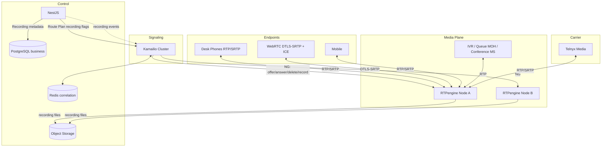
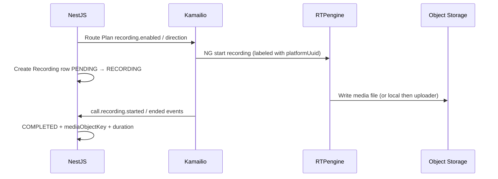
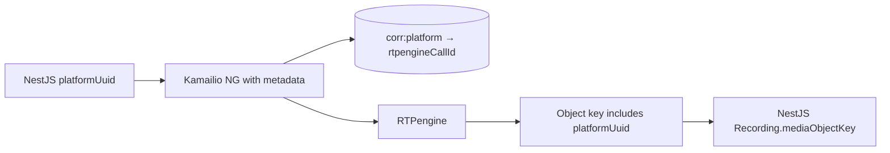

# VSP Phone v4 — RTPengine Media Architecture

| Field | Value |
|-------|-------|
| **Document ID** | TEL-RTP-001 |
| **Version** | 1.0.0 |
| **Status** | Architecture — Sprint 4.2 Design |
| **Last Updated** | 2026-07-08 |
| **Owner** | Telecom Architecture |
| **Location** | `docs/04-telecom/rtpengine-architecture.md` |
| **Depends On** | ADR-004, ADR-008, ADR-009, ADR-012, ADR-015, ADR-016, ADR-017; TEL-KAM-002 (frozen); Call Engine (frozen) |

---

## Purpose

This document defines the **enterprise RTPengine media architecture** for VSP Phone v4 as part of the Telecom Integration Layer (Sprint 4.2).

It is an architecture exercise only. It does **not** include `rtpengine.conf`, Docker Compose, Kamailio module snippets, NestJS code, or Prisma changes.

**Frozen:** Identity, Telephony, Call Engine, Kamailio Telecom Integration (TEL-KAM-002).

**Hard boundaries**

- RTPengine owns media only.
- Kamailio owns SIP signaling and is the sole controller of RTPengine (NG protocol).
- NestJS owns business logic and Recording **metadata**.
- Cross-layer correlation key: `platformUuid` only.
- RTPengine call/session identifiers, SDP, ICE candidates, DTLS state, and SRTP keys must **not** enter the business Prisma schema.

---

## Table of Contents

1. [Executive Summary](#1-executive-summary)
2. [RTPengine Responsibilities](#2-rtpengine-responsibilities)
3. [Component Interaction Diagram](#3-component-interaction-diagram)
4. [Media Flow Architecture](#4-media-flow-architecture)
5. [Media Anchoring Strategy](#5-media-anchoring-strategy)
6. [ICE / STUN / TURN Architecture](#6-ice--stun--turn-architecture)
7. [SRTP / DTLS Architecture](#7-srtp--dtls-architecture)
8. [Codec & Transcoding Strategy](#8-codec--transcoding-strategy)
9. [Recording Architecture](#9-recording-architecture)
10. [DTMF Handling](#10-dtmf-handling)
11. [NAT Traversal Design](#11-nat-traversal-design)
12. [Cluster & High Availability Design](#12-cluster--high-availability-design)
13. [Security Architecture](#13-security-architecture)
14. [Observability Architecture](#14-observability-architecture)
15. [Telecom Correlation Strategy](#15-telecom-correlation-strategy)
16. [Risks & Trade-offs](#16-risks--trade-offs)
17. [Recommended ADRs](#17-recommended-adrs)
18. [Enterprise Readiness Assessment](#18-enterprise-readiness-assessment)
19. [Final Architecture Recommendation](#19-final-architecture-recommendation)

---

## 1. Executive Summary

RTPengine (Sipwise NGCP) is the **media proxy and secure relay** for VSP Phone v4. It anchors RTP/SRTP between desk phones, WebRTC clients, mobile endpoints, carrier trunks (Telnyx), and platform media applications (IVR, queue MOH, conference mixers).

Kamailio drives RTPengine exclusively through the **NG control protocol** (Kamailio `rtpengine` module): `offer` / `answer` / `delete` / recording start-stop. NestJS never processes RTP packets ([ADR-009](../ADR/ADR-009-rtpengine-architecture.md)).

Production policy (aligned with TEL-KAM-002): **all productive calls are media-anchored** through RTPengine for NAT consistency, WebRTC interoperability, encryption bridging, recording, and QoS observability.

| Concern | Owner |
|---------|-------|
| Media relay, ICE, DTLS-SRTP, recording capture | RTPengine |
| When to anchor, which flags, recording policy bits | NestJS Route Plan → Kamailio |
| SIP SDP pass-through / rewrite orchestration | Kamailio |
| Recording business metadata (`Recording` entity) | NestJS |
| Correlation to CallSession | `platformUuid` via Redis + object key naming |

Design readiness targets RingCentral / Zoom Phone / Dialpad-class media edges: always-on relay, SRTP bridging, kernel forwarding where available, multi-node sets with health-aware selection.

---

## 2. RTPengine Responsibilities

### Owned by RTPengine ([ADR-009](../ADR/ADR-009-rtpengine-architecture.md))

| Responsibility | Description |
|----------------|-------------|
| **RTP proxy / media relay** | Forward RTP/RTCP between endpoints and trunks |
| **SRTP** | Terminate/originate SRTP (SDES and DTLS-SRTP) |
| **DTLS** | DTLS-SRTP handshake for WebRTC |
| **ICE** | ICE lite / candidate rewrite / force-relay modes |
| **STUN** | Embedded STUN behavior as part of ICE |
| **TURN integration** | Act as relay candidate; optional external TURN for clients |
| **NAT traversal** | Advertise public addresses; hairpin/NAT-friendly ports |
| **Codec negotiation support** | SDP attribute rewrite; optional transcoding |
| **Recording capture** | Write media files (pcap/proc); decrypted when possible |
| **DTMF relay** | Pass-through RFC 4733 / info as configured |
| **IPv4/IPv6 bridging** | Cross-family media where required |
| **In-kernel forwarding** | Low-latency path when kernel module available |

### Explicitly not owned by RTPengine

| Concern | Owner |
|---------|-------|
| SIP REGISTER / INVITE routing | Kamailio |
| Digest/JWT auth, CallSession lifecycle | NestJS |
| Business Recording row CRUD | NestJS |
| Telnyx number provisioning / webhooks | NestJS Carrier Adapter |
| Object storage lifecycle/retention policy | NestJS + ops |
| Dialplan / queue agent ranking | NestJS |

### Ownership matrix

| Component | Owns | Reads | Never does |
|-----------|------|-------|------------|
| **RTPengine** | Wire media, crypto, ICE on media path, recording files | NG commands from Kamailio | SIP routing; Prisma writes |
| **Kamailio** | NG offer/answer/delete; selects node set | NestJS Route Plan media/recording flags | RTP bytes |
| **NestJS** | Policy: record yes/no, codec preferences | Events: recording started/ended metadata | RTP/SRTP |
| **Redis** | `platformUuid` ↔ RTPengine call-id (telecom) | Kamailio writes | Persist SDP in business DB |
| **Telnyx** | PSTN media peer | RTP to/from RTPengine | Device media without anchor |

---

## 3. Component Interaction Diagram



**Control plane:** NestJS → Kamailio → RTPengine (never NestJS → RTPengine for call media control in v1).  
**Optional later:** NestJS may call RTPengine HTTP/NG for admin diagnostics only — not call setup.

---

## 4. Media Flow Architecture

All productive calls: **Kamailio inserts RTPengine before SDP is committed to peers** (`rtpengine_offer` on initial INVITE, `rtpengine_answer` on 200 OK, `rtpengine_delete` on BYE/failure).

### 4.1 Internal extension (Line ↔ Line)

```text
Phone A ←RTP/SRTP→ RTPengine ←RTP/SRTP→ Phone B
         ↑ Kamailio NG offer/answer using platformUuid-labeled call
```

- Prefer codec passthrough (G.711 / Opus / G.722 as negotiated).
- Transcode only on mismatch or recording requirement.

### 4.2 Inbound PSTN (Telnyx → platform)

```text
PSTN ←→ Telnyx ←RTP→ RTPengine ←RTP/SRTP→ Device / Queue MOH / IVR app
```

- Kamailio accepts INVITE from Telnyx ACL.
- NestJS Route Plan selects destination class.
- RTPengine bridges carrier RTP (often plain RTP) to endpoint SRTP/WebRTC as needed.

### 4.3 Outbound PSTN

```text
Device ←RTP/SRTP→ RTPengine ←RTP→ Telnyx ←→ PSTN
```

- Carrier-facing leg typically RTP (or carrier SRTP if enabled).
- CLI/CLD are signaling concerns; media is generic relay.

### 4.4 Queue calls

```text
Caller ←→ RTPengine ←→ Queue media app (MOH / announcements)
                 ↘ after agent connect: RTPengine bridges Caller ↔ Agent
```

- Media application is a SIP UA behind Kamailio (TEL-KAM-002 media app plane).
- RTPengine may rename/subscribe streams on agent connect (replace MOH peer).

### 4.5 IVR

```text
Caller ←→ RTPengine ←→ IVR media service (play/collect)
```

- DTMF to NestJS for menu decisions (see §10).
- Next hop may re-offer via Kamailio without dropping media session when possible.

### 4.6 Conference

```text
Participants ←→ RTPengine ←→ Conference mixer (N-way)
```

- Mixer owns N-way mix; RTPengine anchors each participant leg.
- Recording may capture mixer output and/or per-leg (policy).

### 4.7 WebRTC browser

```text
Browser ←DTLS-SRTP + ICE→ RTPengine ←RTP/SRTP→ Peer or Telnyx
```

- ICE force-relay through RTPengine public candidates ([ADR-012](../ADR/ADR-012-webrtc-mobile-signaling.md)).
- DTLS-SRTP terminated at RTPengine; PSTN/desk side may be RTP or SDES-SRTP.

---

## 5. Media Anchoring Strategy

### Policy: always anchor in production

| Mode | When |
|------|------|
| **Always relay** | Default for all tenant calls |
| **Direct media** | Not used in production (breaks NAT/recording/WebRTC bridging) |
| **Exception** | Lab/debug feature flag only |

### Why always-on ([ADR-009](../ADR/ADR-009-rtpengine-architecture.md), TEL-KAM-002)

- Unified NAT behavior
- Compatible with recording
- WebRTC ↔ SIP bridging
- Symmetric RTP issues reduced
- Central QoS/metrics

### Node selection

Kamailio `rtpengine` module sets ([Kamailio rtpengine module](https://www.kamailio.org/docs/modules/stable/modules/rtpengine.html)):

1. Prefer **hash on `platformUuid`** for sticky media node across SIP Call-ID changes.
2. Fallback hash on SIP Call-ID if UUID not yet injected (then remap).
3. Weight-based load distribution across set members.
4. Disable dead nodes (probe / failed NG replies).

### Interfaces

- Private interface toward cluster network.
- Public / advertised addresses for ICE and remote RTP (EIP / floating IP).
- Separate carrier-facing interface optional (DMZ) for Telnyx.

---

## 6. ICE / STUN / TURN Architecture

RTPengine provides ICE support per Sipwise docs: bridge ICE ↔ non-ICE, force-relay, ICE lite modes.

### Client (WebRTC) path

| Element | Role |
|---------|------|
| **STUN** | Clients discover reflexive candidates (may use public STUN or RTPengine-adjacent STUN) |
| **TURN** | Optional dedicated coturn for tough NATs; RTPengine remains call media relay |
| **RTPengine ICE** | `ICE=force` or `force-relay` so browser media locks to RTPengine |

### SIP desk phone path

- Typically no ICE; RTPengine inserts itself via classic c=/m= rewrite.
- When bridging WebRTC ↔ desk phone: RTPengine terminates ICE on WebRTC side and plain RTP on SIP side.

### Recommendations

| Scenario | Flag guidance (conceptual) |
|----------|----------------------------|
| WebRTC leg | ICE force / force-relay + DTLS-SRTP |
| SIP desk / Telnyx | ICE remove or unused; RTP or SDES as peer requires |
| Mixed call | Per-leg flags via Kamailio based on endpoint type from NestJS Route Plan |

**External TURN** (coturn) is an optional Sprint 4.x infrastructure service for client gathering; it does not replace RTPengine anchoring.

---

## 7. SRTP / DTLS Architecture

| Mechanism | Use |
|-----------|-----|
| **DTLS-SRTP** | WebRTC browsers/mobile WebRTC ([ADR-012](../ADR/ADR-012-webrtc-mobile-signaling.md)) |
| **SDES-SRTP** | Optional desk phones / enterprise SIP if provisioned |
| **Plain RTP** | Many PSTN carrier legs (Telnyx default) |
| **Bridging** | RTPengine decrypts/re-encrypts between heterogeneous peers |

### Policies

- WebRTC: DTLS mandatory; reject clear RTP to browsers.
- Internal SIP: prefer SRTP when devices support it; fallback RTP with tenant security policy.
- Carrier: follow Telnyx trunk capabilities; expect RTP initially.
- Opportunistic SRTP (RFC 8643) optional later — not required for freeze.

### Key handling

- DTLS keys never leave RTPengine.
- Recording decrypts media **on the proxy** for storage (standard Sipwise behavior when recording decrypted streams).
- NestJS never receives SRTP keys.

---

## 8. Codec & Transcoding Strategy

### Principles

1. **Prefer passthrough** — lowest latency/CPU.
2. **Transcode only when required** — codec mismatch, recording format policy, or PSTN interoperability.
3. **Codec preference lists** come from NestJS/tenant policy → Kamailio SDP preferences → RTPengine.

### Baseline codec set (architecture target)

| Domain | Codecs |
|--------|--------|
| WebRTC | Opus, G.711 (PCMU/PCMA) |
| Desk SIP | G.711, G.722, (optional Opus) |
| PSTN / Telnyx | G.711 primarily |

### Transcoding

- Enabled on RTPengine nodes with sufficient CPU; scale media pool independently of Kamailio ([ADR-009](../ADR/ADR-009-rtpengine-architecture.md)).
- Avoid double-transcoding (WebRTC Opus → G.711 → Opus).
- Video (future): deferred; architecture must not block later Opus/VP8/AV1 — out of Sprint 4.2 voice scope.

### Fax / pass-through

| Mode | Guidance |
|------|----------|
| **T.38** | Prefer pass-through / reject if relay would break; detect `image` m-lines |
| **G.711 fax pass-through** | Disable transcoder; avoid AGC/PLC that damages fax |
| **Default** | VSP v1: voice-first; fax as best-effort pass-through ADR |

If T.38 is required as a product feature, a dedicated Fax ADR is required before promising parity with fax-heavy UCaaS competitors.

---

## 9. Recording Architecture

Aligned with [ADR-004](../ADR/ADR-004-call-architecture.md) / [ADR-009](../ADR/ADR-009-rtpengine-architecture.md):

> RTPengine records media · NestJS stores metadata only.

### Trigger chain



### File generation

| Aspect | Design |
|--------|--------|
| Method | RTPengine `pcap` and/or `proc` recording (finalize in ADR-029) |
| Naming | Include `platformUuid` (and tenantId) in path/filename |
| Upload | Sidecar or recorder daemon → object storage ([ADR-015](../ADR/ADR-015-deployment-architecture.md)) |
| Format | Prefer standardized audio (e.g. WAV/MP3) post-process if pcap is raw |

### Metadata (`Recording` entity — frozen)

NestJS fields already modeled: `callSessionId`, `mediaObjectKey`, `mediaFormat`, `durationSeconds`, status, optional `lineId` / `conferenceId`.

**Never store:** RTPengine call-id, local PCAP path as source of truth, SDP.

### Multi-segment

Call Engine allows 1:N recordings — pause/resume, compliance segments, conference mix + call legs.

---

## 10. DTMF Handling

| Source | Path |
|--------|------|
| RFC 4733 telephone-event | Pass through RTPengine; media apps detect |
| SIP INFO | Kamailio may convert/normalize (signaling) |
| WebRTC | Generally telephone-event via DTLS-SRTP |

### IVR / NestJS

1. IVR media app receives DTMF.
2. App notifies NestJS (`platformUuid`, digit).
3. NestJS returns next IVR destination.
4. Kamailio executes SIP retarget; RTPengine stays on media where possible.

RTPengine should **not** be the business DTMF interpreter.

---

## 11. NAT Traversal Design

| Layer | Mechanism |
|-------|-----------|
| Signaling NAT | Kamailio Path/Record-Route, outbound, received ([TEL-KAM-002](./kamailio-telecom-integration-architecture.md)) |
| Media NAT | RTPengine advertised public endpoints; always relay |
| Symmetric NAT | Forced relay to RTPengine public IP |
| Far-end NAT | RTPengine learning from first packets |
| WebRTC | ICE + RTPengine relay candidates |

### Addressing

- Configure `advertised` / interface addresses carefully for multi-homed hosts.
- Health checks must verify **public RTP reachability**, not only local NG socket.

---

## 12. Cluster & High Availability Design

### Topology

```text
Kamailio set_rtpengine_set(N)
        ├── RTPengine A (weight W) ─┐
        ├── RTPengine B (weight W) ─┼─ shared recording uploader → OSS
        └── RTPengine C (weight W) ─┘
```

### Requirements ([ADR-009](../ADR/ADR-009-rtpengine-architecture.md), [ADR-017](../ADR/ADR-017-disaster-recovery.md))

| Capability | Design |
|------------|--------|
| Multiple instances | Mandatory in production |
| Horizontal scale | Add nodes to set; independent of Kamailio count |
| Load balancing | Kamailio set weights + hash affinity |
| Health checks | NG ping / failed command → mark disabled; metrics exporter |
| Failover | New calls avoid bad node; **mid-call node death drops media** (industry-typical) |
| Capacity | CPU-bound when transcoding; separate “passthrough” vs “transcode” pools optional |

### Mid-call failure stance

Document SLA: media plane failover without mid-call migration in v1. Future: media migration research — not required for freeze.

### Kernel module

Prefer xt_RTPENGINE / kernel forwarding on production nodes for scale; userspace fallback acceptable for smaller regions.

---

## 13. Security Architecture

| Control | Design |
|---------|--------|
| Control plane | NG control on private network only; firewall from Internet |
| Media exposure | Only advertised RTP UDP port ranges public |
| WebRTC crypto | DTLS-SRTP mandatory |
| Recording access | Object storage IAM; signed URLs via NestJS |
| Tenant isolation | Media not mixed across tenants; labeling by `platformUuid`/`tenantId` in metadata |
| Amplification | Port range limits; anti-spoofing where applicable |
| Secrets | No SRTP keys in logs; redact NG dumps in prod |
| Carrier | Restrict RTP to expected Telnyx ranges where practical |

---

## 14. Observability Architecture

Aligned with [ADR-016](../ADR/ADR-016-monitoring-observability.md):

| Signal | Metrics / content |
|--------|-------------------|
| **Metrics** | Sessions active, PPS, bitrate, packet loss, NG errors, transcoding sessions, recording queue depth |
| **Logs** | Structured JSON: `platformUuid`, `tenantId`, NG command, result; no keying material |
| **Health** | Process liveness; NG readiness; public interface ARP/IP; disk for recording buffer |
| **Tracing** | NestJS + Kamailio span attributes carry `platformUuid`; RTPengine as span events via exporter later |
| **Alerting** | Packet loss, NG timeout storms, disk full, node disabled |

RTPengine is an approved monitoring target in ADR-016.

---

## 15. Telecom Correlation Strategy

### Rule

Business domain knows **`platformUuid`** (+ Recording `mediaObjectKey`).  
Telecom layer may know RTPengine call-id **only in Redis**.

### Flow



| Store | Content |
|-------|---------|
| Redis `corr:platform:{uuid}` | rtpengine call id(s), node id, recording local name |
| Redis `corr:rtp:{rtpCallId}` | platformUuid, tenantId |
| Object key | `tenants/{tenantId}/recordings/{platformUuid}/...` |
| PostgreSQL | `Recording` metadata only |

On BYE: Kamailio `delete` → Redis TTL expire → NestJS finalize Recording.

---

## 16. Risks & Trade-offs

| Risk | Trade-off | Mitigation |
|------|-----------|------------|
| Always-on relay CPU/bandwidth | Cost vs reliability | Kernel forwarding; passthrough-first |
| Transcoding cost | Quality vs capacity | Separate pools; codec policy |
| Mid-call node death | Complexity vs uptime | Overprovision; fast reprovision; document SLA |
| Recording disk spike | Local buffer before OSS | Watchdog; backpressure; local RAID |
| ICE edge cases | Interop pain | Force-relay WebRTC; lab matrix |
| Fax over relay | Distortion | Pass-through ADR; limit claims |
| Double encryption bugs | Call setup fails | Clear per-leg flag matrix from endpoint type |
| NestJS not in NG path | Good isolation | Keep it; do not shortcut NestJS→RTPengine for setup |

---

## 17. Recommended ADRs

| ADR | Title | Purpose |
|-----|-------|---------|
| **ADR-027** | Dispatcher & RTPengine Topology | Sets, weights, hash on platformUuid, probes (shared with Kamailio sprint) |
| **ADR-029** | Media Recording Pipeline | pcap vs proc, upload sidecar, object key layout, retention |
| **ADR-030** | Media Crypto & ICE Policy | Per-endpoint flags: DTLS/SDES/RTP, ICE force-relay |
| **ADR-031** | Codec Preference & Transcoding Policy | Tenant/global codec lists; when transcode allowed |
| **ADR-028** | Media Application Plane | IVR/Queue/Conf mixers as SIP media apps (already proposed) |
| **ADR-032** | Fax / Image Media Pass-through | T.38 / G.711 fax stance (if product needs fax) |

Implementation of RTPengine should wait for **ADR-027** and **ADR-029** at minimum (plus existing ADR-019 correlation).

---

## 18. Enterprise Readiness Assessment

| Dimension | Score (0–10) | Notes |
|-----------|--------------|-------|
| Layer separation | 9.5 | Clear media vs SIP vs business |
| WebRTC readiness | 9 | DTLS + ICE force-relay |
| Carrier readiness | 8.5 | RTP bridge to Telnyx |
| Recording | 8 | Metadata split correct; pipeline ADR needed |
| HA / scale | 8 | Multi-node; mid-call failover limited |
| Security | 8.5 | Private NG; public RTP ranges |
| Ops / observability | 8 | Aligns with ADR-016 |
| **Overall design readiness** | **8.5** | Ready to freeze as Sprint 4.2 baseline |

---

## 19. Final Architecture Recommendation

**Adopt this RTPengine architecture as the Sprint 4.2 media baseline.**

### Lock these decisions

1. RTPengine is the sole media owner; Kamailio is the sole call-setup controller via NG.  
2. Always media-anchor production calls.  
3. WebRTC uses DTLS-SRTP + ICE force-relay through RTPengine.  
4. Recording files from RTPengine → object storage; NestJS `Recording` metadata only, keyed by `platformUuid`.  
5. RTPengine session IDs live only in Redis telecom correlation — never Prisma.  
6. Prefer codec passthrough; transcode by policy.  
7. Scale RTPengine independently with weighted sets and health disable.  
8. No Prisma redesign for media.

### Implementation sequence (after ADR-027 / ADR-029)

1. Stand up dual RTPengine lab nodes + Kamailio NG.  
2. Internal SIP call with anchor (no recording).  
3. WebRTC ↔ SIP bridge.  
4. Telnyx media path.  
5. Recording capture + OSS upload + NestJS metadata.  
6. Queue/IVR/Conference media app legs.  
7. Load test + Prometheus alerts.

### Non-goals for this sprint

- NestJS direct RTP control  
- Storing RTPengine IDs in Call Engine  
- Mid-call live media migration  
- Full fax product guarantee without ADR-032  

---

## Related Documents

| Document | Role |
|----------|------|
| [ADR-009 RTPengine Architecture](../ADR/ADR-009-rtpengine-architecture.md) | Accepted responsibilities |
| [TEL-KAM-002 Kamailio Integration](./kamailio-telecom-integration-architecture.md) | Signaling + NG control context |
| [ADR-004 Call Architecture](../ADR/ADR-004-call-architecture.md) | Recording split; platformUuid |
| [ADR-012 WebRTC & Mobile](../ADR/ADR-012-webrtc-mobile-signaling.md) | DTLS/ICE expectations |
| [ADR-015 Deployment](../ADR/ADR-015-deployment-architecture.md) | Object storage |
| [ADR-016 Monitoring](../ADR/ADR-016-monitoring-observability.md) | RTPengine as target |

---

## Revision History

| Version | Date | Changes |
|---------|------|---------|
| 1.0.0 | 2026-07-08 | Sprint 4.2 RTPengine media architecture |
