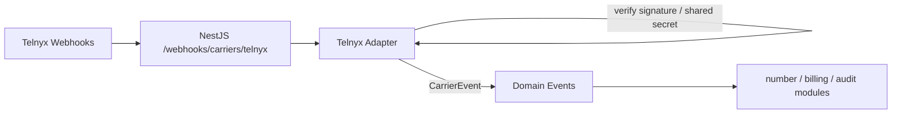

# VSP Phone v4 — Telnyx Carrier Integration Architecture

| Field | Value |
|-------|-------|
| **Document ID** | TEL-CAR-001 |
| **Version** | 1.0.0 |
| **Status** | Architecture — Sprint 4.3 Design |
| **Last Updated** | 2026-07-08 |
| **Owner** | Telecom Architecture |
| **Location** | `docs/04-telecom/telnyx-carrier-integration-architecture.md` |
| **Depends On** | ADR-001, ADR-003, ADR-006, ADR-008, ADR-010, ADR-016, ADR-017; TEL-KAM-002; TEL-RTP-001; Frozen business domains |

---

## Purpose

This document defines the **enterprise carrier integration architecture** for VSP Phone v4 with **Telnyx as the first carrier**, while remaining **vendor-independent** for Bandwidth, Twilio, Plivo, and Custom SIP Trunks / BYOC ([ADR-010](../ADR/ADR-010-carrier-abstraction.md)).

Architecture exercise only. No SDKs, Prisma changes, Docker files, or Kamailio configuration.

**Frozen:** Identity, Telephony, Call Engine, Kamailio (TEL-KAM-002), RTPengine (TEL-RTP-001).

**Hard boundaries**

- Business modules never call Telnyx APIs directly.
- All carrier I/O goes through the **Carrier Adapter**.
- PSTN signaling path is **Kamailio ↔ Telnyx SIP trunk** (not Telnyx Call Control as primary softswitch).
- Media path is **RTPengine ↔ Telnyx**.
- Cross-layer call correlation: **`platformUuid` only**.
- Carrier-native IDs (Telnyx call/control IDs, connection IDs, order IDs) live in the **telecom / carrier correlation store**, not in frozen Call Engine columns.

---

## Table of Contents

1. [Executive Summary](#1-executive-summary)
2. [Telnyx Responsibilities](#2-telnyx-responsibilities)
3. [Carrier Adapter Architecture](#3-carrier-adapter-architecture)
4. [Outbound Call Flow](#4-outbound-call-flow)
5. [Inbound Call Flow](#5-inbound-call-flow)
6. [Number Management Strategy](#6-number-management-strategy)
7. [Authentication Strategy](#7-authentication-strategy)
8. [Webhook Architecture](#8-webhook-architecture)
9. [Carrier Correlation Strategy](#9-carrier-correlation-strategy)
10. [Retry & Failover Design](#10-retry--failover-design)
11. [Multi-Carrier Strategy](#11-multi-carrier-strategy)
12. [Security Considerations](#12-security-considerations)
13. [Observability Architecture](#13-observability-architecture)
14. [Risks & Trade-offs](#14-risks--trade-offs)
15. [Recommended ADRs](#15-recommended-adrs)
16. [Enterprise Readiness Assessment](#16-enterprise-readiness-assessment)
17. [Final Architecture Recommendation](#17-final-architecture-recommendation)

---

## 1. Executive Summary

Telnyx provides **PSTN interconnection**: SIP trunking for inbound/outbound voice, DID inventory/orders, porting, and emergency address APIs. VSP Phone v4 treats Telnyx as a **replaceable Carrier Adapter implementation** behind a stable NestJS interface.

**Call plane (voice):**

```text
Device/App → Kamailio → (SIP) Telnyx → PSTN
              ↕ NG
           RTPengine ↔ Telnyx media
```

**Control / inventory plane (API):**

```text
Admin / Provisioning → NestJS → Carrier Adapter (Telnyx) → Telnyx REST
Webhook ← Telnyx → Carrier Adapter → normalized domain events → Call/Number modules
```

This matches [ADR-008](../ADR/ADR-008-kamailio-architecture.md) (Telnyx through Kamailio) and [ADR-010](../ADR/ADR-010-carrier-abstraction.md) (adapter-only Telnyx access). Enterprise peers (RingCentral, 8x8, Bandwidth-powered clouds) use the same split: SIP trunks for media/signaling scale, REST for number lifecycle.

Preferred Telnyx trunk auth for static Kamailio edges: **IP authentication** (optionally + token / tech prefix). Credential registration is supported for flexibility but is secondary for active-active Kamailio clusters.

---

## 2. Telnyx Responsibilities

### Telnyx owns

| Responsibility | Notes |
|----------------|-------|
| PSTN origination / termination | Public telephone network carriage |
| SIP interconnect | Connection + Outbound Voice Profile toward Kamailio |
| DID inventory & ordering | Search, order, assign to connections |
| Number porting workflow | Carrier-side port process (platform tracks via adapter) |
| Emergency address / E911 APIs | Dynamic emergency addresses/endpoints (US/CA context) |
| Carrier webhooks | Number orders, messaging (N/A initially), connection events as configured |
| Regional SIP PoPs / AnchorSite | Latency and media path optimization on Telnyx side |

### Telnyx does **not** own

| Concern | Owner |
|---------|-------|
| Device registration | Kamailio |
| Media anchoring / ICE / DTLS | RTPengine |
| CallSession / platformUuid | NestJS Call Engine |
| Tenant dialplan / Queue / IVR policy | NestJS |
| Multi-tenant isolation | NestJS + Kamailio realm |

### Ownership matrix

| Component | Owns | Reads | Never does |
|-----------|------|-------|------------|
| **Telnyx** | PSTN, trunk, DIDs, carrier webhooks | SIP from Kamailio; media with RTPengine | Line/User business model |
| **Carrier Adapter** | Telnyx REST, webhook verify/normalize, trunk config projection | Secrets, Carrier.configuration | SIP packet routing |
| **Kamailio** | SIP to/from Telnyx; ACL; dispatcher failover | Route Plan trunk hints | Telnyx REST |
| **RTPengine** | RTP with Telnyx | NG from Kamailio | Telnyx APIs |
| **NestJS business** | CallSession, PhoneNumber business fields | Normalized adapter DTOs | Direct `@telnyx/*` calls |

---

## 3. Carrier Adapter Architecture

### Vertical stack ([ADR-010](../ADR/ADR-010-carrier-abstraction.md))

```text
Business / Routing Engine
        ↓
   Carrier Layer (NestJS `carrier` module)
        ↓
   Carrier Adapter Interface  ← stable contract
        ↓
   ┌────────────┬────────────┬────────────┐
   TelnyxAdapter Bandwidth…  Twilio…  ByocSipAdapter
        ↓
   Telnyx REST / Webhooks     (others…)
```

SIP for live calls remains Kamailio-driven; the Adapter may return **trunk dial directives** (dispatcher set, R-URI host, auth headers) consumed by NestJS Routing → Kamailio Route Plan — not by performing the INVITE itself.

### Adapter interface (conceptual)

| Operation group | Examples |
|-----------------|----------|
| **Numbers** | searchAvailable, createOrder, getOrder, listNumbers, assignNumberToTrunk, releaseNumber, startPort, getPortStatus |
| **Emergency** | upsertEmergencyAddress, bindNumberToEmergencyEndpoint |
| **Trunk / connection** | ensureConnection, syncOutboundProfile, rotateCredentials (ops) |
| **Health** | ping, getCircuitHealth, listRegions |
| **Events** | verifyWebhook, normalizeWebhook → `CarrierEvent` |
| **Call assist (optional)** | mapOutboundCli/Cld; **not** place SIP calls via Call Control in v1 |

### Normalized models (adapter boundary)

Platform-facing types — **carrier-agnostic**:

- `CarrierNumber` (E.164, status, capabilities)
- `CarrierOrder`
- `CarrierPortRequest`
- `CarrierTrunkHint` (signaling hosts, auth mode, dispatcherSetId)
- `CarrierEvent` (`NUMBER_ORDER_*`, `NUMBER_*`, `PORT_*`, `TRUNK_*`, optional `CALL_*` if webhook present)
- `CarrierError` (retryable / permanent)

Telnyx IDs remain inside the TelnyxAdapter and Redis correlation map.

### Configuration isolation ([ADR-006](../ADR/ADR-006-database-design.md), ADR-010 §10)

- Business `Carrier` entity: type `TELNYX`, code, status, `configuration` JSONB for **opaque provider blob**.
- Secrets (API key, SIP password, IP token): **secrets manager**, referenced by key id in configuration — not plaintext in Prisma if avoidable.
- No Telnyx connection UUID columns on `PhoneNumber` / `CallSession`.

---

## 4. Outbound Call Flow

```mermaid
sequenceDiagram
  participant D as Device
  participant K as Kamailio
  participant N as NestJS Routing
  participant A as Telnyx Adapter
  participant R as RTPengine
  participant T as Telnyx SIP
  participant P as PSTN

  D->>K: INVITE (outbound)
  K->>N: resolve Route Plan
  N->>N: Create CallSession (platformUuid)
  N->>A: selectTrunk(tenant, destination)
  A-->>N: TrunkHint (dispatcher set, CLI rules)
  N-->>K: Route Plan + platformUuid + recording flags
  K->>R: offer
  K->>T: INVITE (to E.164@telnyx; IP/token auth)
  T->>P: PSTN
  T-->>K: 18x / 200
  K->>R: answer
  K-->>N: call.answered (platformUuid)
```

### Rules

1. NestJS allocates `platformUuid` before carrier INVITE.
2. Kamailio selects Telnyx via **dispatcher set** (`telnyx_primary` / `telnyx_backup`) from Route Plan.
3. Auth: source IP allowlisted + optional `X-Telnyx-Token` on INVITE when using IP+token connections.
4. CLI must be a Telnyx number owned/assigned to the connection (Adapter validates at provision time; NestJS CallPolicy/CallerID selects presentation number).
5. Media always via RTPengine (TEL-RTP-001).

### Credential-mode outbound (alternate)

If credential connection is used, Kamailio registers (or uses outbound digest) per Telnyx Credential Connections. Prefer **IP mode** for HA Kamailio clusters to avoid registration sticky-node complexity.

---

## 5. Inbound Call Flow

```mermaid
sequenceDiagram
  participant P as PSTN
  participant T as Telnyx
  participant K as Kamailio
  participant N as NestJS Routing
  participant R as RTPengine
  participant D as Destination

  P->>T: inbound DID
  T->>K: INVITE (ACL from Telnyx PoP IPs)
  K->>K: Verify source IP allow list
  K->>N: resolve (DNIS E.164)
  N->>N: CallSession + platformUuid; DNIS → Line/Queue/IVR/Conf/VM
  N-->>K: Route Plan
  K->>R: offer/answer as dialog progresses
  K->>D: INVITE / app media
  K-->>N: lifecycle events
```

### Rules

1. Telnyx delivers INVITE to platform FQDN/IP configured on the SIP Connection (priority list / SRV as needed).
2. Kamailio **must** enforce Telnyx signaling IP allow lists ([sip.telnyx.com](https://sip.telnyx.com) regional ranges).
3. NestJS DNIS routing is authoritative (ADR-021 inbound routing when accepted).
4. Optional: Telnyx call webhooks enrich Redis correlation; **Kamailio SIP remains call-state authoritative** for the platform call leg.

---

## 6. Number Management Strategy

### DID provisioning

| Step | Actor |
|------|-------|
| Search inventory | Admin API → Carrier Adapter `searchAvailable` |
| Create order | Adapter `createOrder` → Telnyx `POST /number_orders` |
| Track order | Webhooks + poll → normalized `CarrierOrder` events |
| Assign to trunk | Adapter assigns Telnyx number to SIP Connection |
| Bind business | NestJS creates/updates `PhoneNumber` (E.164, tenant, site, carrier FK) |

Regulatory requirement groups (country-specific) stay inside Adapter; UI surfaces adapter-normalized checklist.

### Assignment

- Platform `PhoneNumber` links to tenant `Carrier` and optional Site/Line.
- Routing destination (Rule 12) remains NestJS / future NumberRoute — not Telnyx call-control apps.

### Ported numbers

- Adapter starts/monitors port request with Telnyx.
- Business `PhoneNumberStatus.PORTING` already exists — status updates via normalized events.
- FOC dates and losing-carrier details stored in **carrier ops store / JSON metadata**, not core required columns.

### Emergency numbers

- Site `emergencyAddress` informs Adapter emergency address upsert.
- Bind DIDs to emergency endpoints via Telnyx dynamic emergency APIs.
- NestJS Site Settings remain source of address truth; Telnyx mirror is Adapter-managed.

### Inventory ownership

| Data | Location |
|------|----------|
| E.164, tenant, status, site, line | Business `PhoneNumber` |
| Telnyx number id, connection id, order id | Carrier correlation Redis + Adapter opaque config |
| Emergency binding ids | Carrier correlation / Adapter store |

---

## 7. Authentication Strategy

### Toward Telnyx (platform → carrier)

| Method | VSP stance |
|--------|------------|
| **IP authentication** | **Preferred** for Kamailio HA (static / Elastic IPs) |
| **IP + Token** (`X-Telnyx-Token`) | Preferred when multiple connections share egress IPs |
| **IP + Tech prefix** | Optional alternate |
| **Credentials (digest register)** | Supported; use for single-node or lab; careful with multi-node |
| **FQDN inbound + IP/cred outbound** | Supported for inbound routing flexibility |

TLS SIP to Telnyx (5061) preferred for signaling encryption when mutually supported.

### Toward platform (carrier → Kamailio)

| Control | Design |
|---------|--------|
| Signaling ACL | Only Telnyx regional SIP IPs |
| Optional shared secret headers | Strip/validate if used |
| Media ACL | Prefer Telnyx media ranges toward RTPengine public ports |

### API authentication

- Telnyx **API Key** (Mission Control) in secrets manager.
- Adapter uses key only server-side; never exposed to admin UI clients.

### Separation from device SIP auth

Device digest to Kamailio remains independent of Telnyx credentials ([ADR-007](../ADR/ADR-007-authentication-authorization.md)).

---

## 8. Webhook Architecture



### Principles

1. Single ingress path: `/webhooks/carriers/{provider}` → Adapter.
2. **Verify** authenticity before processing (Telnyx signing / secret as documented per product).
3. **Idempotent** handling keyed by Telnyx event id in Redis (telecom).
4. Normalize to `CarrierEvent`; business modules never parse Telnyx JSON.
5. Separate webhook profiles:
   - Number order / number status
   - Port status
   - Optional call events (supplementary; SIP remains primary)

### Call events policy

For **SIP trunk** mode, VSP treats **Kamailio-originated lifecycle events** as primary for CallSession. Telnyx call webhooks are **optional enrichment** for CDR reconciliation and billing disputes — mapped via Redis correlation, not required for call setup.

---

## 9. Carrier Correlation Strategy

### Identifiers

| ID | Layer | Persistence |
|----|-------|-------------|
| `platformUuid` | Business + telecom | CallSession (frozen) |
| SIP Call-ID | Telecom | Redis only |
| RTPengine call id | Telecom | Redis only |
| Telnyx call / session / connection / order ids | Carrier telecom | Redis + Adapter ops — **not** Call Engine schema |

### Redis maps (extend TEL-KAM-002 / ADR-019)

| Key | Value |
|-----|-------|
| `corr:platform:{platformUuid}` | sipCallIds[], rtpIds[], `telnyxCallId?`, `carrierCode`, trunkSet |
| `corr:telnyx:call:{id}` | platformUuid, tenantId |
| `corr:telnyx:number:{e164}` | telnyxNumberId, connectionId |
| `corr:telnyx:order:{id}` | tenantId, business request id |

### Propagation

1. Outbound: set correlation before INVITE; if Telnyx echoes custom headers, include `X-VSP-Platform-UUID`.
2. Inbound: create `platformUuid` on NestJS resolve; bind Telnyx identifiers from SIP headers / later webhooks when available.
3. Recordings / billing: always join on `platformUuid`.

---

## 10. Retry & Failover Design

### SIP trunk failover ([ADR-010](../ADR/ADR-010-carrier-abstraction.md) §9)

| Layer | Behavior |
|-------|----------|
| Kamailio dispatcher | `telnyx_primary` → `telnyx_backup` / alternate region hosts via `ds_next_dst` on 408/503 |
| NestJS Routing | On carrier health RED, select alternate `Carrier` for tenant (second provider later) |
| Adapter Health | Probe Telnyx status / synthetic OPTIONS through Kamailio metrics |

### REST API retries

| Error class | Policy |
|-------------|--------|
| 429 / 5xx / network | Exponential backoff + jitter; idempotency keys on orders |
| 4xx permanent | Fail; surface normalized error |
| Webhook delivery | Telnyx retries; platform idempotent |

### Call retry

- Outbound user busy / SIP 486: business policy (voicemail) — not carrier failover.
- Trunk unavailable: failover to backup Telnyx connection or secondary carrier Adapter.

---

## 11. Multi-Carrier Strategy

### Interchangeability ([ADR-010](../ADR/ADR-010-carrier-abstraction.md))

| Capability | Mechanism |
|------------|-----------|
| Multiple carriers per tenant | Multiple `Carrier` rows; routing policy selects |
| Swap provider | New Adapter; same interface; remap DIDs via port/provision |
| BYOC | `CUSTOM_SIP` adapter: IP ACL + dispatcher only; minimal REST |
| No lock-in | Zero Telnyx types outside `TelnyxAdapter` package |

### Future adapters (approved list)

Bandwidth, Twilio, Plivo, Custom SIP Trunks — each implements the same interface. Adding SignalWire/Flowroute requires a **new ADR** (extension of ADR-010 list).

### Capability matrix

Adapter reports capabilities (`supportsPorting`, `supportsEmergency`, `supportsSms`…) so NestJS UI disables unsupported features per carrier without `if (telnyx)`.

---

## 12. Security Considerations

| Control | Design |
|---------|--------|
| API keys | Secrets manager; rotation runbook |
| SIP to Telnyx | Prefer TLS; IP ACL both directions |
| Webhooks | Signature verification; TLS only; no open relay |
| Tenant isolation | Adapter methods always require `tenantId`; numbers scoped |
| Least privilege | Separate Telnyx keys per env; avoid God keys in prod if sub-accounts used |
| PCI/PII | Minimize CNAM/CDR in logs; redact |
| BYOC | Customer trunk ACL hardening; no shared global passwords |

---

## 13. Observability Architecture

Aligned with [ADR-016](../ADR/ADR-016-monitoring-observability.md):

| Signal | Content |
|--------|---------|
| **Logs** | Structured: `tenantId`, `platformUuid`, `carrierCode=TELNYX`, operation, result (no API keys) |
| **Metrics** | Outbound ASR, INVITE rate to Telnyx, 4xx/5xx from trunk, adapter REST latency, webhook lag, order success |
| **Health** | Adapter `getCircuitHealth`; Kamailio dispatcher state for Telnyx sets |
| **Tracing** | NestJS spans for adapter calls; attribute `platformUuid` |
| **Alerts** | Trunk down, webhook verify failures, order stuck, ASR drop |

---

## 14. Risks & Trade-offs

| Risk | Trade-off | Mitigation |
|------|-----------|------------|
| SIP trunk vs Call Control | Less Telnyx dialplan features; more platform control | Correct for UCaaS; use Adapter for inventory only |
| IP auth + multi-region egress | Complex allowlists | Document EIP inventory; IP+token |
| Credential registration HA | Sticky REGISTER | Prefer IP auth |
| Webhook vs SIP dual source of truth | Conflicting call state | SIP/Kamailio authoritative for calls |
| Regulatory number orders | Long-running | Async orders + webhooks |
| Carrier outage | Business impact | Dispatcher + multi-carrier |
| Accidental Telnyx SDK in business modules | Lock-in | Lint/arch tests forbidding imports |

---

## 15. Recommended ADRs

| ADR | Title | Purpose |
|-----|-------|---------|
| **ADR-033** | Carrier Adapter Interface Contract | Stable DTO/operations; capability matrix |
| **ADR-034** | Telnyx SIP Trunk & Auth Profile | IP vs credential; regions; TLS; header token |
| **ADR-035** | Carrier Webhook Ingress | Paths, verify, idempotency, event catalog |
| **ADR-019** | Telecom Correlation Layer | Extend for Telnyx IDs (if not already Accepted) |
| **ADR-021** | Inbound Number Routing | DNIS → destinations (completes inbound) |
| **ADR-036** | Number Inventory & Porting | Order/port state machine; emergency bind |
| **ADR-037** | Carrier Failover Policy | When to switch trunks vs carriers; ASR thresholds |

Do not start Telnyx SDK work until **ADR-033** and **ADR-034** are Accepted.

---

## 16. Enterprise Readiness Assessment

| Dimension | Score (0–10) | Notes |
|-----------|--------------|-------|
| Vendor independence | 9 | Adapter boundary clear |
| SIP trunk correctness | 9 | Matches ADR-008/010 |
| Number lifecycle | 8 | Orders/ports/emergency designed |
| HA / failover | 8 | Dispatcher + multi-carrier ready |
| Security | 8.5 | IP ACL, secrets, webhook verify |
| Observability | 8 | Carrier metrics defined |
| Lock-in risk | 9 | Contained in TelnyxAdapter |
| **Overall design readiness** | **8.5** | Ready to freeze Sprint 4.3 |

---

## 17. Final Architecture Recommendation

**Adopt this Telnyx carrier integration design as the Sprint 4.3 baseline.**

### Lock these decisions

1. Telnyx is first carrier via **SIP trunk to Kamailio** + **REST via Telnyx Carrier Adapter**.  
2. Business logic never imports Telnyx SDKs.  
3. Prefer **IP (+ token) authentication** for production Kamailio.  
4. Media with Telnyx always through **RTPengine**.  
5. `platformUuid` remains sole business↔telecom call key; Telnyx IDs only in Redis/Adapter.  
6. Webhooks terminate at Adapter; call state from Kamailio events primarily.  
7. Multi-carrier / BYOC via additional adapters — no core redesign.  
8. No Prisma changes required for this architecture freeze.

### Implementation sequence

1. Accept ADR-033 / ADR-034 / ADR-035.  
2. Implement Carrier Adapter interface + TelnyxAdapter (numbers first).  
3. Provision Telnyx Connection + Outbound Profile; sync dispatcher.  
4. Outbound PSTN lab call (IP auth).  
5. Inbound DID + DNIS routing.  
6. Webhooks for number orders.  
7. Emergency address bind.  
8. Failover secondary Telnyx region / connection.  
9. Health metrics & alerts.

### Non-goals

- Replacing Kamailio with Telnyx Call Control for core dialplan  
- Storing Telnyx call IDs on `CallSession`  
- SMS/MMS in Sprint 4.3 (future adapter capability)  

---

## Related Documents

| Document | Role |
|----------|------|
| [ADR-010 Carrier Abstraction](../ADR/ADR-010-carrier-abstraction.md) | Adapter decisions |
| [TEL-KAM-002](./kamailio-telecom-integration-architecture.md) | SIP edge + dispatcher |
| [TEL-RTP-001](./rtpengine-architecture.md) | Media to Telnyx |
| [ADR-008](../ADR/ADR-008-kamailio-architecture.md) | Telnyx through Kamailio |
| Telnyx SIP Trunking docs | Auth, connections, regions |

---

## Revision History

| Version | Date | Changes |
|---------|------|---------|
| 1.0.0 | 2026-07-08 | Sprint 4.3 Telnyx carrier integration architecture |
