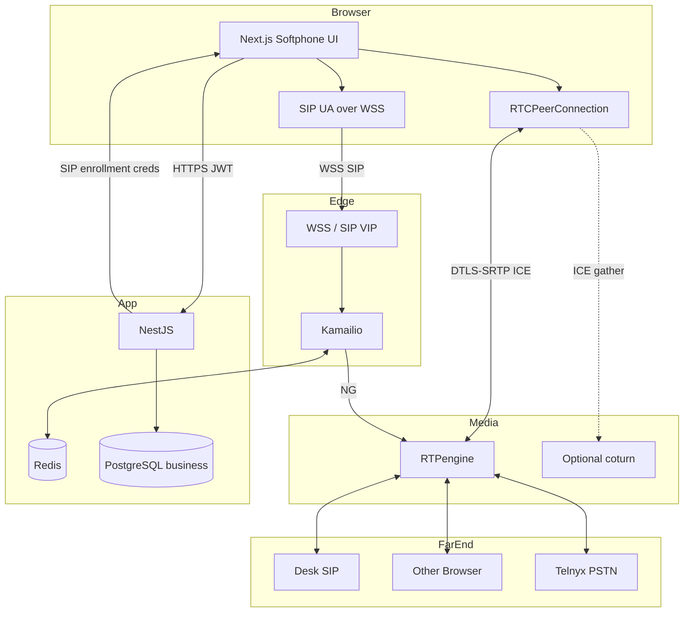
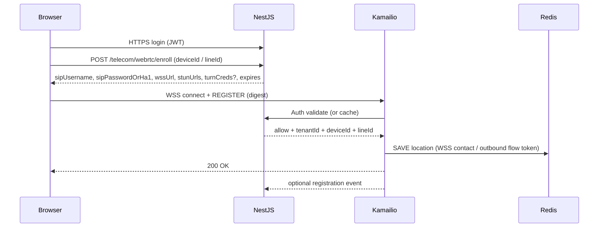
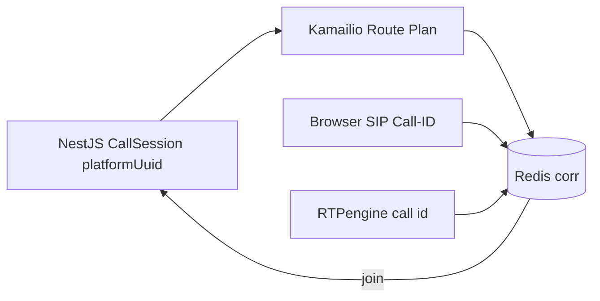

# VSP Phone v4 — WebRTC Signaling Architecture

| Field | Value |
|-------|-------|
| **Document ID** | TEL-WRTC-001 |
| **Version** | 1.0.0 |
| **Status** | Architecture — Sprint 4.4 Design |
| **Last Updated** | 2026-07-08 |
| **Owner** | Telecom Architecture |
| **Location** | `docs/04-telecom/webrtc-signaling-architecture.md` |
| **Depends On** | ADR-004, ADR-007, ADR-008, ADR-009, ADR-012; TEL-KAM-002; TEL-RTP-001; TEL-CAR-001; Frozen business domains |

---

## Purpose

This document defines the **enterprise WebRTC browser softphone architecture** for VSP Phone v4: SIP over Secure WebSocket (RFC 7118) for signaling, and DTLS-SRTP + ICE via RTPengine for media.

Architecture exercise only. No SIP.js/JsSIP code, Kamailio cfg, Docker, or Prisma changes.

**Frozen:** Identity, Telephony, Call Engine, Kamailio, RTPengine, Telnyx carrier.

**Hard boundaries**

- Kamailio owns SIP signaling (including WSS).
- RTPengine owns media (ICE/DTLS-SRTP bridging).
- NestJS owns business logic, auth token issuance for SIP enrollment, CallSession `platformUuid`.
- **No** ICE candidates, SDP, DTLS state, WebSocket connection IDs, or browser session IDs in the business Prisma schema.
- Cross-layer call correlation: **`platformUuid` only**.

---

## Table of Contents

1. [Executive Summary](#1-executive-summary)
2. [WebRTC Responsibilities](#2-webrtc-responsibilities)
3. [Component Interaction Diagram](#3-component-interaction-diagram)
4. [Browser Registration Architecture](#4-browser-registration-architecture)
5. [SIP over WebSocket Architecture](#5-sip-over-websocket-architecture)
6. [ICE / STUN / TURN Strategy](#6-ice--stun--turn-strategy)
7. [DTLS-SRTP Architecture](#7-dtls-srtp-architecture)
8. [Browser Authentication & Session Lifecycle](#8-browser-authentication--session-lifecycle)
9. [Media Flow Architecture](#9-media-flow-architecture)
10. [NAT Traversal Strategy](#10-nat-traversal-strategy)
11. [Security Architecture](#11-security-architecture)
12. [Observability Architecture](#12-observability-architecture)
13. [Telecom Correlation Strategy (`platformUuid`)](#13-telecom-correlation-strategy-platformuuid)
14. [Risks & Trade-offs](#14-risks--trade-offs)
15. [Recommended ADRs](#15-recommended-adrs)
16. [Enterprise Readiness Assessment](#16-enterprise-readiness-assessment)
17. [Final Architecture Recommendation](#17-final-architecture-recommendation)

---

## 1. Executive Summary

Browser calling in VSP Phone v4 uses the industry-standard **SIP-over-WebSocket softphone pattern** ([RFC 7118](https://datatracker.ietf.org/doc/html/rfc7118), [ADR-012](../ADR/ADR-012-webrtc-mobile-signaling.md)):

```text
Browser (SIP.js / JsSIP UA)
    │  WSS — SIP REGISTER / INVITE / BYE
    ▼
Kamailio (websocket + registrar + proxy)
    │  NG control
    ▼
RTPengine (ICE force-relay + DTLS-SRTP ↔ RTP/SRTP)
    │
    ├── Desk phone / another browser / media apps
    └── Telnyx PSTN
```

This matches Dialpad / Zoom Phone / RingCentral-class browser softphones: WSS signaling to an SBC/proxy, media terminated on a media engine that speaks WebRTC crypto and classic SIP media.

**Sprint 4.4 scope:** Browser client architecture. iOS/Android (ADR-012 approved) reuse the same Kamailio/RTPengine patterns with push ([ADR-012](../ADR/ADR-012-webrtc-mobile-signaling.md)); native mobile details remain a follow-on ADR.

---

## 2. WebRTC Responsibilities

### What “WebRTC” means here

| Plane | Technology | Owner |
|-------|------------|-------|
| **Signaling** | SIP over WSS (RFC 7118) | Browser UA + Kamailio |
| **Media** | RTP in DTLS-SRTP + ICE | Browser WebRTC stack + RTPengine |
| **Business** | Line/Device/CallSession | NestJS |

### Ownership matrix

| Component | Owns | Never does |
|-----------|------|------------|
| **Browser** | getUserMedia, RTCPeerConnection, SIP UA over WSS, local ICE gather | Persist SDP/ICE in platform DB; trust unsigned SIP without enrollment |
| **Kamailio** | WSS terminate, SIP parse, REGISTER location, routing, NG to RTPengine | Media crypto; JWT API auth for REST |
| **RTPengine** | ICE toward browser, DTLS-SRTP, bridge to SIP/PSTN media | SIP routing; Prisma writes |
| **NestJS** | Issue short-lived SIP enrollment credentials, Route Plan, CallSession, Presence APIs | Store ICE/SDP; process RTP |
| **Telnyx** | PSTN when call leaves platform | Browser registrar |
| **TURN (optional coturn)** | Client relay candidates when needed | Replace RTPengine anchoring |
| **Redis** | Location + `platformUuid` correlation (telecom) | Business source of truth |

---

## 3. Component Interaction Diagram



---

## 4. Browser Registration Architecture

### Identity model (frozen Telephony)

- Browser is a **Device** of type `WEBRTC` assigned to a **Line**.
- AoR maps to Line/extension within tenant realm (TEL-KAM-002 / proposed ADR-025).
- Multiple devices per user remain valid ([ADR-012](../ADR/ADR-012-webrtc-mobile-signaling.md), [ADR-003](../ADR/ADR-003-telephony-platform-decisions.md)).

### Registration flow



### Contact / Outbound

Browsers cannot form valid local SIP URIs ([Kamailio websocket docs](https://www.kamailio.org/docs/modules/stable/modules/websocket.html)). Architecture requires:

| Mechanism | Stance |
|-----------|--------|
| **SIP Outbound (RFC 5626) + Path (RFC 3327)** | **Preferred** for correct routing of requests to the WSS connection |
| **nathelper Contact alias** | Acceptable complement / fallback |

Location store holds the binding that lets any Kamailio node deliver INVITE to the correct WebSocket connection (shared Redis location per TEL-KAM-002).

### Expiration

- Short REGISTER expires (e.g. 60–300s) with frequent refresh for presence of softphones.
- NestJS enrollment credentials TTL ≤ registration policy; rotate on re-enroll.

---

## 5. SIP over WebSocket Architecture

### Transport

| Item | Decision |
|------|----------|
| Scheme | **WSS only** in production ([ADR-012](../ADR/ADR-012-webrtc-mobile-signaling.md) Secure WebSocket Only) |
| Subprotocol | `sip` per RFC 7118 |
| Edge | Kamailio `websocket` + TLS certificates on VIP / ingress |
| Keepalive | WebSocket ping/pong + SIP OPTIONS or REGISTER refresh |
| Message framing | One SIP message per WebSocket message (RFC 7118) |

### Signaling path vs media path

- **Signaling:** Browser ↔ Kamailio (WSS) — may stay on same region VIP.
- **Media:** Browser ↔ RTPengine (UDP/DTLS) — never hairpinned through NestJS.

### UA library

Implementation choice (SIP.js vs JsSIP vs custom) is deferred; architecture requires RFC 7118 UA behavior, Outbound-ready REGISTER, and DTLS-SRTP/ICE SDP.

### Desktop / other browsers

Same WSS registrar; codec and autoplay policies vary by browser — tracked in compatibility matrix (ADR).

---

## 6. ICE / STUN / TURN Strategy

Aligned with [TEL-RTP-001](./rtpengine-architecture.md) and [ADR-012](../ADR/ADR-012-webrtc-mobile-signaling.md):

| Element | Role |
|---------|------|
| **STUN** | Browser gathers server-reflexive candidates |
| **TURN (coturn)** | Optional relay for restrictive corp NAT / symmetric NAT |
| **RTPengine ICE** | `ICE=force` / `force-relay` so **call media always anchors** on RTPengine |

### Policy

1. Production calls still **must** complete media through RTPengine (always-on anchor).
2. TURN is for **candidate gathering / reachability**, not a substitute for media anchoring.
3. NestJS enroll response supplies `iceServers` (STUN/TURN URLs + short-lived TURN credentials).
4. Strip/bridge ICE when peer is non-WebRTC SIP/Telnyx via RTPengine flags (`ICE=remove` on SIP leg).

---

## 7. DTLS-SRTP Architecture

| Leg | Crypto |
|-----|--------|
| Browser ↔ RTPengine | **DTLS-SRTP mandatory**; clear RTP rejected |
| RTPengine ↔ Desk SIP | RTP or SDES-SRTP per device policy |
| RTPengine ↔ Telnyx | Typically RTP (TEL-CAR-001) |
| Browser ↔ Browser | Each leg DTLS to RTPengine (not P2P in production) |

### Key handling

- DTLS handshake between browser and RTPengine only.
- No DTLS keys, fingerprints, or SDP `a=fingerprint` stored in Prisma.
- Optional SDP fingerprint logging redacted in production.

---

## 8. Browser Authentication & Session Lifecycle

### Dual auth planes ([ADR-007](../ADR/ADR-007-authentication-authorization.md))

| Plane | Mechanism |
|-------|-----------|
| App / REST | JWT access + refresh |
| SIP | Digest (or equivalent) using **enrollment credentials** bound to Device |

Enrollment credentials ≠ User password. Issued by NestJS Telecom enroll API after JWT authorization and Device ownership checks.

### Lifecycle

```text
Login (JWT)
  → Select/create WebRTC Device
  → Enroll (SIP creds + WSS + ICE servers)
  → WSS REGISTER
  → Ready (Presence AVAILABLE if policy)
  → INVITE / accept calls
  → Unregister / enroll revoke on logout
```

### Reconnect & recovery

| Event | Behavior |
|-------|----------|
| WSS drop | UA auto-reconnect; re-REGISTER; Outbound flow recovers dialog path |
| Brief network blip | Media may recover via ICE restart; if fails → BYE + user retry |
| JWT expire mid-session | Softphone refreshes JWT for REST; SIP digests independent until enroll expiry |
| Enroll expiry | Forced re-enroll; REGISTER with new creds |
| Kamailio node loss | VIP / sticky WSS; shared location; re-REGISTER if connection reset |
| Mid-call RTPengine loss | Media drop (TEL-RTP-001 SLA); signaling may survive to tell NestJS ENDED |

**Do not** attempt to restore CallSession by storing browser PeerConnection IDs in PostgreSQL.

### Presence

- REGISTER success → NestJS may set Presence via events ([ADR-004](../ADR/ADR-004-call-architecture.md) / Line Presence).
- Softphone UI also updates presence via NestJS APIs (business), not via raw SIP PUBLISH unless later ADR enables it.

---

## 9. Media Flow Architecture

All scenarios: **Kamailio NG offer/answer with WebRTC-leg flags** (DTLS + ICE force-relay) and peer-leg flags as required.

### Browser → Browser

```text
Browser A ←DTLS-SRTP+ICE→ RTPengine ←DTLS-SRTP+ICE→ Browser B
```

Two WebRTC Devices / Lines; NestJS Route Plan forks or targets; both legs WebRTC.

### Browser → Desk phone

```text
Browser ←DTLS-SRTP+ICE→ RTPengine ←RTP/SRTP→ Grandstream
```

### Browser → PSTN

```text
Browser ←DTLS-SRTP+ICE→ RTPengine ←RTP→ Telnyx ←→ PSTN
```

### PSTN → Browser

```text
PSTN → Telnyx → Kamailio → NestJS DNIS → INVITE to WebRTC Contact over WSS
Media: Telnyx ←RTP→ RTPengine ←DTLS-SRTP→ Browser
```

### Codecs

| Preference | Codecs |
|------------|--------|
| WebRTC offer | Opus, then G.711 |
| Toward PSTN | RTPengine may transcode Opus ↔ G.711 |
| Toward desk | Prefer G.711/G.722 passthrough when possible |

DTMF: RFC 4733 telephone-event through DTLS-SRTP; IVR media apps consume as in TEL-RTP-001.

---

## 10. NAT Traversal Strategy

| Layer | Mechanism |
|-------|-----------|
| Signaling NAT | WSS out to Kamailio VIP (browser-friendly); Outbound/Path for return path |
| Media NAT | ICE + STUN + optional TURN + **RTPengine forced relay** |
| Symmetric / corp firewall | TURN + RTPengine public UDP ranges allowlisted |
| Hairpin | Disabled for production production P2P; always relay |

Publish RTPengine and TURN UDP/TCP ports in customer IT docs (same as Zoom/Teams network requirements pattern).

---

## 11. Security Architecture

| Control | Design |
|---------|--------|
| **WSS** | TLS 1.2+; modern ciphers; HSTS on softphone origin |
| **HTTPS** | Softphone and enroll API only over TLS |
| **DTLS-SRTP** | Mandatory for browser media |
| **Token validation** | JWT for enroll; SIP digest validates enrollment secret |
| **Enroll binding** | Credentials scoped to `tenantId` + `deviceId` + `lineId`; short TTL |
| **Origin checks** | Optional WSS origin allow list per tenant app domain |
| **Strip spoofed headers** | Ignore client `X-VSP-*` until authenticated |
| **Microphone permission** | Browser UX; no server trust of muted state alone |
| **Recording notice** | Business policy / UI (compliance) when Route Plan enables record |
| **XSS / token theft** | Softphone follows Next.js CSP; store SIP secret in memory, not localStorage if possible |

---

## 12. Observability Architecture

Aligned with [ADR-016](../ADR/ADR-016-monitoring-observability.md):

| Signal | Examples |
|--------|----------|
| **Logs** | `tenantId`, `deviceId`, `platformUuid`, WSS connect/disconnect, REGISTER result (no passwords) |
| **Metrics** | WSS connections, REGISTER success rate, INVITE from WS, ICE failure rate, DTLS handshake fail, enroll API latency |
| **Client metrics** | Softphone may report getStats (RTT, packet loss) to NestJS telemetry API — optional ADR |
| **Tracing** | NestJS enroll + routing spans; attribute `platformUuid` on call setup |
| **Alerts** | WSS error spikes, ICE fail %, enroll 401 storms |

WebRTC session IDs appear only in telecom/client logs — never as business keys.

---

## 13. Telecom Correlation Strategy (`platformUuid`)



| Artifact | Storage |
|----------|---------|
| `platformUuid` | CallSession (business) + SIP header + Redis |
| Browser SIP Call-ID | Redis only |
| RTCPeerConnection / mid | Browser memory / telecom logs only |
| ICE candidates / SDP | On-wire + RTPengine; **not** Prisma |
| Recording object key | Includes `platformUuid` (TEL-RTP-001) |

Transfers / ICE restart may change SIP Call-ID or media; Redis remaps to the same `platformUuid`.

---

## 14. Risks & Trade-offs

| Risk | Trade-off | Mitigation |
|------|-----------|------------|
| Browser autoplay / mic permissions | UX friction | Pre-call permission UX |
| Safari/WebKit gaps | Interop | Compatibility matrix; Opus/G.711 baseline |
| Corp firewall blocks UDP | Calls fail without TURN | Deploy coturn; document ports |
| Always-relay bandwidth | Cost | Same as TEL-RTP-001; required for recording |
| WSS sticky sessions | LB complexity | Shared location + Outbound; VIP |
| Stolen enroll creds | Impersonation | Short TTL; revoke on logout; device bind |
| SIP.js vs JsSIP choice | Team familiarity | ADR-038 picks one |
| Mobile background | Separate from browser | Follow-on mobile ADR for push |

---

## 15. Recommended ADRs

| ADR | Title | Purpose |
|-----|-------|---------|
| **ADR-038** | Browser Softphone Client Stack | SIP.js vs JsSIP; enroll API shape; iceServers |
| **ADR-039** | SIP over WSS & Outbound Profile | WSS listener, Path/Outbound, expires, keepalive |
| **ADR-030** | Media Crypto & ICE Policy | Confirm WebRTC flag matrix (if not Accepted) |
| **ADR-040** | TURN Credential Service | Short-lived TURN REST (time-limited coturn) |
| **ADR-025** | SIP Identity & Realm | WebRTC AoR format (shared with Kamailio) |
| **ADR-041** | Softphone Presence & Multi-Device UX | Ring-all vs last-active for WebRTC Devices |

Do not start softphone UI wiring until **ADR-038** and **ADR-039** are Accepted.

---

## 16. Enterprise Readiness Assessment

| Dimension | Score (0–10) | Notes |
|-----------|--------------|-------|
| Standards alignment | 9.5 | RFC 7118 + DTLS-SRTP + ICE |
| Fit with frozen Kamailio/RTP | 9.5 | Direct extension of TEL-KAM/RTP |
| Security | 9 | WSS + DTLS + enroll TTL |
| NAT / enterprise network | 8 | Needs TURN ops maturity |
| Multi-tenant isolation | 9 | Device/Line scoped enroll |
| HA / scale | 8 | Shared location + VIP WSS |
| Ops observability | 8 | Metrics defined |
| **Overall design readiness** | **8.7** | Ready to freeze Sprint 4.4 |

---

## 17. Final Architecture Recommendation

**Adopt this WebRTC signaling architecture as the Sprint 4.4 baseline.**

### Lock these decisions

1. Browser softphone = **SIP over WSS** to Kamailio (RFC 7118).  
2. Media = **DTLS-SRTP + ICE force-relay** through RTPengine (no production P2P).  
3. NestJS issues **short-lived SIP enrollment** after JWT auth; separate from User password.  
4. Prefer **SIP Outbound + Path** for WSS contact routing.  
5. Optional **coturn** for gather; does not replace anchoring.  
6. `platformUuid` only cross-layer call ID; no WebRTC protocol state in Prisma.  
7. Same Device/Line model as desk phones for multi-device ringing.  
8. No Prisma redesign.

### Implementation sequence

1. Accept ADR-038 / ADR-039.  
2. Kamailio WSS listener + Outbound/Path REGISTER.  
3. NestJS enroll API + iceServers.  
4. Browser REGISTER smoke test.  
5. Browser ↔ browser call via RTPengine.  
6. Browser ↔ desk; browser ↔ Telnyx.  
7. Reconnect / expire / revoke tests.  
8. TURN for restricted networks.  
9. Softphone metrics dashboard.

### Non-goals for Sprint 4.4

- Native iOS/Android push architecture (follow-on)  
- Video / screenshare ([ADR-012](../ADR/ADR-012-webrtc-mobile-signaling.md) future)  
- Storing SDP/ICE in PostgreSQL  
- P2P media without RTPengine  

---

## Related Documents

| Document | Role |
|----------|------|
| [ADR-012 WebRTC & Mobile](../ADR/ADR-012-webrtc-mobile-signaling.md) | Approved client rules |
| [TEL-KAM-002](./kamailio-telecom-integration-architecture.md) | WSS edge + location |
| [TEL-RTP-001](./rtpengine-architecture.md) | ICE/DTLS/media |
| [TEL-CAR-001](./telnyx-carrier-integration-architecture.md) | Browser ↔ PSTN |
| RFC 7118 | SIP over WebSocket |

---

## Revision History

| Version | Date | Changes |
|---------|------|---------|
| 1.0.0 | 2026-07-08 | Sprint 4.4 WebRTC signaling architecture |
