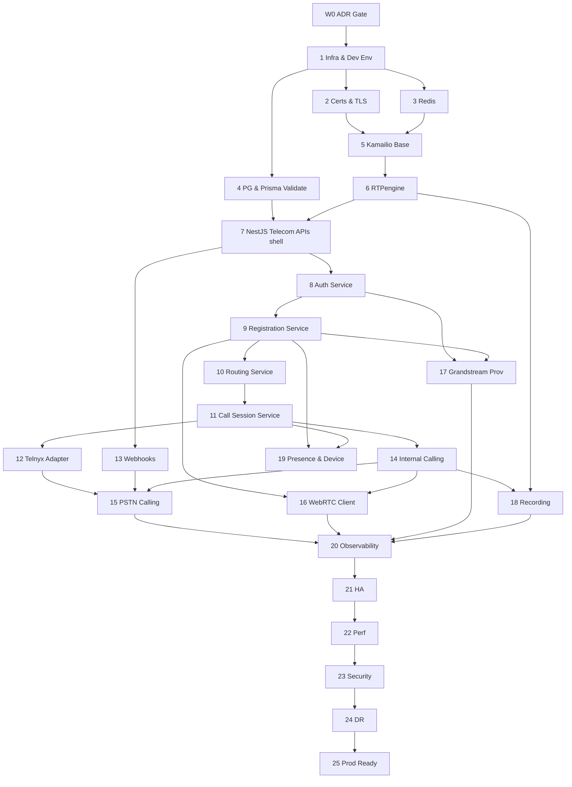

# VSP Phone v4 — Sprint 5 Engineering Implementation Blueprint

| Field | Value |
|-------|-------|
| **Document ID** | IMP-S5-001 |
| **Version** | 1.0.0 |
| **Status** | Engineering Playbook — Pre-Implementation |
| **Last Updated** | 2026-07-08 |
| **Owner** | Engineering Management / Architecture |
| **Location** | `docs/09-implementation/sprint-5-engineering-blueprint.md` |
| **Depends On** | All Accepted ADRs; TEL-KAM-002; TEL-RTP-001; TEL-CAR-001; TEL-WRTC-001; TEL-PROV-001; TEL-RT-001 |

---

## Purpose

This is the **engineering implementation playbook** for Sprint 5. It translates the frozen architecture (through Sprint 4.6) into phased delivery: objectives, dependencies, APIs, events, tests, deploy/rollback, and production readiness.

**This is not implementation.** Do not treat this document as permission to redesign frozen domains, invent Prisma models, or rewrite telecom architecture.

**Hard rules**

- No architectural redesign unless a critical production-blocking defect is found and escalated.
- No SIP protocol state in the business Prisma schema.
- `platformUuid` is the only cross-layer call correlator.
- Telecom integration events ≠ ADR-014 domain events (both are inventoryed; mapping is explicit).

---

## Table of Contents

1. [Sprint 5 Master Roadmap](#1-sprint-5-master-roadmap)
2. [Phase Dependency Diagram](#2-phase-dependency-diagram)
3. [Phase Definitions (1–25)](#3-phase-definitions-1–25)
4. [Engineering Milestones](#4-engineering-milestones)
5. [API Inventory](#5-api-inventory)
6. [Event Inventory](#6-event-inventory)
7. [Testing Strategy](#7-testing-strategy)
8. [Deployment Strategy](#8-deployment-strategy)
9. [Rollback Strategy](#9-rollback-strategy)
10. [Production Readiness Checklist](#10-production-readiness-checklist)
11. [Final Implementation Recommendation](#11-final-implementation-recommendation)

---

## 1. Sprint 5 Master Roadmap

### 1.1 Scope

Deliver a working **multi-tenant voice path** in a staging environment:

Desk phone and/or softphone REGISTER → internal call → PSTN in/out (Telnyx) → WebRTC browser call → basic recording → provisioning path for Grandstream → observability + HA smoke + DR drill evidence.

Queue/IVR/Conference **runtime** may ship as thin vertical slices after core voice (still within Sprint 5 if capacity allows; otherwise Sprint 5.1). They are already designed in TEL-RT-001 — implement behind the same NestJS continue APIs once media apps exist.

### 1.2 Wave overview

| Wave | Phases | Goal | Exit gate |
|------|--------|------|-----------|
| **W0 — Gate** | ADR acceptance | Contracts frozen | ADR-019, 021, 024, 025, 029, 038, 039, 042–044 Accepted (049 if conf in S5) |
| **W1 — Foundation** | 1–6 | Env, TLS, Redis, Prisma validate, Kamailio+RTPengine up | Healthchecks green; SIP OPTIONS OK |
| **W2 — Telecom core** | 7–11 | NestJS telecom APIs, auth, register, route, CallSession | Desk REGISTER + CallSession on internal INVITE |
| **W3 — Carrier & voice** | 12–15 | Telnyx adapter, webhooks, internal+PSTN | E.164 call completes both directions |
| **W4 — Clients & devices** | 16–17 | WebRTC client, Grandstream provisioning | Browser↔desk; MAC→cfg→REGISTER |
| **W5 — Media ops** | 18–19 | Recording, presence/device state | Recording object + metadata; presence drives busy |
| **W6 — Productionize** | 20–25 | Monitor, HA, perf, security, DR, readiness | Signed Production Readiness Checklist |

### 1.3 Team lanes (suggested)

| Lane | Focus phases |
|------|----------------|
| **Platform / DevOps** | 1–3, 6, 20–22, 24–25 |
| **Telecom (Kamailio/RTP)** | 5–6, 14–15, 21–22 |
| **NestJS backend** | 4, 7–13, 18–19 |
| **Client (Web)** | 16 |
| **Devices** | 17 |
| **QA / Security** | All waves; lead 22–23, 25 |

### 1.4 Non-goals (Sprint 5)

- Yealink/Fanvil/Poly provisioning  
- Full BLF / SLA product  
- Kafka event bus (remain NestJS EventEmitter + HTTP telecom callbacks; NATS later per ADR-014)  
- Prisma redesign / CallSession SIP columns  
- Architecture rewrites of Sprint 1–4.6  

---

## 2. Phase Dependency Diagram

**Critical path:** W0 → 1 → 2/3/4 → 5 → 6 → 7 → 8 → 9 → 10 → 11 → 14 → 15 → 20 → 25.

WebRTC (16) and Provisioning (17) can run **in parallel** after Registration (9), with Internal Calling (14) preferred before softphone E2E.

---

## 3. Phase Definitions (1–25)

### Phase 0 — ADR Gate (prerequisite, not numbered in user list)

| Field | Content |
|-------|---------|
| **Objective** | Accept required ADRs so engineers do not invent wire contracts mid-sprint |
| **Prerequisites** | Sprint 4.6 frozen |
| **Deliverables** | Accepted: ADR-019, 021, 024, 025, 029, 038, 039, 042, 043, 044; ADR-049 if conference in S5; ADR-051 if E911 fail-open claimed |
| **Components** | Architecture council |
| **Risks** | Partial acceptance → ambiguous AoR/DNIS/header formats |
| **Acceptance** | ADR index shows Accepted; OpenAPI stubs match ADR-024 |
| **Testing** | Contract review checklist signed |
| **Rollback** | N/A — do not start W1 coding without gate |

---

### Phase 1 — Infrastructure & Development Environment

| Field | Content |
|-------|---------|
| **Objective** | Reproducible local + shared staging stack (Compose first per ADR-015) |
| **Prerequisites** | Phase 0 |
| **Deliverables** | Updated `docker-compose` (Postgres, Redis, NestJS, Kamailio, RTPengine placeholders, MinIO/S3 local, mailhog optional); seed scripts; `.env.example`; Dev onboarding README |
| **Components** | DevOps, all eng |
| **Risks** | Host networking / UDP ports on Windows; image drift |
| **Acceptance** | New engineer brings stack up in &lt; 1 hour; `health` endpoints respond |
| **Testing** | Smoke compose up; CI compose lint |
| **Rollback** | Revert compose PR; keep prior Postgres volume |

---

### Phase 2 — Certificates & TLS

| Field | Content |
|-------|---------|
| **Objective** | TLS for SIP, WSS, HTTPS APIs, provisioning edge |
| **Prerequisites** | Phase 1 |
| **Deliverables** | Dev: mkcert/local CA; Staging: ACME or uploaded certs for `api.`, `sip.`, `wss.`, `prov.`; trust store notes for Grandstream Validate Server Certificates |
| **Components** | DevOps, Kamailio, NestJS, Provisioning edge |
| **Risks** | WSS cert SAN mismatch; device trust of private CA |
| **Acceptance** | TLS handshake OK for HTTPS/WSS/SIP TLS; no plaintext production profiles |
| **Testing** | openssl/s_client; browser WSS; desk TLS REGISTER test |
| **Rollback** | Prior cert revision in secrets manager; keep overlapping validity |

---

### Phase 3 — Redis Integration

| Field | Content |
|-------|---------|
| **Objective** | Shared location, correlation, auth cache keys ready |
| **Prerequisites** | Phase 1 |
| **Deliverables** | Redis HA or Compose Redis; key namespace `vsp:{tenantId}:…`; TTL conventions from ADR-019; NestJS Redis module; Kamailio Redis connector |
| **Components** | NestJS, Kamailio, DevOps |
| **Risks** | Key collision; unbounded growth; single-node as “HA” |
| **Acceptance** | SET/GET location+corr round-trip; flush policy documented |
| **Testing** | Unit key builders; integration TTL; failover stub if Sentinel/Cluster |
| **Rollback** | Flush telecom DB only; business PG untouched |

---

### Phase 4 — PostgreSQL & Prisma Validation

| Field | Content |
|-------|---------|
| **Objective** | Confirm frozen schema boots; **no redesign** — validate only |
| **Prerequisites** | Phase 1 |
| **Deliverables** | `prisma migrate` on staging; seed Tenant/User/Line/Extension/Device; report of any Sprint 3 conditional issues (e.g. `sipCallId` if still present → ticket to remove before telecom writes — do not add new SIP columns) |
| **Components** | NestJS data lane |
| **Risks** | Drift between docs and schema; accidental migrations |
| **Acceptance** | Migrate apply clean; app boot; CRUD smoke on Identity/Telephony |
| **Testing** | Migration CI; schema validate; seed integration |
| **Rollback** | Restore PG snapshot from pre-migrate |

---

### Phase 5 — Kamailio Base Configuration

| Field | Content |
|-------|---------|
| **Objective** | VIP listener TLS/WSS, pike, dispatcher skeleton, NestJS HTTP client stubs |
| **Prerequisites** | Phases 2–3; ADR-024/025 |
| **Deliverables** | Base `kamailio.cfg` (implement now — first code drop allowed for Kamailio); health; OPTIONS; version pin |
| **Components** | Telecom lane |
| **Risks** | Over-thick dialplan before NestJS APIs exist |
| **Acceptance** | Kamailio starts; TLS/WSS accept connections; logs structured |
| **Testing** | SIPp OPTIONS; config lint; reload drill |
| **Rollback** | Previous cfg artifact in object store; `kamcmd` reload prior |

---

### Phase 6 — RTPengine Deployment

| Field | Content |
|-------|---------|
| **Objective** | NG control from Kamailio; media ports open; recording path stub |
| **Prerequisites** | Phase 5 |
| **Deliverables** | RTPengine container/VM; firewall UDP ranges; Kamailio `rtpengine` set; offer/answer smoke with two soft UAs |
| **Components** | Telecom, DevOps |
| **Risks** | NAT/public IP advertising; kernel modules |
| **Acceptance** | Anchored audio between two lab UAs; `delete` cleans |
| **Testing** | PCR metrics sample; ng-client offer/answer |
| **Rollback** | Drain node from set; traffic to remaining |

---

### Phase 7 — NestJS Telecom APIs (shell)

| Field | Content |
|-------|---------|
| **Objective** | Module wiring + OpenAPI for telecom endpoints (empty correct contracts) |
| **Prerequisites** | Phases 4–6; ADR-024 |
| **Deliverables** | Controllers under `/api/v1/telecom/...` + internal service-auth routes for Kamailio; request validation DTOs; mTLS or shared HMAC for Kamailio→API |
| **Components** | `kamailio`, `sip`, `call`, `carrier`, `rtpengine`, `provisioning` modules |
| **Risks** | Public exposure of telecom routes |
| **Acceptance** | OpenAPI published; 401 without service auth; contract tests green |
| **Testing** | e2e contract tests; auth negative tests |
| **Rollback** | Feature-flag routes off |

---

### Phase 8 — Authentication Service

| Field | Content |
|-------|---------|
| **Objective** | SIP digest verification via vault/HA1; separate from User JWT |
| **Prerequisites** | Phase 7; ADR-043/025 |
| **Deliverables** | `POST /api/v1/telecom/auth/sip-digest`; Redis auth cache TTL; vault integration |
| **Components** | NestJS auth/sip, Vault, Kamailio |
| **Risks** | Timing attacks; cache serving revoked creds too long |
| **Acceptance** | Good creds allow; bad deny; revoke ≤ cache TTL |
| **Testing** | Unit HA1; integration with Kamailio REGISTER |
| **Rollback** | Disable cache; force NestJS verify; revoke vault version |

---

### Phase 9 — Registration Service

| Field | Content |
|-------|---------|
| **Objective** | Kamailio usrloc → Redis; NestJS registration events → Device status sync |
| **Prerequisites** | Phase 8 |
| **Deliverables** | Location bindings; `registration.*` integration events; periodic `lastRegisteredAt` sync |
| **Components** | Kamailio, Redis, NestJS device/sip |
| **Risks** | Writing Contact into Prisma |
| **Acceptance** | Desk + one UA REGISTER; restart Kamailio node retains location (shared Redis) |
| **Testing** | Expire/refresh/reboot scenarios from TEL-RT-001 |
| **Rollback** | Clear AoR bindings; devices fall OFFLINE via reconcile |

---

### Phase 10 — Routing Service

| Field | Content |
|-------|---------|
| **Objective** | Route Plan resolver: internal extension, DNIS, outbound PSTN intent |
| **Prerequisites** | Phase 9; ADR-021 |
| **Deliverables** | `POST /telecom/routing/resolve` + `continue`; CallPolicy/CallerID checks; fail-closed |
| **Components** | NestJS call/telephony/phone-number |
| **Risks** | Latency; N+1 DB; cross-tenant leak |
| **Acceptance** | Contract tests for INTERNAL/INBOUND/OUTBOUND; tenant isolation tests |
| **Testing** | Unit policy matrix; integration DNIS fixtures |
| **Rollback** | Flag: reject all new INVITEs |

---

### Phase 11 — Call Session Service

| Field | Content |
|-------|---------|
| **Objective** | Allocate `platformUuid`; persist CallSession lifecycle from telecom events |
| **Prerequisites** | Phase 10 |
| **Deliverables** | Create on resolve; transitions Ringing→Answered→Ended; ADR-014 `CallStarted`/`CallAnswered`/`CallEnded`; Redis corr write coordination with Kamailio |
| **Components** | NestJS `call`, Kamailio events |
| **Risks** | Double create; SIP Call-ID stored in PG |
| **Acceptance** | One CallSession per business call; corr keys present; **zero** SIP IDs in business columns |
| **Testing** | Idempotent event apply; concurrent invites |
| **Rollback** | Stop event consumers; freeze sessions ENDED via admin job |

---

### Phase 12 — Telnyx Carrier Adapter

| Field | Content |
|-------|---------|
| **Objective** | Adapter interface + Telnyx impl for trunk hints + number ops subset |
| **Prerequisites** | Phase 11; TEL-CAR-001 |
| **Deliverables** | `selectTrunk`, DID search/order stubs needed for lab; secrets in vault; `Carrier` row TELNYX |
| **Components** | `carrier` module |
| **Risks** | Creds in repo; sandbox vs prod mix |
| **Acceptance** | TrunkHint for lab destination; dry-run number search |
| **Testing** | Adapter unit with recorded HTTP; contract |
| **Rollback** | Disable carrier feature flag |

---

### Phase 13 — Webhook Processing

| Field | Content |
|-------|---------|
| **Objective** | Verify & normalize Telnyx webhooks; enrich correlation only |
| **Prerequisites** | Phase 7+12 |
| **Deliverables** | `POST /api/v1/webhooks/telnyx`; signature verify; idempotent ingest; map to `carrier.webhook.received` + optional corr update |
| **Components** | `webhook`, `carrier` |
| **Risks** | Replay attacks; Kamailio conflicting as call authority |
| **Acceptance** | Invalid sig 401; duplicate delivery no double side effects |
| **Testing** | Signature fixtures; idempotency keys |
| **Rollback** | Return 503; queue to DLQ |

---

### Phase 14 — Internal Calling

| Field | Content |
|-------|---------|
| **Objective** | Extension→Extension with media via RTPengine |
| **Prerequisites** | Phases 6, 9–11 |
| **Deliverables** | Kamailio execute FORK Route Plan; RTP anchored; events → CallSession |
| **Components** | Kamailio, RTPengine, NestJS |
| **Risks** | One-way audio; codec mismatch |
| **Acceptance** | Two lab devices bidirectional audio; BYE ends session + deletes media |
| **Testing** | SIPp + real softphones; busy/no-answer paths |
| **Rollback** | Disable internal dialing feature; announce maintenance |

---

### Phase 15 — PSTN Calling

| Field | Content |
|-------|---------|
| **Objective** | Outbound + inbound Telnyx SIP with CLI/DNIS |
| **Prerequisites** | 12–14 |
| **Deliverables** | Dispatcher sets; ACL Telnyx IPs; CLI validation; failover secondary set smoke |
| **Components** | Kamailio, Adapter, NestJS |
| **Risks** | Toll fraud; wrong CLI; geo/IP ACL gaps |
| **Acceptance** | Outbound PSTN answer; inbound DID rings internal; anonymous/policy cases covered in tests |
| **Testing** | Carrier lab numbers; fraud rate-limit tests |
| **Rollback** | Remove DID routing; reject INBOUND; block OUTBOUND intent |

---

### Phase 16 — WebRTC Browser Client

| Field | Content |
|-------|---------|
| **Objective** | Browser softphone MVP (SIP.js or JsSIP per ADR-038) |
| **Prerequisites** | 2, 8–9, 14; ADR-038/039 |
| **Deliverables** | Enroll API; WSS REGISTER; browser↔browser and browser↔desk calls; ICE force-relay |
| **Components** | Admin/web app, NestJS, Kamailio, RTPengine |
| **Risks** | Autoplay/mic; Safari gaps |
| **Acceptance** | Login→enroll→call&lt;30s setup; reconnect re-REGISTER documented |
| **Testing** | Chrome/Firefox matrix; WSS drop; enroll expiry |
| **Rollback** | Hide softphone UI; revoke enroll issuing |

---

### Phase 17 — Grandstream Provisioning Service

| Field | Content |
|-------|---------|
| **Objective** | HTTPS provisioning MVP for one GRP/GXP model |
| **Prerequisites** | 2, 8–9; ADR-042–044 |
| **Deliverables** | Device enroll + template render + Provisioning Server; MAC auth; quarantine unknown MAC; cfg→REGISTER |
| **Components** | `provisioning`, edge, vault, DeviceAssignment |
| **Risks** | Secret leakage in artifacts; open auto-join |
| **Acceptance** | Factory/stage phone pulls cfg; registers; reassign reprovisions |
| **Testing** | MAC isolation; cert validation on; rotate secret |
| **Rollback** | Freeze artifact publish; phones keep last cfg |

---

### Phase 18 — Recording Pipeline

| Field | Content |
|-------|---------|
| **Objective** | Policy-driven record → OSS → NestJS Recording metadata |
| **Prerequisites** | 6, 14; ADR-029 |
| **Deliverables** | NG start/stop; upload worker; `Recording` finalize; pause/resume stub if PCI needed |
| **Components** | RTPengine, Kamailio, NestJS `recording`, OSS |
| **Risks** | Unencrypted buckets; missing platformUuid in keys |
| **Acceptance** | Answered call produces playable object + DB row; BYE finalizes |
| **Testing** | Missing upload reconcile; dual-segment |
| **Rollback** | Route Plan force `recording.enabled=false` |

---

### Phase 19 — Presence & Device State

| Field | Content |
|-------|---------|
| **Objective** | Presence from registration + call events; Device ONLINE/OFFLINE/BUSY |
| **Prerequisites** | 9, 11 |
| **Deliverables** | Presence updates; queue eligibility inputs; admin visibility |
| **Components** | NestJS presence/device/call |
| **Risks** | Flapping; overwriting user DND |
| **Acceptance** | On call → ON_CALL/BUSY; unregister → OFFLINE within reconcile SLA |
| **Testing** | Race call vs unregister |
| **Rollback** | Presence read-only default AVAILABLE |

---

### Phase 20 — Monitoring & Observability

| Field | Content |
|-------|---------|
| **Objective** | Metrics/logs/traces with `platformUuid` correlation |
| **Prerequisites** | Voice paths working (14–16) |
| **Deliverables** | Prometheus metrics; structured logs; OTel traces NestJS→annotate Kamailio where possible; dashboards per ADR-016 / TEL-RT-001 |
| **Components** | All |
| **Risks** | PII in logs; high cardinality labels |
| **Acceptance** | Trace one PSTN call end-to-end by platformUuid; alert rules for auth_fail / rtp_node_down |
| **Testing** | Chaos log redaction tests |
| **Rollback** | Reduce sample rate; disable noisy debug |

---

### Phase 21 — High Availability

| Field | Content |
|-------|---------|
| **Objective** | Prove active-active Kamailio + multi RTPengine + API replicas |
| **Prerequisites** | 3, 5–6, 20 |
| **Deliverables** | 2 Kamailio nodes shared Redis; VIP; dispatcher probe; API ≥2; drain runbooks |
| **Components** | DevOps, Telecom |
| **Risks** | Dialog loss on node kill (documented) |
| **Acceptance** | Kill one Kamailio: new REGISTERs OK; kill one RTP: new calls OK; document in-call drop |
| **Testing** | Failover test plan executed & recorded |
| **Rollback** | Scale back to last known topology |

---

### Phase 22 — Performance Testing

| Field | Content |
|-------|---------|
| **Objective** | Establish baseline capacity before prod |
| **Prerequisites** | 21 |
| **Deliverables** | SIPp REGISTER/INVITE profiles; NestJS resolve load; targets documented (e.g. cps, concurrent calls) |
| **Components** | QA, Telecom, NestJS |
| **Risks** | Lab ≠ prod network |
| **Acceptance** | Written baseline + bottleneck notes; no error budget blow on agreed profile |
| **Testing** | Load + soak 1–4h |
| **Rollback** | N/A (lab) |

---

### Phase 23 — Security Hardening

| Field | Content |
|-------|---------|
| **Objective** | Prod security controls enforced |
| **Prerequisites** | 15–18 |
| **Deliverables** | Rate limits, header strip, vault-only secrets, WAF/ACL review, dependency scan, threat checklist sign-off |
| **Components** | Security, all |
| **Risks** | Toll fraud; provisioning MAC enumerate |
| **Acceptance** | Pen-test or internal review on REGISTER/INVITE/prov/webhook; findings ≤ agreed severity |
| **Testing** | Security test suite (§7) |
| **Rollback** | Emergency dial-block + API lockdown flags |

---

### Phase 24 — Disaster Recovery Validation

| Field | Content |
|-------|---------|
| **Objective** | Execute ADR-017 drills for PG, Redis, recordings, configs |
| **Prerequisites** | 21, backups configured |
| **Deliverables** | Restore PG to staging; Redis rebuild procedure; kamailio.cfg + template artifact restore; RTO/RPO evidence |
| **Components** | DevOps |
| **Risks** | Untested backups |
| **Acceptance** | Signed drill report meeting ADR-017 targets |
| **Testing** | Restore game day |
| **Rollback** | Keep primary intact; drill on clone |

---

### Phase 25 — Production Readiness Checklist

| Field | Content |
|-------|---------|
| **Objective** | Go / no-go for limited production pilot |
| **Prerequisites** | 1–24 exit criteria met |
| **Deliverables** | Completed §10 checklist; pilot tenant; on-call rota; runbooks |
| **Components** | Eng Manager + Architects |
| **Risks** | Soft launches without fraud controls |
| **Acceptance** | All **Blocker** items green; known issues logged |
| **Testing** | Pilot call script (internal+PSTN+WebRTC+record) |
| **Rollback** | Pilot kill switch: disable PSTN + enroll + provisioning publish |

---

## 4. Engineering Milestones

| Milestone | When (relative) | Evidence |
|-----------|-----------------|----------|
| **M0** ADR Gate | Week 0 | ADR Accepted list |
| **M1** Lab SIP plane up | End W1 | OPTIONS + RTP smoke |
| **M2** First REGISTER | Mid W2 | Desk/UA 200 OK |
| **M3** First internal call | End W2 / early W3 | CallSession + audio |
| **M4** First PSTN call | End W3 | In+out answer |
| **M5** Softphone + phone | Mid W4 | Browser↔desk |
| **M6** Provisioned GRP | End W4 | Zero-touch or staged cfg |
| **M7** Recording complete | Mid W5 | OSS + DB |
| **M8** HA + observability | End W6 early | Dashboards + failover log |
| **M9** Perf + security + DR | End W6 | Reports attached |
| **M10** Pilot ready | Sprint end | Checklist signed |

Suggested calendar: **10–12 engineering weeks** for core voice pilot with 6–8 FTE across lanes; compress only by cutting Queue/IVR/Conf and second phone models.

---

## 5. API Inventory

Conventions ([ADR-013](../ADR/ADR-013-api-standards.md)): JSON, `/api/v1/`, UUID ids, UTC, JWT for user APIs, **service authentication** for Kamailio→NestJS, idempotency keys where noted.

Timeouts default: **user APIs 10s**; **telecom sync resolve/auth 500ms target / 2s hard**; **webhooks 5s ack** (async process).

### 5.1 Kamailio → NestJS (service auth)

| Endpoint | Purpose | Request (conceptual) | Response | Auth | Errors | Idempotency | Timeout |
|----------|---------|----------------------|----------|------|--------|-------------|---------|
| `POST /api/v1/telecom/auth/sip-digest` | Validate digest | `{ aor, username, realm, nonce, response, method, uri, srcIp }` | `{ allow, tenantId, deviceId, lineId, expiresSec }` | mTLS/HMAC | 401 deny; 429 | Cache by nonce+user | 2s |
| `POST /api/v1/telecom/routing/resolve` | New INVITE plan | `{ tenantHint?, callerAor, requestUri, callId, to, from, dnis?, cli?, intentHint? }` | `{ platformUuid, tenantId, callIntent, actions[], recording, rtp, timers }` | service | 403 policy; 404 DNIS; 503 fail-closed | Key = `Idempotency-Key` or hash(callId+uri) short TTL | 2s |
| `POST /api/v1/telecom/routing/continue` | Queue/IVR/timeout next hop | `{ platformUuid, reason, digit?, agentDeviceId? }` | next Route Plan fragment | service | 404 unknown uuid | Key = platformUuid+reason+seq | 2s |
| `POST /api/v1/telecom/events` | Batch/async SIP lifecycle | `{ type, platformUuid?, callId, tenantId, ts, payload }` | `{ accepted: true }` | service | 400 schema | Event `eventId` unique | 5s |
| `POST /api/v1/telecom/recording/intent` | Pause/resume/stop from policy path | `{ platformUuid, action }` | `{ ok }` | service | 409 bad state | action+uuid+seq | 2s |

### 5.2 User / Admin JWT APIs (subset required before voice pilot)

| Endpoint | Purpose | Request | Response | Auth | Errors | Idempotency | Timeout |
|----------|---------|---------|----------|------|--------|-------------|---------|
| `POST /api/v1/auth/login` | User JWT | credentials | tokens | public+rate limit | 401 | N/A | 10s |
| `POST /api/v1/telecom/webrtc/enroll` | Short-lived SIP creds | `{ deviceId? }` | `{ sipUsername, sipPassword, wssUrl, expiresAt, iceServers[] }` | JWT | 403 | enroll by device | 5s |
| `POST /api/v1/telecom/webrtc/enroll/revoke` | Kill enroll | `{ deviceId }` | `{ ok }` | JWT | 404 | yes | 5s |
| CRUD `/api/v1/tenants/.../lines` | Line admin | standard | Line | JWT+RBAC | 4xx | PATCH version | 10s |
| CRUD `.../extensions` | Extension | … | … | JWT | conflict 409 | … | 10s |
| CRUD `.../devices` | Device inventory | incl. mac | Device | JWT | MAC conflict | … | 10s |
| `POST .../devices/{id}/assignments` | DeviceAssignment | userId, lineId | Assignment | JWT | 422 | yes | 10s |
| `POST .../devices/{id}/reprovision` | Force render | `{}` | job id | JWT | 409 | key per device | 10s |
| CRUD `.../phone-numbers` | DID inventory | E.164 | PhoneNumber | JWT | … | … | 10s |
| `GET .../calls/{platformUuid}` | CallSession | — | session | JWT | 404 | — | 10s |
| `GET .../recordings` | List | filters | page | JWT | — | — | 10s |
| `GET .../recordings/{id}/url` | Signed URL | — | url | JWT | 403 | — | 10s |
| `PATCH .../presence` | User presence override | status | Presence | JWT | 422 | — | 5s |
| Carrier admin `.../carriers/telnyx/...` | Order/search DID | adapter DTOs | normalized | JWT | 502 adapter | Idempotency-Key | 30s |

### 5.3 Provisioning edge (device-facing)

| Endpoint | Purpose | Request | Response | Auth | Errors | Idempotency | Timeout |
|----------|---------|---------|----------|------|--------|-------------|---------|
| `GET /prov/gs/{mac}.xml` (scheme per ADR-042) | Device cfg | headers UA | XML/cfg | MAC token/basic | 401/404 quarantine | GET safe | 10s |
| `GET /prov/fw/{model}/{version}/...` | Firmware blob | — | binary | same | 404 | GET safe | 60s |
| `POST /api/v1/internal/provisioning/render` | Force render | `{ deviceId }` | `{ artifactHash }` | service | 422 | deviceId+hash inputs | 30s |

### 5.4 Webhooks

| Endpoint | Purpose | Request | Response | Auth | Errors | Idempotency | Timeout |
|----------|---------|---------|----------|------|--------|-------------|---------|
| `POST /api/v1/webhooks/telnyx` | Carrier events | Telnyx JSON | 200 fast | signature | 401 | `webhookId` / event id | Ack 5s |

### 5.5 Health

| Endpoint | Purpose | Auth |
|----------|---------|------|
| `GET /health` / `GET /ready` | Liveness/readiness (PG/Redis) | none / internal |

---

## 6. Event Inventory

### 6.1 Telecom integration events (Kamailio / media / webhooks → NestJS)

These are **integration events**. NestJS maps them into domain state then may emit ADR-014 domain events. Producers must not write Prisma directly.

| Event | Producer | Consumer | Payload (min) | Correlation |
|-------|----------|----------|---------------|-------------|
| `registration.created` | Kamailio | NestJS device | tenantId, deviceId, aor, expiresAt, userAgent | deviceId (no platformUuid) |
| `registration.refreshed` | Kamailio | NestJS | same | deviceId |
| `registration.expired` | Kamailio / reconcile | NestJS | aor, deviceId | deviceId |
| `registration.auth_failed` | Kamailio | NestJS security metrics | aor, srcIp | — |
| `call.created` | NestJS on resolve *(also emit)* / Kamailio confirm | NestJS call | platformUuid, callId, direction, from, to | **platformUuid** |
| `call.ringing` | Kamailio | NestJS call | platformUuid, callId, legId | platformUuid |
| `call.answered` | Kamailio | NestJS call | platformUuid, answeredDeviceId? | platformUuid |
| `call.held` | Kamailio | NestJS call | platformUuid | platformUuid |
| `call.resumed` | Kamailio | NestJS call | platformUuid | platformUuid |
| `call.transfer_started` | Kamailio | NestJS call | platformUuid, target | platformUuid |
| `call.transferred` | Kamailio | NestJS call | platformUuid, newCallId? | platformUuid (remap Redis) |
| `call.transfer_failed` | Kamailio | NestJS call | platformUuid, cause | platformUuid |
| `call.ended` | Kamailio | NestJS call | platformUuid, causeClass, timestamps | platformUuid |
| `recording.started` | Kamailio/RTP path | NestJS recording | platformUuid, segmentId | platformUuid |
| `recording.paused` | Kamailio | NestJS recording | platformUuid, segmentId | platformUuid |
| `recording.resumed` | Kamailio | NestJS recording | platformUuid, segmentId | platformUuid |
| `recording.completed` | Uploader / Kamailio | NestJS recording | platformUuid, mediaObjectKey, duration | platformUuid |
| `recording.failed` | Uploader | NestJS recording | platformUuid, errorCode | platformUuid |
| `queue.entered` | NestJS / media app | NestJS queue | platformUuid, queueId | platformUuid |
| `queue.agent_offered` | NestJS | metrics | platformUuid, deviceId | platformUuid |
| `queue.overflow` | NestJS | NestJS | platformUuid, dest | platformUuid |
| `ivr.digit` | IVR media app | NestJS ivr | platformUuid, digit, nodeId | platformUuid |
| `conference.joined` | Conf app | NestJS | conferenceId, platformUuid?, deviceId | conferenceId + platformUuid per ADR-049 |
| `conference.left` | Conf app | NestJS | same | same |
| `carrier.webhook.received` | NestJS webhook | carrier corr | provider, eventType, providerCallId? | map→platformUuid when known |
| `presence.changed` | NestJS | clients/audit | lineId, status | lineId |
| `device.status_changed` | NestJS | admin UI | deviceId, status | deviceId |
| `provisioning.rendered` | NestJS | audit | deviceId, artifactHash | deviceId |
| `provisioning.downloaded` | Prov edge | NestJS | mac, deviceId | deviceId |
| `provisioning.quarantined` | Prov edge | NestJS security | mac, srcIp | — |

### 6.2 Domain events (ADR-014 — business bus)

Published **only** by NestJS business logic after successful state change:

`UserCreated`, `DeviceAssigned`, `LineCreated`, `NumberAssigned`, `CallStarted`, `CallAnswered`, `CallEnded`, `RecordingStarted`, `QueueJoined`, `QueueLeft`

| Domain event | Typical trigger integration event | Payload must include |
|--------------|-----------------------------------|----------------------|
| `CallStarted` | after CallSession create / first ringing | platformUuid, tenantId |
| `CallAnswered` | `call.answered` applied | platformUuid |
| `CallEnded` | `call.ended` applied | platformUuid, causeClass |
| `RecordingStarted` | `recording.started` applied | platformUuid, recordingId |
| `DeviceAssigned` | admin assignment API | deviceId, lineId, userId |
| `QueueJoined` / `QueueLeft` | queue.* applied | platformUuid, queueId |

**New domain events** beyond ADR-014 require a new ADR (e.g. ADR-046 provisioning domain events). Until then, keep provisioning on integration+audit logs.

### 6.3 Event rules

1. Immutable; corrections = new events.  
2. Consumers idempotent on `eventId`.  
3. No SIP Call-ID in domain event **business** fields required by Prisma — may appear in integration envelope only.  
4. Always prefer `platformUuid` for call joins.

---

## 7. Testing Strategy

| Stage | Scope | Tools / method | Exit criteria |
|-------|-------|----------------|---------------|
| **Unit** | Policies, HA1, Route Plan builder, Adapter mappers, event reducers | Jest | Coverage on critical paths ≥ team bar |
| **Integration** | NestJS+PG+Redis; webhook sig; render pipeline | Testcontainers / Compose | Contract tests pass in CI |
| **SIP interoperability** | REGISTER/INVITE/BYE/REFER; despise variants | SIPp, Linphone, Zoiper, Grandstream | TEL-RT-001 registration+internal matrix green |
| **WebRTC** | Enroll, WSS, ICE, browser↔* | Chrome/Firefox automation | TEL-WRTC matrix subset green |
| **Carrier** | Telnyx sandbox in/out, failover | Lab DIDs | PSTN script signed |
| **Load** | cps, concurrent, resolve RPS | SIPp + k6 | Baseline report |
| **Failover** | Kill Kamailio/RTP/API/Redis replica | Runbook | Phase 21 evidence |
| **Security** | Digest brute, webhook forge, MAC enum, JWT IDOR | Burp/zap + scripts | No Sev-1 open |
| **End-to-end** | Provision→REGISTER→call→record→CDR view | Pilot script | M10 checklist |

Traceability: each TEL-RT-001 flow ID maps to at least one automated or manual test case in `docs/08-testing` (populate during S5).

---

## 8. Deployment Strategy

Aligned with [ADR-015](../ADR/ADR-015-deployment-architecture.md):

| Env | Method | Contents |
|-----|--------|----------|
| **Dev** | Docker Compose | Full stack lite |
| **Staging** | Docker Compose or single k8s ns | Prod-like Kamailio×2, RTP×2, API×2 |
| **Prod pilot** | Docker/k8s ready | Blue/green or rolling API; Kamailio reload; RTP drain |

**Pipeline:** build → unit/integration → image scan → deploy staging → SIP smoke → promote.

**Config:** 12-factor env + secrets manager; kamailio.cfg and templates versioned artifacts (content hash).

**Order of enablement in prod pilot:** API+PG+Redis → Kamailio/RTP → REGISTER only → internal dialing → recording → PSTN → WebRTC enroll → provisioning publish.

---

## 9. Rollback Strategy

| Layer | Rollback method | Data notes |
|-------|-----------------|------------|
| **NestJS API** | Redeploy previous image; feature flags off | CallSessions remain; no SIP IDs |
| **Kamailio cfg** | Reload previous artifact | Active dialogs may drop |
| **RTPengine** | Remove bad node from set | In-call media on node lost |
| **Route Plan logic** | Flag fail-closed / previous module version | New calls reject |
| **Carrier** | Disable outbound intent + inbound DNIS | DIDs park |
| **Provisioning** | Stop publish; DNS keep last artifacts | Devices retain last cfg |
| **WebRTC enroll** | Revoke issuer key / disable route | Softphones stop refreshing |
| **Postgres migrate** | **Avoid** expand-contract; if expand-only S5, rollback = app only | Never drop columns mid-pilot without plan |
| **Redis** | Restore from replica; accept location flush → mass re-REGISTER | Business PG intact |

**Kill switches (required):** `VOICE_ENABLED`, `PSTN_ENABLED`, `WEBRTC_ENROLL_ENABLED`, `PROV_PUBLISH_ENABLED`, `RECORDING_ENABLED`.

---

## 10. Production Readiness Checklist

### Blockers (must be green)

- [ ] Phase 0 ADRs Accepted  
- [ ] No SIP Call-ID / Contact / SDP columns on business CallSession  
- [ ] TLS on SIP, WSS, API, provisioning  
- [ ] Vault for SIP & Telnyx secrets  
- [ ] Shared Redis location + correlation documented  
- [ ] Internal call E2E + PSTN in/out E2E on staging  
- [ ] Fail-closed when NestJS routing down  
- [ ] Telnyx IP ACL + webhook signature verify  
- [ ] Recording bucket private + KMS  
- [ ] Toll-fraud rate limits on outbound  
- [ ] Observability: platformUuid searchable  
- [ ] HA kill tests recorded  
- [ ] DR restore drill recorded  
- [ ] On-call + runbooks published  
- [ ] Pilot kill switches tested  

### Should-have

- [ ] WebRTC browser↔desk  
- [ ] One Grandstream model provisioned  
- [ ] Presence reflecting call/reg state  
- [ ] Perf baseline published  
- [ ] Security review signed  

### Defer OK

- [ ] Queue/IVR/Conf full UX  
- [ ] BLF/SLA  
- [ ] Multi-vendor phones  
- [ ] Kafka  

---

## 11. Final Implementation Recommendation

**Proceed to Sprint 5 implementation only after Phase 0 ADR gate, then execute waves W1→W6 in dependency order.**

### Operating principles

1. **Architecture is frozen** — escalate critical defects; do not “improve” Kamailio/RTPengine/Prisma designs in feature PRs.  
2. **Contracts first** — OpenAPI for ADR-024 APIs before thick dialplan.  
3. **Vertical slices** — REGISTER→internal audio before PSTN before WebRTC polish.  
4. **Correlation discipline** — every call PR reviewed for `platformUuid` + zero SIP-in-Prisma.  
5. **Flags everywhere** — voice/PSTN/enroll/prov/record kill switches before pilot.  
6. **Evidence-based exit** — no milestone done without test artifact linked.

### First 30 days (suggested)

1. Close ADR gate.  
2. Compose + TLS + Redis + Prisma validate.  
3. Kamailio+RTPengine smoke.  
4. Auth + REGISTER.  
5. Resolve + CallSession + internal call.

### Success definition for Sprint 5

A staging (and optional limited pilot) tenant can: **provision or enroll an endpoint, place an internal call with anchored media, place or receive a PSTN call via Telnyx, optionally use the browser softphone, produce a recording with metadata, and operate under documented HA/DR/obs controls — without redesigning frozen architecture.**

---

## Related Documents

| Doc | Role |
|-----|------|
| [TEL-RT-001](../04-telecom/enterprise-sip-call-flows-runtime-architecture.md) | Runtime flows to implement |
| [ADR-013](../ADR/ADR-013-api-standards.md) | API rules |
| [ADR-014](../ADR/ADR-014-event-driven-architecture.md) | Domain events |
| [ADR-015](../ADR/ADR-015-deployment-architecture.md) | Deploy topology |
| [ADR-016](../ADR/ADR-016-monitoring-observability.md) | Monitoring |
| [ADR-017](../ADR/ADR-017-disaster-recovery.md) | DR |

---

## Revision History

| Version | Date | Changes |
|---------|------|---------|
| 1.0.0 | 2026-07-08 | Initial Sprint 5 engineering implementation blueprint |
