# VSP Phone v4 — Platform Entity Relationship Diagram

| Field | Value |
|-------|-------|
| **Document ID** | DIAG-ERD-001 |
| **Version** | 1.0.0 |
| **Status** | Approved Blueprint |
| **Last Updated** | 2026-07-08 |
| **Sources** | [Domain Model](../03-database/domain-model.md), ADR-001 through ADR-017 |

---

## Purpose

Master entity-relationship blueprint for the full VSP Phone v4 platform. Includes all approved entities — implemented and planned — before finalizing the Prisma schema.

Relationships only. No field definitions.

---

## Legend

| Notation | Meaning |
|----------|---------|
| `\|\|--\|\|` | Exactly one |
| `\|\|--o{` | One to zero or more |
| `\|\|--\|{` | One to one or more |
| `}o--o{` | Zero or more to zero or more (via join entity) |

---

## Complete Platform ERD

```mermaid
erDiagram
    %% ─────────────────────────────────────────────────────────────────────
    %% Platform root
    %% ─────────────────────────────────────────────────────────────────────

    Platform ||--o{ Tenant : contains
    Platform ||--o{ Billing : provides
    Platform ||--o{ CRM : provides
    Platform ||--o{ AuditLog : provides
    Platform ||--o{ Notification : provides
    Platform ||--o{ Reporting : provides

    %% ─────────────────────────────────────────────────────────────────────
    %% Tenant boundary — identity & organization
    %% ─────────────────────────────────────────────────────────────────────

    Tenant ||--|| TenantSettings : has
    Tenant ||--o{ Site : contains
    Tenant ||--o{ User : contains
    Tenant ||--o{ Role : defines
    Tenant ||--o{ Permission : defines
    Tenant ||--o{ Policies : defines
    Tenant ||--o{ Line : contains
    Tenant ||--o{ Device : contains
    Tenant ||--o{ PhoneNumber : contains
    Tenant ||--o{ Carrier : contains
    Tenant ||--o{ SIPEndpoint : contains
    Tenant ||--o{ Queue : contains
    Tenant ||--o{ IVR : contains
    Tenant ||--o{ Conference : contains
    Tenant ||--o{ Recording : contains
    Tenant ||--o{ CallSession : contains
    Tenant ||--o{ AuditLog : scopes
    Tenant ||--o{ Notification : scopes
    Tenant ||--o{ Billing : bills
    Tenant ||--o{ CRM : scopes
    Tenant ||--o{ Reporting : scopes

    Site }o--|| Tenant : belongs_to
    Site ||--|| SiteSettings : has
    Site ||--o{ NumberAssignment : receives
    Site ||--o{ UserSite : scopes

    User }o--|| Tenant : belongs_to
    User ||--|| UserProfile : has
    User ||--o{ Line : owns
    User ||--o{ DeviceAssignment : assigned_via
    User ||--o{ UserSite : member_of
    User ||--o{ UserRole : authorized_via
    User ||--o{ Notification : receives
    User ||--o{ CRM : referenced_by

    Role }o--|| Tenant : belongs_to
    Role ||--o{ RolePermission : grants
    Role ||--o{ UserRole : assigned_via

    Permission }o--|| Tenant : belongs_to
    Permission ||--o{ RolePermission : included_in

    UserSite }o--|| User : links
    UserSite }o--|| Site : links
    UserSite }o--|| Tenant : scoped_to

    UserRole }o--|| User : links
    UserRole }o--|| Role : links
    UserRole }o--o| Site : scoped_to
    UserRole }o--|| Tenant : scoped_to

    RolePermission }o--|| Role : links
    RolePermission }o--|| Permission : links
    RolePermission }o--|| Tenant : scoped_to

    %% ─────────────────────────────────────────────────────────────────────
    %% Line — telephony identity hub (ADR-002 Rule 6)
    %% ─────────────────────────────────────────────────────────────────────

    Line }o--|| Tenant : belongs_to
    Line }o--|| User : owned_by
    Line ||--|| Extension : has
    Line ||--|| Voicemail : has
    Line ||--|| Presence : has
    Line ||--|| CallerID : has
    Line ||--|| RecordingPolicy : has
    Line ||--|| CallPolicy : has
    Line ||--o{ Device : rings
    Line ||--o{ PhoneNumber : terminates
    Line ||--o{ Recording : produces
    Line ||--o{ CallSession : participates_in
    Line ||--o{ DeviceAssignment : assigned_via
    Line ||--o{ NumberAssignment : routes_to

    Extension }o--|| Line : owned_by
    Extension }o--|| Tenant : unique_within

    Voicemail }o--|| Line : owned_by
    Voicemail }o--|| Tenant : scoped_to
    Voicemail ||--o{ PhoneNumber : routes_to

    Presence }o--|| Line : owned_by
    Presence }o--|| Device : reflects

    CallerID }o--|| Line : owned_by
    CallerID }o--o| PhoneNumber : presents

    RecordingPolicy }o--|| Line : owned_by
    RecordingPolicy ||--o{ Recording : governs

    CallPolicy }o--|| Line : owned_by
    CallPolicy }o--o{ Device : governs

    Policies }o--|| Tenant : owned_by
    Policies }o--o{ Recording : governs
    Policies }o--o{ User : enforces_on

    %% ─────────────────────────────────────────────────────────────────────
    %% Devices & endpoints
    %% ─────────────────────────────────────────────────────────────────────

    Device }o--|| Tenant : belongs_to
    Device }o--o| Line : assigned_to
    Device }o--o| User : assigned_to
    Device ||--o| SIPEndpoint : registers_as
    Device ||--o{ DeviceAssignment : history
    Device ||--o{ CallSession : participates_in
    Device }o--o| Presence : reflects

    DeviceAssignment }o--|| Device : tracks
    DeviceAssignment }o--|| User : tracks
    DeviceAssignment }o--o| Line : tracks
    DeviceAssignment }o--|| Tenant : scoped_to

    SIPEndpoint }o--|| Tenant : belongs_to
    SIPEndpoint }o--o| Device : serves
    SIPEndpoint }o--o| Carrier : interconnects_via

    %% ─────────────────────────────────────────────────────────────────────
    %% Phone numbers & carrier
    %% ─────────────────────────────────────────────────────────────────────

    PhoneNumber }o--|| Tenant : belongs_to
    PhoneNumber }o--o| Site : assigned_to
    PhoneNumber }o--o| Line : terminates_on
    PhoneNumber }o--o| Carrier : provisioned_via
    PhoneNumber }o--o| IVR : routes_to
    PhoneNumber }o--o| Queue : routes_to
    PhoneNumber }o--o| Conference : routes_to
    PhoneNumber }o--o| Voicemail : routes_to
    PhoneNumber ||--o{ NumberAssignment : history
    PhoneNumber ||--o{ CallSession : participates_in
    PhoneNumber }o--o| CallerID : referenced_by
    PhoneNumber }o--o{ Billing : meters

    NumberAssignment }o--|| PhoneNumber : tracks
    NumberAssignment }o--o| Site : tracks
    NumberAssignment }o--o| Line : tracks
    NumberAssignment }o--o| IVR : routes_to
    NumberAssignment }o--o| Queue : routes_to
    NumberAssignment }o--o| Conference : routes_to
    NumberAssignment }o--o| Voicemail : routes_to
    NumberAssignment }o--|| Tenant : scoped_to

    Carrier }o--|| Tenant : belongs_to
    Carrier ||--o{ PhoneNumber : provisions
    Carrier ||--o{ SIPEndpoint : interconnects

    %% ─────────────────────────────────────────────────────────────────────
    %% Routing & call handling (ADR-003, ADR-004, ADR-008)
    %% ─────────────────────────────────────────────────────────────────────

    Queue }o--|| Tenant : belongs_to
    Queue }o--o{ PhoneNumber : routes_from
    Queue }o--o{ IVR : routes_from
    Queue }o--o{ Line : delivers_to
    Queue }o--o{ CallSession : handles
    Queue }o--o{ Reporting : metrics_for

    IVR }o--|| Tenant : belongs_to
    IVR }o--o{ PhoneNumber : routes_from
    IVR }o--o{ Queue : routes_to
    IVR }o--o{ Line : routes_to
    IVR }o--o{ Conference : routes_to
    IVR }o--o{ Voicemail : routes_to
    IVR }o--o{ CallSession : handles

    Conference }o--|| Tenant : belongs_to
    Conference }o--o{ PhoneNumber : routes_from
    Conference }o--o{ IVR : routes_from
    Conference }o--o{ Line : includes
    Conference }o--o{ Device : includes
    Conference ||--o{ Recording : produces
    Conference }o--o{ CallSession : hosts

    %% ─────────────────────────────────────────────────────────────────────
    %% Call session & recording (ADR-004 Platform UUID)
    %% ─────────────────────────────────────────────────────────────────────

    CallSession }o--|| Tenant : belongs_to
    CallSession }o--o| Line : involves
    CallSession }o--o| Device : involves
    CallSession }o--o| PhoneNumber : involves
    CallSession }o--o| Queue : involves
    CallSession }o--o| IVR : involves
    CallSession }o--o| Conference : involves
    CallSession ||--o{ Recording : may_produce
    CallSession ||--o{ AuditLog : generates
    CallSession }o--o{ Billing : meters

    Recording }o--|| Tenant : belongs_to
    Recording }o--o| Line : associated_with
    Recording }o--o| CallSession : captures
    Recording }o--o| Conference : captures
    Recording }o--o| RecordingPolicy : governed_by
    Recording }o--o{ Billing : meters
    Recording }o--o{ Reporting : metrics_for

    %% ─────────────────────────────────────────────────────────────────────
    %% Platform services (cross-cutting)
    %% ─────────────────────────────────────────────────────────────────────

    AuditLog }o--|| Tenant : scoped_to
    AuditLog }o--o| User : actor
    AuditLog }o--o| CallSession : references

    Notification }o--|| Tenant : scoped_to
    Notification }o--o| User : targets

    Billing }o--o| Tenant : applies_to
    Billing }o--o| Recording : rates
    Billing }o--o| PhoneNumber : rates
    Billing }o--o| CallSession : rates

    CRM }o--o| Tenant : scoped_to
    CRM }o--o| User : references

    Reporting }o--o| Tenant : scoped_to
    Reporting }o--o| Queue : aggregates
    Reporting }o--o| Recording : aggregates
    Reporting }o--o| Billing : complements
```

---

## Entity Index

### Platform

| Entity | Layer | Status |
|--------|-------|--------|
| Platform | Root | Planned |
| Billing | Platform Service | Planned |
| CRM | Platform Service | Planned |
| Reporting | Platform Service | Planned |

### Identity & Multi-Tenant

| Entity | Layer | Status |
|--------|-------|--------|
| Tenant | Tenant | Prisma drafted |
| TenantSettings | Tenant | Planned |
| Site | Tenant | Prisma drafted |
| SiteSettings | Tenant | Planned |
| User | Tenant | Prisma drafted |
| UserProfile | Tenant | Planned |
| Role | Tenant | Prisma drafted |
| Permission | Tenant | Prisma drafted |
| UserSite | Join | Prisma drafted |
| UserRole | Join | Prisma drafted |
| RolePermission | Join | Prisma drafted |
| Policies | Tenant | Planned |

### Telephony Identity

| Entity | Layer | Status |
|--------|-------|--------|
| Line | Tenant | Planned |
| Extension | Line-owned | Planned |
| Voicemail | Line-owned | Planned |
| Presence | Line-owned | Planned |
| CallerID | Line-owned | Planned |
| RecordingPolicy | Line-owned | Planned |
| CallPolicy | Line-owned | Planned |

### Endpoints & Numbers

| Entity | Layer | Status |
|--------|-------|--------|
| Device | Tenant | Planned |
| DeviceAssignment | History | Planned |
| SIPEndpoint | Tenant | Planned |
| PhoneNumber | Tenant | Planned |
| NumberAssignment | History | Planned |
| Carrier | Tenant | Planned |

### Call Handling

| Entity | Layer | Status |
|--------|-------|--------|
| Queue | Tenant | Planned |
| IVR | Tenant | Planned |
| Conference | Tenant | Planned |
| CallSession | Tenant | Planned |
| Recording | Tenant | Planned |

### Platform Services

| Entity | Layer | Status |
|--------|-------|--------|
| AuditLog | Platform Service | Planned |
| Notification | Platform Service | Planned |

---

## Relationship Notes

| Rule | Source | ERD expression |
|------|--------|----------------|
| Every resource belongs to one Tenant | ADR-002 Rule 1 | All tenant entities `belongs_to` Tenant |
| Users may belong to multiple Sites | ADR-002 Rule 4 | User ↔ Site via `UserSite` |
| Roles may differ per Site | ADR-007 | `UserRole` optionally scoped to `Site` |
| Line owns Extension, Voicemail, Presence, Caller ID, policies | ADR-002 Rule 6 | Line 1:1 line-owned entities |
| Line may ring multiple Devices | ADR-002 Rule 7 | Line → Device |
| Device may be reassigned over time | ADR-002 Rule 8 | `DeviceAssignment` history |
| Extensions unique within Tenant | ADR-002 Rule 9 | Extension scoped to Tenant |
| Phone Numbers reassigned between Sites | ADR-002 Rule 10 | `NumberAssignment` history |
| Phone Number routes to IVR, Queue, Line, Conference, or Voicemail | ADR-002 Rule 12 | PhoneNumber optional routes |
| Every call has Platform UUID | ADR-004 | `CallSession` as call identity aggregate |
| RBAC via Role and Permission | ADR-007 | Role ↔ Permission via `RolePermission` |
| Multiple carriers per Tenant | ADR-010 | Tenant → Carrier |

---

## Related Documents

| Document | Relevance |
|----------|-----------|
| [Domain Model](../03-database/domain-model.md) | Authoritative entity definitions |
| [ADR-002: Tenant Domain Model](../ADR/ADR-002-tenant-domain-model.md) | Tenant hierarchy rules |
| [ADR-004: Call Architecture](../ADR/ADR-004-call-architecture.md) | CallSession lifecycle |
| [ADR-007: Authentication & Authorization](../ADR/ADR-007-authentication-authorization.md) | RBAC and site-scoped roles |
| [ADR-010: Carrier Abstraction](../ADR/ADR-010-carrier-abstraction.md) | Carrier entity |
