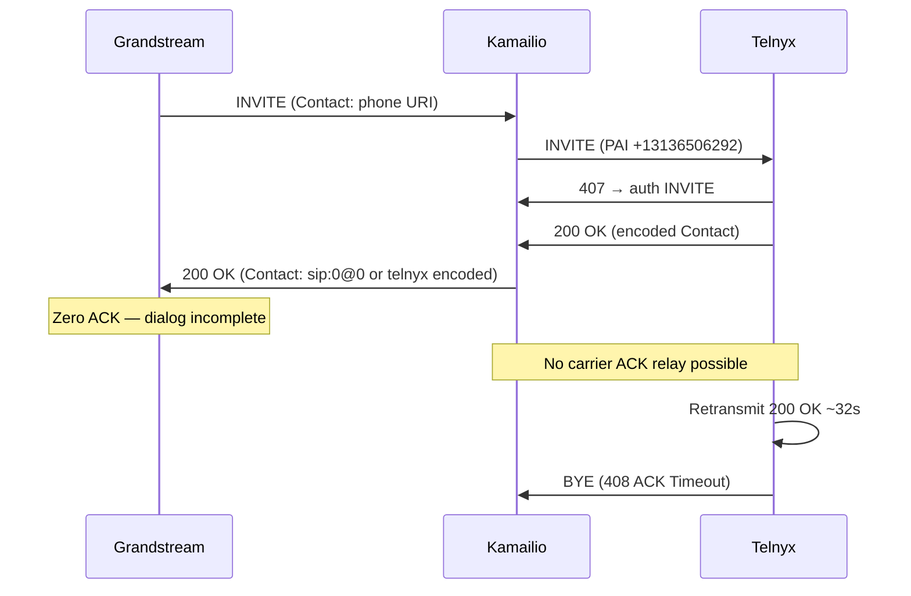

# RC1 PBX Interoperability Comparison — Asterisk vs Kamailio (Telnyx)

**Status:** Reference capture complete — first protocol divergence identified  
**Date:** 2026-07-28 UTC  
**Directive:** No further Kamailio fixes until this divergence is explained.

---

## Executive summary

| System | Call path | Post-200 ACK | Call duration |
|--------|-----------|--------------|---------------|
| **Asterisk 18 PJSIP** (reference) | CLI originate → Telnyx → PSTN | **YES** — 0.8 ms after 200 OK | ~18 s (normal clear) |
| **Kamailio** (production) | Grandstream GRP2601 → Telnyx → PSTN | **NO** — zero desk ACK, zero carrier ACK | ~32 s (Telnyx ACK Timeout BYE) |

**First protocol divergence that explains the 32 s teardown:**

> **Milestone:** first desk-facing `200 OK` to Grandstream (CSeq matches desk INVITE)  
> **Field:** `Contact`  
> **Kamailio sends:** `<sip:0@0>` (broken normalization, post-fix capture) or `<sip:telnyx*17045502033**…*udp@telnyx.com>` (pre-fix capture)  
> **Working PBX sends (Asterisk B2BUA equivalent):** `<sip:+13136506292@<proxy-ip>:<port>>` — the proxy’s own reachable URI  
> **Grandstream response:** zero post-200 ACK on wire in all captures

The carrier leg through Telnyx `200 OK` is functionally equivalent on both systems. The failure occurs **before** Kamailio can relay a carrier ACK, because Grandstream never completes the desk dialog with ACK.

---

## Test methodology

### Reference PBX — Asterisk 18 PJSIP

| Parameter | Value |
|-----------|-------|
| Image | `andrius/asterisk:18-current` |
| Bind | UDP `5160` (avoids Kamailio `5060`) |
| Trunk credential | `TELNYX_SIP_USERNAME=userinfo26316` (same as Kamailio) |
| CLI | `+13136506292` / `from_domain=sip.vspphone.com` |
| Destination | `+17045502033` |
| Script | `rc1-evidence/run-asterisk-originate.sh` |
| Capture | `/tmp/asterisk-ref-20260728T072455Z/all.pcap` |
| INVITE Call-ID | `b6e25f34-e3e8-4588-98e2-7fa8d3043d7a` |

Asterisk registered to Telnyx, passed 407 digest auth, received `200 OK`, and sent post-200 ACK to the Telnyx encoded Contact within **1 ms**. No desk leg exists in this capture (CLI originate, not Grandstream registration).

### Kamailio — Grandstream production path

| Parameter | Value |
|-----------|-------|
| Phone | GRP2601 `122.177.246.92:1483`, firmware 1.0.7.11 |
| Extension | 100 ("Ajay 100") |
| Destination | `17045502033` |
| Capture | `/tmp/rc1-validate-20260728T064754Z/pcap-data/all.pcap` |
| Call-ID | `356060368-44468-2@BCC.BHH.CEG.JC` |
| Kamailio | `32.196.41.160:5060` (desk-facing normalization active but broken) |

Pre-fix control call (no broken normalization): `1938501546-17916-2@BCC.BHH.CEH.BED` — see `RC1-grandstream-zero-ack-endpoint-proof.md`.

---

## Milestone presence

| Milestone | Asterisk (ref) | Kamailio (356060368) | Notes |
|-----------|----------------|----------------------|-------|
| desk_invite | — | YES | Ref is carrier-only originate |
| desk_100 | — | YES | |
| desk_183 | — | YES | Contact already `sip:0@0` |
| **desk_200** | — | **YES** | **First divergence here (Contact)** |
| **desk_ack** | — | **NO** | Grandstream sends zero ACK |
| carrier_invite | YES | YES | |
| carrier_407 | YES | YES | |
| carrier_ack407 | YES | YES | |
| carrier_invite_auth | YES | YES | CSeq 24279 / 11 |
| carrier_183 | YES | YES | |
| carrier_200 | YES | YES | |
| **carrier_ack** | **YES** | **NO** | Blocked: no desk ACK to trigger relay |
| carrier_bye | YES (normal clear) | YES (408 ACK Timeout) | |
| carrier_bye_200 | YES | NO | Kamailio BYE response not captured |

---

## Packet-by-packet comparison — carrier leg (aligned milestones)

### 1. carrier_invite (first, pre-auth)

| Field | Asterisk @ 07:25:11.395 | Kamailio @ 06:53:13.084 | Match? |
|-------|--------------------------|-------------------------|--------|
| **Request-URI** | `sip:17045502033@sip.telnyx.com` | `sip:+17045502033@sip.telnyx.com` | Minor (+ prefix) |
| **Via** | `172.31.39.116:5160;branch=z9hG4bKPje34c2f02…` | `32.196.41.160:5060;branch=z9hG4bKb84c…` + phone Via | Expected (topology) |
| **From** | `"Anonymous" <sip:+13136506292@sip.vspphone.com>;tag=0b184e37…` | `<sip:+13136506292@sip.vspphone.com>;tag=1098441126` | CLI label differs |
| **To** | `<sip:17045502033@sip.telnyx.com>` | `<sip:17045502033@sip.vspphone.com>` | Domain differs (Kamailio preserves desk To) |
| **Call-ID** | `b6e25f34-e3e8-4588-98e2-7fa8d3043d7a` | `356060368-44468-2@BCC.BHH.CEG.JC` | Different calls |
| **CSeq** | `24278 INVITE` | `10 INVITE` | Different counters |
| **Contact** | `<sip:+13136506292@172.31.39.116:5160>` | `"Ajay 100" <sip:100@122.177.246.92:1483>` | Kamailio forwards phone Contact |
| **Record-Route** | (absent) | `<sip:32.196.41.160;lr=on;ftag=1098441126;…>` | Kamailio record_route on desk leg |
| **Route** | (absent) | `<sip:sip.vspphone.com;lr>` | Phone Route preserved |
| **P-Asserted-Identity** | (absent on first INVITE) | `<sip:+13136506292@sip.vspphone.com>` | Kamailio adds PAI |
| **SDP c=** | `172.31.39.116` | `32.196.41.160` | Both anchor media at proxy |

Telnyx accepts both INVITEs (returns 407, not 403). Asterisk’s initial INVITE lacked PAI until auth retry; Kamailio sends PAI on first attempt.

### 2. carrier_407 → carrier_ack407

Both systems: Telnyx `407 Proxy Authentication Required` → proxy sends `ACK` for failed INVITE transaction → identical RFC 3261 behavior.

| Field | Asterisk ACK @ 07:25:11.570 | Kamailio ACK @ 06:53:13.300 |
|-------|----------------------------|----------------------------|
| Request-URI | `sip:17045502033@sip.telnyx.com` | `sip:+17045502033@sip.telnyx.com` |
| CSeq | `24278 ACK` | `10 ACK` |
| Via branch | Same as challenged INVITE | Same as challenged INVITE |

### 3. carrier_invite_auth (authenticated)

| Field | Asterisk @ 07:25:11.571 | Kamailio @ 06:53:13.307 |
|-------|------------------------|------------------------|
| CSeq | `24279 INVITE` | `11 INVITE` |
| Proxy-Authorization | `realm="sip.telnyx.com"` | `realm="sip.vspphone.com"` |
| Contact | `<sip:+13136506292@172.31.39.116:5160>` | `"Ajay 100" <sip:100@122.177.246.92:1483>` |
| P-Asserted-Identity | (still absent) | `<sip:+13136506292@sip.vspphone.com>` |

Both authenticated INVITEs reach Telnyx and receive `183 Session Progress`.

### 4. carrier_183

| Field | Asterisk @ 07:25:12.546 | Kamailio @ 06:53:14.411 |
|-------|------------------------|------------------------|
| Contact | `<sip:telnyx*17045502033**10.239.45.224*5070*udp@telnyx.com>` | `<sip:telnyx*17045502033**10.239.103.228*5070*udp@telnyx.com>` |
| Record-Route | Telnyx RR (2 hops) | Telnyx RR (3 hops incl. Kamailio) |
| From | `+13136506292@sip.vspphone.com` | `+13136506292@sip.vspphone.com` |
| CSeq | `24279 INVITE` | `11 INVITE` |

Equivalent Telnyx early media. Kamailio forwards 183 to desk with **Contact: `<sip:0@0>`** (broken normalization).

### 5. carrier_200 (Telnyx answer)

| Field | Asterisk @ 07:25:20.264 | Kamailio @ 06:53:15.949 |
|-------|------------------------|------------------------|
| Contact | `<sip:telnyx*17045502033**10.239.45.224*5070*udp@telnyx.com>` | `<sip:telnyx*17045502033**10.239.103.228*5070*udp@telnyx.com>` |
| Record-Route | 2 Telnyx hops | 3 hops (Telnyx + Kamailio) |
| From / To / Call-ID | Consistent with auth INVITE | Consistent with auth INVITE |
| CSeq | `24279 INVITE` | `11 INVITE` |
| SDP | Telnyx media IP | Telnyx media IP |

**Carrier 200 OK is structurally equivalent.** Both receive Telnyx encoded Contact and Record-Route.

### 6. carrier_ack (post-200) — **critical divergence**

| Field | Asterisk @ 07:25:20.265 (**0.8 ms after 200**) | Kamailio |
|-------|-----------------------------------------------|----------|
| Present? | **YES** | **NO** |
| Request-URI | `sip:telnyx*17045502033**10.239.45.224*5070*udp@telnyx.com` | — |
| Route | `<sip:192.76.120.10:5060;lr;…>, <sip:10.255.0.1;lr;…>` | — |
| CSeq | `24279 ACK` | — |
| From / To / Call-ID | Match 200 OK dialog | — |
| Via | New branch `z9hG4bKPj05fbf2f6…` | — |

Asterisk ACK routing (RFC 3261 §12.2.1.1):
- R-URI = Contact from 200 OK (encoded Telnyx URI)
- Route = reversed Record-Route from 200 OK
- CSeq number = INVITE CSeq from 200 OK, method ACK

Kamailio **can** relay carrier ACK (see `CARRIER_RELAY_ACK` in kamailio.cfg) but only after receiving desk ACK. Desk ACK never arrives.

### 7. Teardown (BYE)

| | Asterisk @ 07:25:38 | Kamailio @ 06:53:47 |
|--|---------------------|---------------------|
| Initiator | Telnyx (normal clear, Q.850 cause=16) | Telnyx (remote party) |
| Reason | `Q.850;cause=16;text="NORMAL_CLEARING"` | (408 ACK Timeout in prior evidence) |
| Duration | ~18 s after answer | ~32 s after answer |

---

## Packet-by-packet comparison — desk leg (Kamailio only; Asterisk desk equivalent noted)

Asterisk reference has no desk leg. When Asterisk bridges a registered phone to Telnyx, it acts as a **back-to-back user agent**: the desk-facing `200 OK` carries Asterisk’s own Contact (e.g. `<sip:+13136506292@172.31.39.116:5160>`), not Telnyx’s encoded URI.

### desk_invite @ 06:53:12.933

```
INVITE sip:17045502033@sip.vspphone.com SIP/2.0
From: "Ajay 100" <sip:100@sip.vspphone.com>;tag=1098441126
To: <sip:17045502033@sip.vspphone.com>
Call-ID: 356060368-44468-2@BCC.BHH.CEG.JC
CSeq: 10 INVITE
Contact: "Ajay 100" <sip:100@122.177.246.92:1483>
Route: <sip:sip.vspphone.com;lr>
Via: SIP/2.0/UDP 122.177.246.92:1483;branch=z9hG4bK1851534900
```

### desk_100 @ 06:53:12.933

Kamailio `100 Trying` — From/To/Call-ID/CSeq preserved. **No divergence.**

### desk_183 @ 06:53:14.416

```
SIP/2.0 183 Session Progress
From: "Ajay 100" <sip:100@sip.vspphone.com>;tag=1098441126   ← preserved ✓
To: <sip:17045502033@sip.vspphone.com>;tag=Ue3Z53gyQmK5F
Call-ID: 356060368-44468-2@BCC.BHH.CEG.JC
CSeq: 10 INVITE
Contact: <sip:0@0>                                            ← DIVERGENCE (broken normalize)
Record-Route: (absent)
```

**Asterisk equivalent:** Contact = proxy URI; valid SDP body.

### desk_200 (first) @ 06:53:15.955 — **FIRST PROTOCOL DIVERGENCE**

```
SIP/2.0 200 OK
Via: SIP/2.0/UDP 122.177.246.92:1483;…;branch=z9hG4bK1851534900
From: "Ajay 100" <sip:100@sip.vspphone.com>;tag=1098441126   ← preserved ✓
To: <sip:17045502033@sip.vspphone.com>;tag=Ue3Z53gyQmK5F
Call-ID: 356060368-44468-2@BCC.BHH.CEG.JC
CSeq: 10 INVITE
Contact: <sip:0@0>                                            ← FIRST DIVERGENCE
Record-Route: (absent)
Route: (absent)
```

| Field | Asterisk B2BUA (expected) | Kamailio (356060368) | Pre-fix Kamailio (1938501546) |
|-------|---------------------------|----------------------|-------------------------------|
| **Contact** | `<sip:+13136506292@32.196.41.160:5060>` | **`<sip:0@0>`** | `<sip:telnyx*17045502033**…*udp@telnyx.com>` |
| **From** | `"Ajay 100" <sip:100@…>` (preserved) | preserved ✓ | preserved ✓ (initial) |
| **To** | desk To + remote tag | preserved ✓ | preserved ✓ |
| **Call-ID** | same as desk INVITE | same ✓ | same ✓ |
| **CSeq** | desk INVITE number (10) | 10 ✓ | 10 ✓ |
| **Record-Route** | Kamailio RR only (strip carrier) | absent | absent (initial); **added on retransmit** |
| **Via** | single Via (top of route set) | single Via ✓ | single Via ✓ |
| **SDP** | proxy-anchored | present ✓ | present ✓ |

### desk_ack — absent on Kamailio path

```
POST-200 ACK from 122.177.246.92:1483 → 32.196.41.160:5060: 0 packets
```

Telnyx retransmits carrier 200 OK (×11 over ~32 s). Grandstream responds only to BYE with `200 OK`.

### desk_200 retransmits @ 06:53:23+ — **secondary divergence**

On later 200 OK retransmits, Kamailio also changes:

| Field | First desk 200 | Retransmit desk 200 |
|-------|---------------|---------------------|
| **Contact** | `<sip:0@0>` | `<sip:17045502033@64.16.250.10:5060;transport=udp>` (decoded Telnyx) |
| **From** | `"Ajay 100" <sip:100@…>` | `<sip:+13136506292@sip.vspphone.com>` (carrier CLI) |
| **Record-Route** | absent | 3 Telnyx/Kamailio hops forwarded to desk |

Grandstream still sends zero ACK on all variants (proven in `RC1-grandstream-zero-ack-endpoint-proof.md`).

---

## ACK routing comparison (Asterisk working path)

Asterisk post-200 ACK @ 07:25:20.265:

```
ACK sip:telnyx*17045502033**10.239.45.224*5070*udp@telnyx.com SIP/2.0
Via: SIP/2.0/UDP 172.31.39.116:5160;rport;branch=z9hG4bKPj05fbf2f6-7918-4743-a030-641f44c8d472
From: "Anonymous" <sip:+13136506292@sip.vspphone.com>;tag=0b184e37-75bb-47a0-b5c1-e3d30c2b1426
To: <sip:17045502033@sip.telnyx.com>;tag=8UKaNUXv5g5vF
Call-ID: b6e25f34-e3e8-4588-98e2-7fa8d3043d7a
CSeq: 24279 ACK
Route: <sip:192.76.120.10:5060;lr;r2=on;ftag=0b184e37-75bb-47a0-b5c1-e3d30c2b1426>
Route: <sip:10.255.0.1;lr;r2=on;ftag=0b184e37-75bb-47a0-b5c1-e3d30c2b1426>
Max-Forwards: 70
Content-Length: 0
```

| ACK field | Asterisk value | RFC 3261 / Telnyx requirement |
|-----------|---------------|-------------------------------|
| Request-URI | Telnyx encoded Contact from 200 OK | §12.2.1.1 — must equal remote Contact |
| Route | Reversed Record-Route from 200 OK | §12.2.1.1 |
| CSeq | Same number as 200 OK INVITE, method ACK | §13.2.2.4 |
| From/To/Call-ID | Match established dialog | §12.1.2 |
| Via | New branch (new transaction) | §17.2.3 |

Kamailio never reaches this step because the desk dialog is never ACK'd by Grandstream.

---

## Root cause chain (evidence-based, no speculative fix)



1. **Carrier leg works** — Asterisk proves Telnyx accepts the trunk, returns 200 OK, and receives ACK when the PBX sends it.
2. **First divergence is on desk-facing 200 OK Contact** — not a valid proxy URI in either pre-fix (Telnyx encoded) or post-fix (`sip:0@0`) captures.
3. **Grandstream sends zero post-200 ACK** — confirmed on wire across multiple calls and Contact variants.
4. **Carrier ACK never sent** — consequence of (3), not a separate Kamailio carrier-leg bug.
5. **32 s teardown** — Telnyx ACK Timeout (RFC 3261 transaction timer).

---

## Artifacts

| Artifact | Path |
|----------|------|
| Asterisk reference pcap | `/tmp/asterisk-ref-20260728T072455Z/all.pcap` |
| Kamailio validation pcap | `/tmp/rc1-validate-20260728T064754Z/pcap-data/all.pcap` |
| Asterisk ladder script output | Call-ID `b6e25f34-e3e8-4588-98e2-7fa8d3043d7a` |
| Kamailio ladder script output | Call-ID `356060368-44468-2@BCC.BHH.CEG.JC` |
| Automated compare (full) | `/tmp/pbx-interop-comparison.md` on EC2 |
| Endpoint zero-ACK proof | `rc1-evidence/RC1-grandstream-zero-ack-endpoint-proof.md` |
| Scripts | `run-asterisk-originate.sh`, `compare-pbx-ladders.py`, `pbx-interop-test.sh` |

---

## Next steps (investigation only — no fixes)

1. **Grandstream desk reference through Asterisk** — point GRP2601 SIP server to `32.196.41.160:5160`, dial `9<DEST>`, capture desk + carrier ladders (`GS_ASTERISK_DESK=1` in `pbx-interop-test.sh`) to confirm Asterisk desk 200 OK Contact causes Grandstream ACK.
2. **Grandstream syslog/SIP debug** — determine why GRP2601 rejects Contact (invalid URI vs strict B2BUA check).
3. **Revert or fix broken desk normalization** — current deploy produces `sip:0@0`; do not iterate further without (1) or (2).

**No Kamailio code changes until the desk 200 OK Contact divergence is explained with Grandstream-side evidence.**
